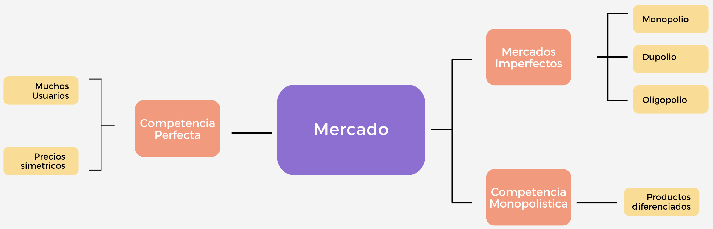
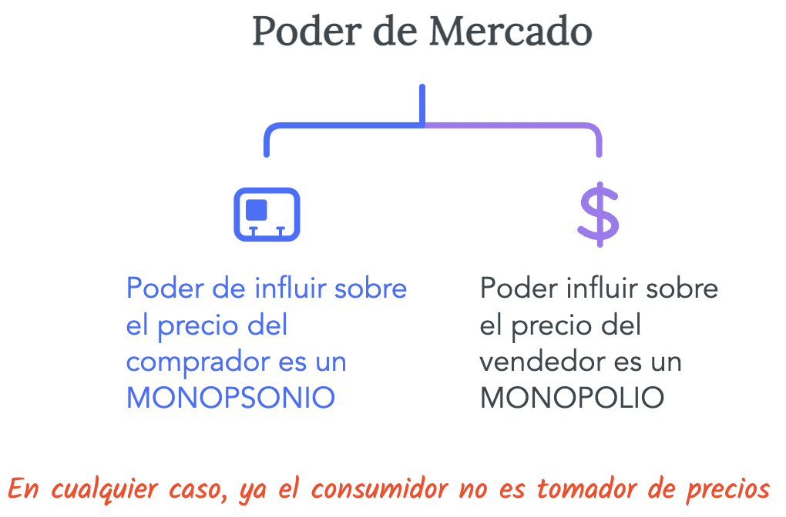

name: xaringan-title
class: left, middle


# Principios de Microeconomía
<br>
## Estructuras de Mercado (Monopolio)
<br>
<br>


### Carlos Yanes | Departamento de Economía | `r Sys.Date()`

```{r Setup, include = F}
options(htmltools.dir.version = FALSE)
library(pacman)
p_load(broom, latex2exp, ggplot2, ggthemes, ggforce, viridis, dplyr, magrittr, knitr, parallel)

library(tidyverse)
library(babynames)
library(fontawesome) # from github: https://github.com/rstudio/fontawesome
library(DiagrammeR)
library(hrbrthemes)
library(econocharts)
library(plotly)
library(kableExtra)
library(flextable)

# Knitr options

opts_chunk$set(
  comment = "#>",
  fig.align = "center",
  fig.height = 7,
  fig.width = 7,
  warning = F,
  message = F
)

# Colores
red_pink <- "#e64173"
met_slate <- "#272822" # metropolis font color 
purple <- "#9370DB"
green <- "#007935"
light_green <- "#7DBA97"
orange <- "#FD5F00"
turquoise <- "#44C1C4"
red <- "#b92e34"


# graph themes options

theme_simple <- theme_bw() + theme(
  axis.line = element_line(color = met_slate),
  panel.grid = element_blank(),
  rect = element_blank(),
  strip.text = element_blank(),
  text = element_text(family = "Fira Sans", color = met_slate, size = 17),
  # axis.text.x = element_text(size = 12),
  # axis.text.y = element_text(size = 12),
  axis.ticks = element_blank()
)
theme_market <- theme_bw() + theme(
  axis.line = element_line(color = met_slate),
  panel.grid = element_blank(),
  rect = element_blank(),
  strip.text = element_blank(),
  text = element_text(family = "Fira Sans", color = met_slate, size = 17),
  axis.title.x = element_text(hjust = 1, size = 17),
  axis.title.y = element_text(hjust = 1, angle = 0, size = 17),
  axis.ticks = element_blank()
)
theme_gif <- theme_bw() + theme(
  axis.line = element_line(color = met_slate),
  panel.grid = element_blank(),
  rect = element_blank(),
  text = element_text(family = "Fira Sans", color = met_slate, size = 17),
  axis.text.x = element_text(size = 12),
  axis.text.y = element_text(size = 12),
  axis.ticks = element_blank()
)
theme_goods <- theme_bw() + theme(
  axis.line = element_line(),
  panel.grid = element_blank(),
  rect = element_rect(size = 1),
  strip.text = element_blank(),
  text = element_text(size = 17, family = "Fira Sans"), 
  axis.text.x = element_text(size = 17),
  axis.text.y = element_text(size = 17, angle = 90, hjust = 0.5),
  axis.title.x = element_text(color = purple, size = 19),
  axis.title.y = element_text(color = red_pink, size = 19),
  axis.ticks = element_blank(),
  plot.title = element_blank(),
  legend.position = "none"
)
theme_game <- theme_bw() + theme(
  axis.line = element_line(),
  panel.grid = element_blank(),
  rect = element_rect(size = 1),
  strip.text = element_blank(),
  text = element_text(size = 20, family = "Fira Sans"), 
  axis.text.x = element_text(size = 20, color = met_slate),
  axis.text.y = element_text(size = 20, angle = 90, color = met_slate, hjust = 0.5),
  axis.title.x = element_text(color = met_slate, size = 20),
  axis.title.y = element_text(color = met_slate, size = 20),
  axis.ticks = element_blank(),
  plot.title = element_blank(),
  legend.position = "none"
)
shift_axis <- function(p, y=0){
  g <- ggplotGrob(p)
  dummy <- data.frame(y=y)
  ax <- g[["grobs"]][g$layout$name == "axis-b"][[1]]
  p + annotation_custom(grid::grobTree(ax, vp = grid::viewport(y=1, height=sum(ax$height))), 
                        ymax=y, ymin=y) +
    geom_hline(aes(yintercept=y), data = dummy, size = 0.5, color = met_slate) +
    theme(axis.text.x = element_blank(), 
          axis.ticks.x = element_blank())
}
wrapper <- function(x, ...) paste(strwrap(x, ...), collapse = "\n")
```

---
class: middle, inverse

.left-column[

# `r emo::ji("fire")`

]

.right-column[
# Preguntas de las sesiones anteriores?
]

---
class: title-slide-section-grey, middle

# Introducción

<br>


---
# Donde estan?

--

.pull-left[
```{R, graphoui, echo = F, fig.height = 5, fig.width = 9, dev = "svg"}
# Datos
pop_df = 
  data.frame(
  lang = c("Ana Trillo", "Juan Gonzalez", "Lina Gutierrez", "Rodrigo Aparicio"),
  n_jobs = c(100, 78, 70, 65),
  free = c(T, F, F, F)
  )
## Graficando
pop_df %>% 
  mutate(lang = lang %>% factor(ordered = T)) %>%
  ggplot(aes(x = lang, y = n_jobs, fill = free)) +
  geom_col() +
  geom_hline(yintercept = 0) +
  aes(x = reorder(lang, -n_jobs), fill = reorder(free, -free)) +
  xlab("Estudiantes") +
  scale_y_continuous(label = scales::comma) +
  ylab("Podium") +
  labs(
    title = "Participación Control",
    subtitle = "Nota de Control 09"
    ) +
  scale_fill_manual(
    "Mejor tiempo?",
    labels = c("Si", "No"),
    values = c("#f92672", "darkslategray")
    ) +
  ggthemes::theme_pander(base_size = 17) +
  # theme_ipsum() +
  theme(legend.position = "bottom")
```
]

--

.pull-right[

]


---
class: inverse, middle

# Por qué existen los Monopolios? `r emo::ji("dollar")`

--

## Son malos para la sociedad? 📊 

---
# Por qué existen los Monopolios?

--

`r fa("angle-double-right", fill="red")` Un recurso clave es propiedad única de una firma.

--

`r fa("angle-double-right", fill="red")` El .black[gobierno] concede a una sola firma el derecho a la exclusividad de producir el bien.

--

`r fa("angle-double-right", fill="red")` Los costos de producción hacen que un único productor sea más eficiente que un elevado número de productores.

--

`r fa("angle-double-right", fill="red")` Bajo monopolio una firma controla las cantidades de un producto ofrecidas en el mercado.

--

- Se rompe el supuesto de que la firma es precio aceptante.

--

- Se viola la condición de .RUred[competencia perfecta] en la que la firma produce cuando el **precio** se iguala al .black[costo marginal].


---
# Por qué existen los Monopolios?

--

<center></center>

---
# Por qué existen los Monopolios?

--

<center></center>

---
# Por qué existen los Monopolios?

--

<center></center>

---
# Por qué existen los Monopolios?

--

### En sintesis...

--

`r fa("sketch", fill="blue")` Un vendedor
`r fa("sketch", fill="blue")` Producto único sin ningún sustituto
`r fa("sketch", fill="blue")` Existen barreras a la entrada

--

--

### Resultado

--

**Poder de mercado:** Un monopolista tiene la forma de ***influir*** en los precios del mercado.

- Un monopolista es un **hacedor de precios**.

---
class: title-slide-section-blue

--

## Pregunta

--

### Es Tom Hanks un Monopolio?

--


- .white[Pues... No]


---
# Mas preguntas

--

**P:** Es Google un monopolio? .purple[Por qué] o .pink[Por qué no]?

--

- .blue[Es uno de los motores de busqueda por lejos mas popular del mundo. Tiene una gran habilidad para comprar potenciales competidores]

- .RUred[Compite con Apple, Amazon y Microsoft.]

--

**R:** .RUred[No es un monopolio, pero tiene poder de mercado.]

---
# Mas preguntas

--

**P:** Es Claro un monopolio? .purple[Por qué] o .pink[Por qué no]?

--

- .blue[Único proveedor de Internet en muchas zonas .mono[+] empresa enorme, integrada verticalmente .mono[+] grandes barreras de entrada.]

- .RUred[Compite con Tigo, Movistar, y otras firmas.]

--

**R:** .RUred[Dependiendo en dónde vivas, sí...]

---
class: title-slide-section-grey, middle

# Barreras a la entrada

<br>


---
# Barreras a la entrada

--

`r fa("atom", fill="red")` .RUred[Barreras estructurales]: Aquellas que solo una firma en especifico puede atender a ese mercado.

--

+ Recuerde a los Avengers: 


--

+ Hay costos que solo puede incurrir una firma (p.e: Tecnología superior)

--

+ Ventajas en la demanda (p.e: lealtad de clientes)

--

`r fa("atom", fill="red")` .RUred[Barreras legales]: Aquellas que le brindan un permiso especial de explotación en el mercado a las firmas.

--

+ Las patentes brindan estimulos a la producción avanzada.

--

`r fa("atom", fill="red")` .RUred[Barreras estrategicas]: Ocurren cuando unas firmas o empresas que estan en el mercado imponen precios a nuevas que lleguan.

---
class: title-slide-section-grey, middle

# Maximización del beneficio

<br>


---
# Maximización del beneficio

--

En un mercado de **Monopolio**:

--

+ Una empresa decide la producción $Q=q$.

--

+ Un cambio en $q$ afecta los precios de mercado, es medido por la *función inversa* de la .black[demanda] $P(q)$.

--

+ Un ejemplo de *función inversa* es:

--

$$p=a-bq, \quad \text{donde}\;a,b>0$$
--

+ Cuando un **monopolista** vende pocas unidades del bien que provee en el mercado, los consumidores están dispuestos a pagar un mayor precio por ese bien escaso.

--

+ Cuando la firma ofrece mayores unidades (grandes valores de $q$), los consumidores están dispuestos a pagar un menor valor por ese bien abundante.


---
# Maximización del beneficio

--

La condición de un **monopolista** es distinto a un mercado competitivo. Su beneficio radicado en:

--

$$\pi= p \times q - CT(q)$$

--

Debe ser diferenciada (usar derivada) para lograr su mayor y mas alto punto de beneficio.

--

.RUred[Ingreso marginal] no es mas que su ingreso adicional obtenido al producir un nivel mayor de producto.

--

.RUred[Costo marginal] Es el costo adicional que incurre el monopolista si decide aumentar en un nivel superior su producto.

--

.black[Condición de equilibrio] 

--

$$Img=Cmg$$
--

+ Si el $Img>Cmg$ el **Monopolista** tendra incentivos a producir mas, porque percibirá un ingreso mucho mayor.

--

+ Si por el contrario $Img<Cmg$ el **Monopolista** reducira su producción lo que considere pertinente para operar en ese mercado.

---
# Maximización del beneficio

--

`r fa("angle-double-right", fill="blue")` Cuando el **Monopolista** desea incrementar la producción puede tener dos efectos:

--

1. Efecto **positivo**, al vender una unidad mas gana la relación $p(q)$, y desde luego su ganancia se incrementa.

--

2. Efecto .RUred[negativo], cuando .black[ofrece] una unidad mas la firma necesariamente necesita disminuir los precios. Esto es: $\frac{\partial p(q)}{\partial q}<0$

--

En resumen, el efecto total del **monopolista** finalmente tiene que ver con el comportamiento de sus costos y de la relación $Img=Cmg$.

---
class: title-slide-section-grey, middle

# Jugando con gráficos
<br>


---
layout: true
# Gráficos de Monopolio

---

En un mercado **monopolístico**, los consumidores de un determinado producto de una empresa tienen .pink[menos alternativas] que en un mercado perfectamente competitivo.

.pull-left[
.center[**Monopolio**]
```{r, echo = FALSE, fig.height = 3.75, fig.width = 3.75, dev = "svg"}
demand <- function(x) 8 - 0.6*x
inv_demand <- function(x) (5/3)*(8 - x)
p_1 <- 7
p_2 <- 6
q_1 <- inv_demand(p_1) 
q_2 <- inv_demand(p_2)
ggplot(data = data.frame(x = 0), mapping = aes(x = x)) +
  scale_x_continuous(limits = c(0, 10.5), expand = c(0, 0), breaks = NULL) +
  scale_y_continuous(limits = c(0, 10.5), expand = c(0, 0), breaks = NULL) +
  theme_market +
  labs(x = "Q", y = "P") +
  stat_function(fun = demand, color = red_pink, size = 1) +
  annotate("text", label = "D", x = 10, y = 2.65, color = red_pink, family = "Fira Sans", size = 9) 
```
]
.pull-right[
.center[**Mercado Perfectamente Competitivo**]
```{r, echo = FALSE, fig.height = 3.75, fig.width = 3.75,  dev = "svg"}
ggplot(data = data.frame(x = 0), mapping = aes(x = x)) +
  scale_x_continuous(limits = c(0, 10.5), expand = c(0, 0), breaks = NULL) +
  scale_y_continuous(limits = c(0, 10.5), expand = c(0, 0), breaks = NULL) +
  theme_market +
  labs(x = "Q", y = "P") +
  geom_hline(yintercept = 5, color = red_pink, size = 1) +
  annotate("text", label = "D", x = 10, y = 5.5, color = red_pink, family = "Fira Sans", size = 9)
```
]
---

.pull-left[
```{r, echo = FALSE, fig.height = 5, fig.width = 5, dev = "svg"}
demand <- function(x) 10 - x
inv_demand <- function(x) 10 - x
p_1 <- 7
p_2 <- 9
q_1 <- inv_demand(p_1) 
q_2 <- inv_demand(p_2)
ggplot(data = data.frame(x = 0), mapping = aes(x = x)) +
  scale_x_continuous(limits = c(0, 10.5), expand = c(0, 0), breaks = seq(0, 10, 1)) +
  scale_y_continuous(limits = c(0, 10.5), expand = c(0, 0), breaks = seq(0, 10, 1)) +
  theme_market +
  labs(x = "Q", y = "P") +
  # geom_rect(aes(xmin = 0, xmax = q_1, ymin = 0, ymax = p_1), alpha = 0.2, fill = green) +
  geom_rect(aes(xmin = 0, xmax = q_2, ymin = 0, ymax = p_2), alpha = 0.2, fill = green) +
  stat_function(fun = demand, color = red_pink, size = 1) +
  # geom_point(x = q_1, y = p_1, color = met_slate, size = 2) +
  geom_point(x = q_2, y = p_2, color = met_slate, size = 2) +
  # geom_segment(x = 0, xend = q_1, y = p_1, yend = p_1, color = met_slate, linetype = "dashed", size = 1) +
  geom_segment(x = 0, xend = q_2, y = p_2, yend = p_2, color = met_slate, linetype = "dashed", size = 1) +
  # geom_segment(x = q_1, xend = q_1, y = 0, yend = p_1, color = met_slate, linetype = "dashed", size = 1) +
  geom_segment(x = q_2, xend = q_2, y = 0, yend = p_2, color = met_slate, linetype = "dashed", size = 1) +
  annotate("text", label = "D", x = 10, y = 0.65, color = red_pink, family = "Fira Sans", size = 9) 
```
]

.pull-right[

.RUred[**Efecto Precio:**] Al bajar el precio, los clientes actuales pagan menos.

.RUred[**Efecto Producto:**] A medida que disminuye el precio, nuevos clientes adquieren bienes y servicios.

]

---
count: false
.pull-left[
```{r, echo = FALSE, fig.height = 5, fig.width = 5, dev = "svg"}
demand <- function(x) 10 - x
inv_demand <- function(x) 10 - x
p_1 <- 7
p_2 <- 9
q_1 <- inv_demand(p_1) 
q_2 <- inv_demand(p_2)
ggplot(data = data.frame(x = 0), mapping = aes(x = x)) +
  scale_x_continuous(limits = c(0, 10.5), expand = c(0, 0), breaks = seq(0, 10, 1)) +
  scale_y_continuous(limits = c(0, 10.5), expand = c(0, 0), breaks = seq(0, 10, 1)) +
  theme_market +
  labs(x = "Q", y = "P") +
  geom_rect(aes(xmin = 0, xmax = q_1, ymin = 0, ymax = p_1), alpha = 0.2, fill = green) +
  # geom_rect(aes(xmin = 0, xmax = q_2, ymin = 0, ymax = p_2), alpha = 0.2, fill = green) +
  stat_function(fun = demand, color = red_pink, size = 1) +
  geom_point(x = q_1, y = p_1, color = met_slate, size = 2) +
  geom_point(x = q_2, y = p_2, color = met_slate, size = 2) +
  geom_segment(x = 0, xend = q_1, y = p_1, yend = p_1, color = met_slate, linetype = "dashed", size = 1) +
  geom_segment(x = 0, xend = q_2, y = p_2, yend = p_2, color = met_slate, linetype = "dashed", size = 1) +
  geom_segment(x = q_1, xend = q_1, y = 0, yend = p_1, color = met_slate, linetype = "dashed", size = 1) +
  geom_segment(x = q_2, xend = q_2, y = 0, yend = p_2, color = met_slate, linetype = "dashed", size = 1) +
  annotate("text", label = "D", x = 10, y = 0.65, color = red_pink, family = "Fira Sans", size = 9) 
```
]

.pull-right[

.RUred[**Efecto Precio:**] Al bajar el precio, los clientes actuales pagan menos.

.RUred[**Efecto Producto:**] A medida que disminuye el precio, nuevos clientes adquieren bienes y servicios.

.grey[Efecto Producto] <br> $\quad$ .mono[>] .RUred[Efecto del Precio] .mono[==>] <br> se reducen los precios y $\Rightarrow$ se .black[incrementan los beneficios].

]

---
count: false
.pull-left[
```{r, echo = FALSE, fig.height = 5, fig.width = 5, dev = "svg"}
demand <- function(x) 10 - x
inv_demand <- function(x) 10 - x
p_1 <- 7
p_2 <- 9
q_1 <- inv_demand(p_1) 
q_2 <- inv_demand(p_2)
ggplot(data = data.frame(x = 0), mapping = aes(x = x)) +
  scale_x_continuous(limits = c(0, 10.5), expand = c(0, 0), breaks = seq(0, 10, 1)) +
  scale_y_continuous(limits = c(0, 10.5), expand = c(0, 0), breaks = seq(0, 10, 1)) +
  theme_market +
  labs(x = "Q", y = "P") +
  geom_rect(aes(xmin = 0, xmax = q_2, ymin = p_1, ymax = p_2), alpha = 0.2, fill = red_pink) +
  geom_rect(aes(xmin = q_1, xmax = q_2, ymin = 0, ymax = p_1), alpha = 0.2, fill = purple) +
  stat_function(fun = demand, color = red_pink, size = 1) +
  geom_point(x = q_1, y = p_1, color = met_slate, size = 2) +
  geom_point(x = q_2, y = p_2, color = met_slate, size = 2) +
  geom_segment(x = 0, xend = q_1, y = p_1, yend = p_1, color = met_slate, linetype = "dashed", size = 1) +
  geom_segment(x = 0, xend = q_2, y = p_2, yend = p_2, color = met_slate, linetype = "dashed", size = 1) +
  geom_segment(x = q_1, xend = q_1, y = 0, yend = p_1, color = met_slate, linetype = "dashed", size = 1) +
  geom_segment(x = q_2, xend = q_2, y = 0, yend = p_2, color = met_slate, linetype = "dashed", size = 1) +
  annotate("text", label = "D", x = 10, y = 0.65, color = red_pink, family = "Fira Sans", size = 9) 
```
]

.pull-right[

.RUred[**Efecto Precio:**] Al bajar el precio, los clientes actuales pagan menos.

.RUred[**Efecto Producto:**] A medida que disminuye el precio, nuevos clientes adquieren bienes y servicios.

.blue[Efecto Producto] <br> $\quad$ .mono[>] .pink[Efecto del Precio] .mono[==>] <br> se reducen los precios y $\Rightarrow$ se .green[incrementan los beneficios].

]

---
.pull-left[
```{r, echo = FALSE, fig.height = 5, fig.width = 5, dev = "svg"}
demand <- function(x) 10 - x
inv_demand <- function(x) 10 - x
p_1 <- 4
p_2 <- 6
q_1 <- inv_demand(p_1) 
q_2 <- inv_demand(p_2)
ggplot(data = data.frame(x = 0), mapping = aes(x = x)) +
  scale_x_continuous(limits = c(0, 10.5), expand = c(0, 0), breaks = seq(0, 10, 1)) +
  scale_y_continuous(limits = c(0, 10.5), expand = c(0, 0), breaks = seq(0, 10, 1)) +
  theme_market +
  labs(x = "Q", y = "P") +
  # geom_rect(aes(xmin = 0, xmax = q_1, ymin = 0, ymax = p_1), alpha = 0.2, fill = green) +
  geom_rect(aes(xmin = 0, xmax = q_2, ymin = 0, ymax = p_2), alpha = 0.2, fill = green) +
  stat_function(fun = demand, color = red_pink, size = 1) +
  # geom_point(x = q_1, y = p_1, color = met_slate, size = 2) +
  geom_point(x = q_2, y = p_2, color = met_slate, size = 2) +
  # geom_segment(x = 0, xend = q_1, y = p_1, yend = p_1, color = met_slate, linetype = "dashed", size = 1) +
  geom_segment(x = 0, xend = q_2, y = p_2, yend = p_2, color = met_slate, linetype = "dashed", size = 1) +
  # geom_segment(x = q_1, xend = q_1, y = 0, yend = p_1, color = met_slate, linetype = "dashed", size = 1) +
  geom_segment(x = q_2, xend = q_2, y = 0, yend = p_2, color = met_slate, linetype = "dashed", size = 1) +
  annotate("text", label = "D", x = 10, y = 0.65, color = red_pink, family = "Fira Sans", size = 9) 
```
]

.pull-right[

.RUred[**Efecto Precio:**] Al bajar el precio, los clientes actuales pagan menos.

.RUred[**Efecto Producto:**] A medida que disminuye el precio, nuevos clientes adquieren bienes y servicios.

]

---
count: false
.pull-left[
```{r, echo = FALSE, fig.height = 5, fig.width = 5, dev = "svg"}
demand <- function(x) 10 - x
inv_demand <- function(x) 10 - x
p_1 <- 4
p_2 <- 6
q_1 <- inv_demand(p_1) 
q_2 <- inv_demand(p_2)
ggplot(data = data.frame(x = 0), mapping = aes(x = x)) +
  scale_x_continuous(limits = c(0, 10.5), expand = c(0, 0), breaks = seq(0, 10, 1)) +
  scale_y_continuous(limits = c(0, 10.5), expand = c(0, 0), breaks = seq(0, 10, 1)) +
  theme_market +
  labs(x = "Q", y = "P") +
  geom_rect(aes(xmin = 0, xmax = q_1, ymin = 0, ymax = p_1), alpha = 0.2, fill = green) +
  # geom_rect(aes(xmin = 0, xmax = q_2, ymin = 0, ymax = p_2), alpha = 0.2, fill = green) +
  stat_function(fun = demand, color = red_pink, size = 1) +
  geom_point(x = q_1, y = p_1, color = met_slate, size = 2) +
  geom_point(x = q_2, y = p_2, color = met_slate, size = 2) +
  geom_segment(x = 0, xend = q_1, y = p_1, yend = p_1, color = met_slate, linetype = "dashed", size = 1) +
  geom_segment(x = 0, xend = q_2, y = p_2, yend = p_2, color = met_slate, linetype = "dashed", size = 1) +
  geom_segment(x = q_1, xend = q_1, y = 0, yend = p_1, color = met_slate, linetype = "dashed", size = 1) +
  geom_segment(x = q_2, xend = q_2, y = 0, yend = p_2, color = met_slate, linetype = "dashed", size = 1) +
  annotate("text", label = "D", x = 10, y = 0.65, color = red_pink, family = "Fira Sans", size = 9) 
```
]

.pull-right[

.RUred[**Efecto Precio:**] Al bajar el precio, los clientes actuales pagan menos.

.RUred[**Efecto Producto:**] A medida que disminuye el precio, nuevos clientes adquieren bienes y servicios.

.RUred[Efecto Producto] <br> $\quad$ .mono[=] .pink[Efecto del Precio] .mono[==>] <br> se reducen los precios y $\Rightarrow$ .green[no cambian los beneficios].

]

---
count: false
.pull-left[
```{r, echo = FALSE, fig.height = 5, fig.width = 5, dev = "svg"}
demand <- function(x) 10 - x
inv_demand <- function(x) 10 - x
p_1 <- 4
p_2 <- 6
q_1 <- inv_demand(p_1) 
q_2 <- inv_demand(p_2)
ggplot(data = data.frame(x = 0), mapping = aes(x = x)) +
  scale_x_continuous(limits = c(0, 10.5), expand = c(0, 0), breaks = seq(0, 10, 1)) +
  scale_y_continuous(limits = c(0, 10.5), expand = c(0, 0), breaks = seq(0, 10, 1)) +
  theme_market +
  labs(x = "Q", y = "P") +
  geom_rect(aes(xmin = 0, xmax = q_2, ymin = p_1, ymax = p_2), alpha = 0.2, fill = red_pink) +
  geom_rect(aes(xmin = q_1, xmax = q_2, ymin = 0, ymax = p_1), alpha = 0.2, fill = purple) +
  stat_function(fun = demand, color = red_pink, size = 1) +
  geom_point(x = q_1, y = p_1, color = met_slate, size = 2) +
  geom_point(x = q_2, y = p_2, color = met_slate, size = 2) +
  geom_segment(x = 0, xend = q_1, y = p_1, yend = p_1, color = met_slate, linetype = "dashed", size = 1) +
  geom_segment(x = 0, xend = q_2, y = p_2, yend = p_2, color = met_slate, linetype = "dashed", size = 1) +
  geom_segment(x = q_1, xend = q_1, y = 0, yend = p_1, color = met_slate, linetype = "dashed", size = 1) +
  geom_segment(x = q_2, xend = q_2, y = 0, yend = p_2, color = met_slate, linetype = "dashed", size = 1) +
  annotate("text", label = "D", x = 10, y = 0.65, color = red_pink, family = "Fira Sans", size = 9) 
```
]

.pull-right[

.RUred[**Efecto Precio:**] Al bajar el precio, los clientes actuales pagan menos.

.RUred[**Efecto Producto:**] A medida que disminuye el precio, nuevos clientes adquieren bienes y servicios.

.RUred[Efecto Producto] <br> $\quad$ .mono[=] .pink[Efecto del Precio] .mono[==>] <br> se reducen los precios y $\Rightarrow$ .green[no cambian los beneficios].

]

---
.pull-left[
```{r, echo = FALSE, fig.height = 5, fig.width = 5, dev = "svg"}
demand <- function(x) 10 - x
inv_demand <- function(x) 10 - x
p_1 <- 1
p_2 <- 3
q_1 <- inv_demand(p_1) 
q_2 <- inv_demand(p_2)
ggplot(data = data.frame(x = 0), mapping = aes(x = x)) +
  scale_x_continuous(limits = c(0, 10.5), expand = c(0, 0), breaks = seq(0, 10, 1)) +
  scale_y_continuous(limits = c(0, 10.5), expand = c(0, 0), breaks = seq(0, 10, 1)) +
  theme_market +
  labs(x = "Q", y = "P") +
  # geom_rect(aes(xmin = 0, xmax = q_1, ymin = 0, ymax = p_1), alpha = 0.2, fill = green) +
  geom_rect(aes(xmin = 0, xmax = q_2, ymin = 0, ymax = p_2), alpha = 0.2, fill = green) +
  stat_function(fun = demand, color = red_pink, size = 1) +
  # geom_point(x = q_1, y = p_1, color = met_slate, size = 2) +
  geom_point(x = q_2, y = p_2, color = met_slate, size = 2) +
  # geom_segment(x = 0, xend = q_1, y = p_1, yend = p_1, color = met_slate, linetype = "dashed", size = 1) +
  geom_segment(x = 0, xend = q_2, y = p_2, yend = p_2, color = met_slate, linetype = "dashed", size = 1) +
  # geom_segment(x = q_1, xend = q_1, y = 0, yend = p_1, color = met_slate, linetype = "dashed", size = 1) +
  geom_segment(x = q_2, xend = q_2, y = 0, yend = p_2, color = met_slate, linetype = "dashed", size = 1) +
  annotate("text", label = "D", x = 10, y = 0.65, color = red_pink, family = "Fira Sans", size = 9) 
```
]

.pull-right[

.RUred[**Efecto Precio:**] Al bajar el precio, los clientes actuales pagan menos.

.RUred[**Efecto Producto:**] A medida que disminuye el precio, nuevos clientes adquieren bienes y servicios.

]

---
count: false
.pull-left[
```{r, echo = FALSE, fig.height = 5, fig.width = 5, dev = "svg"}
demand <- function(x) 10 - x
inv_demand <- function(x) 10 - x
p_1 <- 1
p_2 <- 3
q_1 <- inv_demand(p_1) 
q_2 <- inv_demand(p_2)
ggplot(data = data.frame(x = 0), mapping = aes(x = x)) +
  scale_x_continuous(limits = c(0, 10.5), expand = c(0, 0), breaks = seq(0, 10, 1)) +
  scale_y_continuous(limits = c(0, 10.5), expand = c(0, 0), breaks = seq(0, 10, 1)) +
  theme_market +
  labs(x = "Q", y = "P") +
  geom_rect(aes(xmin = 0, xmax = q_1, ymin = 0, ymax = p_1), alpha = 0.2, fill = green) +
  # geom_rect(aes(xmin = 0, xmax = q_2, ymin = 0, ymax = p_2), alpha = 0.2, fill = green) +
  stat_function(fun = demand, color = red_pink, size = 1) +
  geom_point(x = q_1, y = p_1, color = met_slate, size = 2) +
  geom_point(x = q_2, y = p_2, color = met_slate, size = 2) +
  geom_segment(x = 0, xend = q_1, y = p_1, yend = p_1, color = met_slate, linetype = "dashed", size = 1) +
  geom_segment(x = 0, xend = q_2, y = p_2, yend = p_2, color = met_slate, linetype = "dashed", size = 1) +
  geom_segment(x = q_1, xend = q_1, y = 0, yend = p_1, color = met_slate, linetype = "dashed", size = 1) +
  geom_segment(x = q_2, xend = q_2, y = 0, yend = p_2, color = met_slate, linetype = "dashed", size = 1) +
  annotate("text", label = "D", x = 10, y = 0.65, color = red_pink, family = "Fira Sans", size = 9) 
```
]

.pull-right[

.RUred[**Efecto Precio:**] Al bajar el precio, los clientes actuales pagan menos.

.RUred[**Efecto Producto:**] A medida que disminuye el precio, nuevos clientes adquieren bienes y servicios.

.blue[Efecto Producto] <br> $\quad$ .mono[<] .pink[Efecto del Precio] .mono[==>] <br> se reducen los precios y $\Rightarrow$ .black[los beneficios disminuyen].

]

---
count: false
.pull-left[
```{r, echo = FALSE, fig.height = 5, fig.width = 5, dev = "svg"}
demand <- function(x) 10 - x
inv_demand <- function(x) 10 - x
p_1 <- 1
p_2 <- 3
q_1 <- inv_demand(p_1) 
q_2 <- inv_demand(p_2)
ggplot(data = data.frame(x = 0), mapping = aes(x = x)) +
  scale_x_continuous(limits = c(0, 10.5), expand = c(0, 0), breaks = seq(0, 10, 1)) +
  scale_y_continuous(limits = c(0, 10.5), expand = c(0, 0), breaks = seq(0, 10, 1)) +
  theme_market +
  labs(x = "Q", y = "P") +
  geom_rect(aes(xmin = 0, xmax = q_2, ymin = p_1, ymax = p_2), alpha = 0.2, fill = red_pink) +
  geom_rect(aes(xmin = q_1, xmax = q_2, ymin = 0, ymax = p_1), alpha = 0.2, fill = purple) +
  stat_function(fun = demand, color = red_pink, size = 1) +
  geom_point(x = q_1, y = p_1, color = met_slate, size = 2) +
  geom_point(x = q_2, y = p_2, color = met_slate, size = 2) +
  geom_segment(x = 0, xend = q_1, y = p_1, yend = p_1, color = met_slate, linetype = "dashed", size = 1) +
  geom_segment(x = 0, xend = q_2, y = p_2, yend = p_2, color = met_slate, linetype = "dashed", size = 1) +
  geom_segment(x = q_1, xend = q_1, y = 0, yend = p_1, color = met_slate, linetype = "dashed", size = 1) +
  geom_segment(x = q_2, xend = q_2, y = 0, yend = p_2, color = met_slate, linetype = "dashed", size = 1) +
  annotate("text", label = "D", x = 10, y = 0.65, color = red_pink, family = "Fira Sans", size = 9) 
```
]

.pull-right[

.RUred[**Efecto Precio:**] Al bajar el precio, los clientes actuales pagan menos.

.RUred[**Efecto Producto:**] A medida que disminuye el precio, nuevos clientes adquieren bienes y servicios.

.blue[Efecto Producto] <br> $\quad$ .mono[<] .pink[Efecto del Precio] .mono[==>] <br> se reducen los precios y $\Rightarrow$ .black[los beneficios disminuyen].

]

---
.pull-left[
```{r, echo = FALSE, fig.height = 5, fig.width = 5, dev = "svg"}
demand <- function(x) 10 - x
inv_demand <- function(x) 10 - x
marginal_revenue <- function(x) 10 - 2*x

ggplot(data = data.frame(x = 0), mapping = aes(x = x)) +
  scale_x_continuous(limits = c(0, 10.5), expand = c(0, 0), breaks = seq(0, 10, 1)) +
  scale_y_continuous(limits = c(0, 10.5), expand = c(0, 0), breaks = seq(0, 10, 1)) +
  theme_market +
  labs(x = "Q", y = "P") +
  stat_function(fun = demand, color = red_pink, size = 1) +
  stat_function(fun = marginal_revenue, color = green, size = 1) +
  annotate("text", label = "D", x = 10, y = 0.65, color = red_pink, family = "Fira Sans", size = 9) +
  annotate("text", label = "IM", x = 5.5, y = 0.65, color = green, family = "Fira Sans", size = 9) 
```
]

.pull-right[

## Definición Ingreso Marginal (IM)

> Variación de los ingresos totales derivada de un aumento de la producción de una unidad.


]

---
.pull-left[
```{r, echo = FALSE, fig.height = 5, fig.width = 5, dev = "svg"}
demand <- function(x) 10 - x
inv_demand <- function(x) 10 - x
marginal_revenue <- function(x) 10 - 2*x

ggplot(data = data.frame(x = 0), mapping = aes(x = x)) +
  scale_x_continuous(limits = c(0, 10.5), expand = c(0, 0), breaks = seq(0, 10, 1)) +
  scale_y_continuous(limits = c(0, 10.5), expand = c(0, 0), breaks = seq(0, 10, 1)) +
  theme_market +
  labs(x = "Q", y = "P") +
  stat_function(fun = demand, color = red_pink, size = 1) +
  stat_function(fun = marginal_revenue, color = green, size = 1) +
  annotate("text", label = "D", x = 10, y = 0.65, color = red_pink, family = "Fira Sans", size = 9) +
  annotate("text", label = "IM", x = 5.5, y = 0.65, color = green, family = "Fira Sans", size = 9) 
```
]

.pull-right[

Un monopolista se enfrenta a una curva de IM descendente/decreciente.

- IM .mono[>] $0 .mono[-->] el Beneficio se incrementa.

- IM .mono[=] $0 .mono[-->] punto máximo de beneficio.

- IM .mono[<] $0 .mono[-->] el beneficio se reduce.


]

---
.pull-left[
```{r, echo = FALSE, fig.height = 5, fig.width = 5, dev = "svg"}
x <- seq(0, 8, 0.1)
atc <- function(x) (20 + 12*x - 2*x^2 + (2/3)*x^3)/x
marginal_cost <- function(x) 12 - 4*x + 2*x^2
demand <- function(x) 37 - 5*x
marginal_revenue <- function(x) 37 - 10*x
q <- uniroot(function(x) marginal_revenue(x) - marginal_cost(x), range(x))$root
not_p <- marginal_revenue(q)
p <- demand(q)
cost <- atc(q)
z <- seq(0, q, 0.001)

p_max_1 <- ggplot() +
  scale_x_continuous(limits = c(0, 7.5), expand=c(0,0), breaks = c(q), labels = c(4)) +
  scale_y_continuous(limits = c(0, 37.5), expand=c(0,0), breaks = c(cost, p), labels = c(10, 16)) +
  theme_market +
  labs(x = "Q", y = "$") +
  stat_function(fun = atc, color = orange, size = 1) +
  annotate("text", label = "CTM", x = 6.5, y = 35, color = orange, family = "Fira Sans", size = 9) +
  stat_function(fun = marginal_cost, color = purple, size = 1) +
  annotate("text", label = "CM", x = 1, y = 8, color = purple, family = "Fira Sans", size = 9)
p_max_1
```
]

.pull-right[

**P:** Un monopolio como máximiza su beneficio?

]

---
count: false
.pull-left[
```{r, echo = FALSE, fig.height = 5, fig.width = 5, dev = "svg"}
p_max_1
```
]

.pull-right[

**P:** Un monopolio como maximiza su beneficio?

**R:** dos pasos!

- **Paso 1:** .RUred[decide cuanto producir, establece a Q donde IM .mono[=] CM.]

]

---
count: false
.pull-left[
```{r, echo = FALSE, fig.height = 5, fig.width = 5, dev = "svg"}
p_max_1 <- p_max_1 +
  stat_function(fun = demand, color = red_pink, size = 1) +
  stat_function(fun = marginal_revenue, color = green, size = 1) +
  annotate("text", label = "D", x = 6.25, y = 8, color = red_pink, family = "Fira Sans", size = 9) +
  annotate("text", label = "IM", x = 3.5, y = 8, color = green, family = "Fira Sans", size = 9)
p_max_1
```
]

.pull-right[

**P:** Un monopolio como maximiza su beneficio?

**R:** dos pasos!

- **Paso 1:** .RUred[decide cuanto producir, establece a Q donde IM .mono[=] CM.]

]

---
count: false
.pull-left[
```{r, echo = FALSE, fig.height = 5, fig.width = 5, dev = "svg"}
p_max_1 <- p_max_1 +
  geom_point(aes(x = q, y = not_p), color = met_slate, size = 2) +
  geom_segment(aes(x = q, xend = q, y = 0, yend = not_p), color = met_slate, linetype = "dashed", size = 1)
p_max_1
```
]

.pull-right[

**P:** Un monopolio como maximiza su beneficio?

**R:** dos pasos!

- **Paso 1:** .RUred[decide cuanto producir, establece a Q donde IM .mono[=] CM.]

]

---
count: false
.pull-left[
```{r, echo = FALSE, fig.height = 5, fig.width = 5, dev = "svg"}
p_max_1
```
]

.pull-right[

**P:** Un monopolio como maximiza su beneficio?

**R:** dos pasos!

- **Paso 1:** .RUred[decide cuanto producir, establece a Q donde IM .mono[=] CM.]

- **Paso 2:** .RUred[Coloca P en la curva de demanda.]

]

---
count: false
.pull-left[
```{r, echo = FALSE, fig.height = 5, fig.width = 5, dev = "svg"}
p_max_1 <- p_max_1 +
  geom_point(aes(x = q, y = p), color = met_slate, size = 2) +
  geom_segment(aes(x = q, xend = q, y = not_p, yend = p), color = met_slate, linetype = "dashed", size = 1)
p_max_1
```
]

.pull-right[

**P:** Un monopolio como maximiza su beneficio?

**R:** dos pasos!

- **Paso 1:** .RUred[decide cuanto producir, establece a Q donde IM .mono[=] CM.]

- **Paso 2:** .RUred[Coloca P en la curva de demanda.]

]

---
count: false
.pull-left[
```{r, echo = FALSE, fig.height = 5, fig.width = 5, dev = "svg"}
p_max_1 <- p_max_1 +
  geom_segment(aes(x = 0, xend = q, y = p, yend = p), color = met_slate, linetype = "dashed", size = 1)
p_max_1
```
]

.pull-right[

**P:** Un monopolio como maximiza su beneficio?

**R:** dos pasos!

- **Paso 1:** .RUred[decide cuanto producir, establece a Q donde IM .mono[=] CM.]

- **Paso 2:** .RUred[Coloca P en la curva de demanda.]

]

---
count: false

.pull-left[
```{r, echo = FALSE, fig.height = 5, fig.width = 5, dev = "svg"}
p_max_1
```
]

.pull-right[

**P:** Un monopolio como maximiza su beneficio?

**R:** dos pasos!

- **Paso 1:** .RUred[decide cuanto producir, establece a Q donde IM .mono[=] CM.]

- **Paso 2:** .RUred[Coloca P en la curva de demanda.]

El beneficio .mono[=] (P .mono[-] CTM) &times; Q.sub[M]
]

---
count: false

.pull-left[
```{r, echo = FALSE, fig.height = 5, fig.width = 5, dev = "svg"}
p_max_1 <- p_max_1 +
  geom_point(aes(x = q, y = cost), color = met_slate, size = 2) +
  geom_segment(aes(x = 0, xend = q, y = cost, yend = cost), color = met_slate, linetype = "dashed", size = 1)
p_max_1
```
]

.pull-right[

**P:** Un monopolio como maximiza su beneficio?

**R:** dos pasos!

- **Paso 1:** .RUred[decide cuanto producir, establece a Q donde IM .mono[=] CM.]

- **Paso 2:** .RUred[Coloca P en la curva de demanda.]

El beneficio .mono[=] (P .mono[-] CT(medio)) &times; Q.sub[M] <br> $\quad$ .mono[=] ($16 .mono[-] $10) &times; 4
]

---
count: false
.pull-left[
```{r, echo = FALSE, fig.height = 5, fig.width = 5, dev = "svg"}
p_max_1 <- p_max_1 +
  geom_ribbon(aes(x = z, ymin = cost, ymax = p), fill = green, alpha = 0.2, linetype = "blank") +
  annotate("text", label = "Beneficio", x = q/3, y = (p + cost)/2, color = green, family = "Fira Sans", size = 6) 
p_max_1
```
]

.pull-right[

**P:** Un monopolio como maximiza su beneficio?

**R:** dos pasos!

- **Paso 1:** .RUred[decide cuanto producir, establece a Q donde IM .mono[=] CM.]

- **Paso 2:** .RUred[Coloca P en la curva de demanda.]

El beneficio .mono[=] (P .mono[-] CTM) &times; Q.sub[M] <br> $\quad$ .mono[=] ($16 .mono[-] $10) &times; 4 <br> $\quad$ .mono[=] $24.
]

---
.pull-left[
.center[**Mercado competitivo**]
```{r, echo = FALSE, fig.height = 4.75, fig.width = 3.75,  dev = "svg"}
x <- 0:10
demand <- function(x) 10 - x
supply <- function(x) 1 + x

q <- uniroot(function(x) demand(x) - supply(x), range(x))$root
p <- demand(q)

ggplot(data = data.frame(x = 0), mapping = aes(x = x)) +
  scale_x_continuous(limits = c(0, 10.5), expand = c(0, 0), breaks = c(q), labels = c(expression(Q[C]))) +
  scale_y_continuous(limits = c(0, 10.5), expand = c(0, 0), breaks = c(p), labels = c(expression(P[C]))) +
  theme_market +
  labs(x = "Q", y = "P") +
  stat_function(fun = demand, color = red_pink, size = 1) +
  stat_function(fun = supply, color = purple, size = 1) +
  geom_point(x = q, y = p, color = met_slate, size = 2) +
  geom_segment(x = 0, xend = q, y = p, yend = p, color = met_slate, linetype = "dashed", size = 1) +
  geom_segment(x = q, xend = q, y = 0, yend = p, color = met_slate, linetype = "dashed", size = 1) +
  annotate("text", label = "D", x = 10.1, y = 0.65, color = red_pink, family = "Fira Sans", size = 9) +
  annotate("text", label = "S", x = 9.3, y = 9.65, color = purple, family = "Fira Sans", size = 9)
```
]

---
count: false
.pull-left[
.center[**Mercado competitivo**]
```{r, echo = FALSE, fig.height = 4.75, fig.width = 3.75,  dev = "svg"}
x <- 0:10
demand <- function(x) 10 - x
supply <- function(x) 1 + x

q <- uniroot(function(x) demand(x) - supply(x), range(x))$root
p <- demand(q)

ggplot(data = data.frame(x = 0), mapping = aes(x = x)) +
  scale_x_continuous(limits = c(0, 10.5), expand = c(0, 0), breaks = c(q), labels = c(expression(Q[C]))) +
  scale_y_continuous(limits = c(0, 10.5), expand = c(0, 0), breaks = c(p), labels = c(expression(P[C]))) +
  theme_market +
  labs(x = "Q", y = "P") +
  stat_function(fun = demand, color = red_pink, size = 1) +
  stat_function(fun = supply, color = purple, size = 1) +
  geom_point(x = q, y = p, color = met_slate, size = 2) +
  geom_segment(x = 0, xend = q, y = p, yend = p, color = met_slate, linetype = "dashed", size = 1) +
  geom_segment(x = q, xend = 10.5, y = p, yend = p, color = met_slate, linetype = "dashed", size = 1) +
  geom_segment(x = q, xend = q, y = 0, yend = p, color = met_slate, linetype = "dashed", size = 1) +
  annotate("text", label = "D", x = 10.1, y = 0.65, color = red_pink, family = "Fira Sans", size = 9) +
  annotate("text", label = "S", x = 9.3, y = 9.65, color = purple, family = "Fira Sans", size = 9)
```
]

.pull-right[
.center[**Monopolio**]
```{r, echo = FALSE, fig.height = 4.75, fig.width = 3.75, dev = "svg"}
x <- 0:10
marginal_cost <- function(x) 1 + x
demand <- function(x) 10 - x
marginal_revenue <- function(x) 10 - 2*x
q <- uniroot(function(x) marginal_revenue(x) - marginal_cost(x), range(x))$root
not_p <- marginal_revenue(q)
p <- demand(q)
q_c <- uniroot(function(x) demand(x) - supply(x), range(x))$root
p_c <- demand(q_c)

ggplot() +
  scale_x_continuous(limits = c(0, 10.5), expand = c(0, 0), breaks = c(q, q_c), labels = c(expression(Q[M]), expression(Q[C]))) +
  scale_y_continuous(limits = c(0, 10.5), expand = c(0, 0), breaks = c(p_c, p), labels = c(expression(P[C]), expression(P[M]))) +
  theme_market +
  labs(x = "Q", y = "P") +
  stat_function( fun = marginal_cost, color = purple, size = 1) +
  annotate("text", label = "CM", x = 9.75, y = 9.65, color = purple, family = "Fira Sans", size = 9) +
  stat_function(fun = demand, color = red_pink, size = 1) +
  stat_function(fun = marginal_revenue, color = green, size = 1) +
  annotate("text", label = "D", x = 10.1, y = 0.65, color = red_pink, family = "Fira Sans", size = 9) +
  annotate("text", label = "IM", x = 5.75, y = 0.65, color = green, family = "Fira Sans", size = 9) +
  geom_point(aes(x = q_c, y = p_c), color = met_slate, size = 2) +
  geom_segment(aes(x = 0, xend = q_c, y = p_c, yend = p_c), color = met_slate, linetype = "dashed", size = 1) +
  geom_segment(aes(x = q_c, xend = q_c, y = 0, yend = p_c), color = met_slate, linetype = "dashed", size = 1) +
  geom_point(aes(x = q, y = p), color = met_slate, size = 2) +
  geom_point(aes(x = q, y = not_p), color = met_slate, size = 2) +
  geom_segment(aes(x = q, xend = q, y = 0, yend = p), color = met_slate, linetype = "dashed", size = 1) +
  geom_segment(aes(x = 0, xend = q, y = p, yend = p), color = met_slate, linetype = "dashed", size = 1)
```
]

---
#### Diferencias entre mercados
.pull-left[
## .blue[Mercado competitivo]

1. .blue[Muchas] firmas.

2. .black[Ninguna] firma puede ganar .blue[beneficios en el largo plazo].

3. Cada firma es un .RUred[**tomador de precios**] <br> .mono[-->] no hay poder de mercado!

4. Cada firma produce a un nivel .RUred[eficiente] <br> .mono[-->] *p.e.,* donde P .mono[=] CM.
]

.pull-right[
## .RUred[Monopolio]

1. .blue[Una] firma.

2. Un Monopolista puede ganar .RUred[Beneficios a largo plazo].

3. Un Monopolista es un .RUred[**hacedor de precios**] <br> .mono[-->] demasiado poder de mercado!

4. Un Monopolista produces a un nivel de producción .black[ineficientes]  <br> .mono[-->] *p.e.,* donde P .mono[>] CM.
]

---
layout: false
# Maximización del beneficio

--

.blue[*Ejemplo 1*]: Considere que $p(q)=10-3q$. Si la empresa requiere incrementar su producto, entonces:

--

$$\begin{aligned}
Img=& p(q) + \frac{\partial p(q)}{\partial q}q\\
=& (10-3q)+ (-3)q\\
=& 10-6q
\end{aligned}$$

--

Si la firma vende dos unidades,

--

$$\pi= (10-3 \times 2)2= 8$$
--

Ahora evaluemos su $Img(q)=2$ con las unidades obtenidas.

--

$$(10-3 \times 2)+ (-3)2= 4-6= -2 \; \text{moneda local}$$

--

El efecto **positivo** es solo ganarse 4, porque ahora vende una unidad adicional. Pero de lo .RUred[negativo] al vender una unidad adicional tiene que hacerlo reduciendo su beneficio en 2 unidades monetarias.

---
# Maximización del beneficio

--

<center>

</center>

---
# Maximización del beneficio

--

Regularmente el **monopolista** siempre intenta tomarse el maximo del beneficio de todo el mercado.

--

.blue[*Ejemplo 2*]: Suponga que el .black[Costo Total] de un mercado es de $CT(q)=2q$. Qué precio -con una demanda lineal de $p(q)=10-3q$ - cobra un monopolista?. Cuanto cobra una empresa, si se tratara de un mercado competitivo?

--

+ La regla para la primera parte es $Img=Cmg$

--

$$\begin{aligned}
Img=& Cmg\\
10-6q=& 2\\
10-2=& 6q\\
\frac{8}{6}=&1.34
\end{aligned}$$

--

Por ende el monopolista cobrará $P=6$, *esto se obtiene reemplazando las unidades en la demanda original del mercado*. 

---
# Maximización del beneficio

--

+ Miremos el mercado competitivo

--

$$\begin{aligned}
P=& Cmg\\
10-3q=& 2\\
10-2=& 3q\\
\frac{8}{3}=&2.66
\end{aligned}$$
--

El mercado competitivo cobra un precio de $P=2$. Note que produce mas unidades pero debe hacerlo con un precio inferior.

---
# Maximización del beneficio

--

<center>

</center>

---
class: inverse, middle

# Consecuencias sociales

---
layout: true
# Consecuencias sociales

---
.pull-left[
```{r, echo = FALSE, fig.height = 5, fig.width = 5, dev = "svg"}
x <- 0:10
marginal_cost <- function(x) 1 + x
demand <- function(x) 10 - x
marginal_revenue <- function(x) 10 - 2*x
q <- uniroot(function(x) marginal_revenue(x) - marginal_cost(x), range(x))$root
not_p <- marginal_revenue(q)
p <- demand(q)
q_c <- uniroot(function(x) demand(x) - supply(x), range(x))$root
p_c <- demand(q_c)
w <- seq(0, q, 0.01)
w_2 <- seq(q, q_c, 0.01)

ggplot() +
  scale_x_continuous(limits = c(0, 10.5), expand = c(0, 0), breaks = c(q, q_c), labels = c(expression(Q[M]), expression(Q[C]))) +
  scale_y_continuous(limits = c(0, 10.5), expand = c(0, 0), breaks = c(p_c, p), labels = c(expression(P[C]), expression(P[M]))) +
  theme_market +
  labs(x = "Q", y = "P") +
  stat_function(fun = marginal_cost, color = purple, size = 1) +
  annotate("text", label = "CM", x = 9.75, y = 9.65, color = purple, family = "Fira Sans", size = 9) +
  stat_function(fun = demand, color = red_pink, size = 1) +
  stat_function(fun = marginal_revenue, color = green, size = 1) +
  annotate("text", label = "D", x = 10.1, y = 0.65, color = red_pink, family = "Fira Sans", size = 9) +
  annotate("text", label = "IM", x = 5.75, y = 0.65, color = green, family = "Fira Sans", size = 9) +
  geom_point(aes(x = q_c, y = p_c), color = met_slate, size = 2) +
  geom_segment(aes(x = 0, xend = q_c, y = p_c, yend = p_c), color = met_slate, linetype = "dashed", size = 1) +
  geom_segment(aes(x = q_c, xend = q_c, y = 0, yend = p_c), color = met_slate, linetype = "dashed", size = 1) +
  geom_point(aes(x = q, y = p), color = met_slate, size = 2) +
  geom_point(aes(x = q, y = not_p), color = met_slate, size = 2) +
  geom_segment(aes(x = q, xend = q, y = 0, yend = p), color = met_slate, linetype = "dashed", size = 1) +
  geom_segment(aes(x = 0, xend = q, y = p, yend = p), color = met_slate, linetype = "dashed", size = 1) +
  
  geom_ribbon(aes(x = w, ymin = marginal_cost(w), ymax = p), fill = purple, alpha = 0.2, linetype = "blank") + # PS
  annotate("text", label = "EP", x = q/4, y = p_c - 0.5, color = purple, family = "Fira Sans", size = 5) +
  geom_ribbon(aes(x = w, ymin = p, ymax = demand(w)), fill = red_pink, alpha = 0.2, linetype = "blank") + # CS
  annotate("text", label = "EC", x = q/4, y = p + 0.5, color = red_pink, family = "Fira Sans", size = 5) +
  geom_ribbon(aes(x = w_2, ymin = supply(w_2), ymax = p_c), fill = orange, alpha = 0.2, linetype = "blank") +
  geom_ribbon(aes(x = w_2, ymin = p_c, ymax = demand(w_2)), fill = orange, alpha = 0.2, linetype = "blank") +
  annotate("text", label = "ZPI", x = (q + q_c)/2 - 0.18, y = p_c + 0.3, color = orange, family = "Fira Sans", size = 5)
```
]

.pull-right[

### Ineficiencia

Los monopolios no consiguen maximizar el excedente total.

- Q.sub[M] .mono[<] Q.sub[C] .mono[==>] <br> .RUred[perdida de la eficiencia].

]

---
.pull-left[
```{r, echo = FALSE, fig.height = 5, fig.width = 5, dev = "svg"}
x <- 0:10
marginal_cost <- function(x) 1 + x
demand <- function(x) 10 - x
marginal_revenue <- function(x) 10 - 2*x
q <- uniroot(function(x) marginal_revenue(x) - marginal_cost(x), range(x))$root
not_p <- marginal_revenue(q)
p <- demand(q)
q_c <- uniroot(function(x) demand(x) - supply(x), range(x))$root
p_c <- demand(q_c)
w <- seq(0, q, 0.01)
w_2 <- seq(q, q_c, 0.01)

ggplot() +
  scale_x_continuous(limits = c(0, 10.5), expand = c(0, 0), breaks = c(q, q_c), labels = c(expression(Q[M]), expression(Q[C]))) +
  scale_y_continuous(limits = c(0, 10.5), expand = c(0, 0), breaks = c(p_c, p), labels = c(expression(P[C]), expression(P[M]))) +
  theme_market +
  labs(x = "Q", y = "P") +
  stat_function(fun = marginal_cost, color = purple, size = 1) +
  annotate("text", label = "CM", x = 9.75, y = 9.65, color = purple, family = "Fira Sans", size = 9) +
  stat_function(fun = demand, color = red_pink, size = 1) +
  stat_function(fun = marginal_revenue, color = green, size = 1) +
  annotate("text", label = "D", x = 10.1, y = 0.65, color = red_pink, family = "Fira Sans", size = 9) +
  annotate("text", label = "IM", x = 5.75, y = 0.65, color = green, family = "Fira Sans", size = 9) +
  geom_point(aes(x = q_c, y = p_c), color = met_slate, size = 2) +
  geom_segment(aes(x = 0, xend = q_c, y = p_c, yend = p_c), color = met_slate, linetype = "dashed", size = 1) +
  geom_segment(aes(x = q_c, xend = q_c, y = 0, yend = p_c), color = met_slate, linetype = "dashed", size = 1) +
  geom_point(aes(x = q, y = p), color = met_slate, size = 2) +
  geom_point(aes(x = q, y = not_p), color = met_slate, size = 2) +
  geom_segment(aes(x = q, xend = q, y = 0, yend = p), color = met_slate, linetype = "dashed", size = 1) +
  geom_segment(aes(x = 0, xend = q, y = p, yend = p), color = met_slate, linetype = "dashed", size = 1) +
  geom_rect(aes(xmin = 0, xmax = q, ymin = p_c, ymax = p), alpha = 0.2, fill = purple) +
  geom_ribbon(aes(x = w_2, ymin = supply(w_2), ymax = p_c), fill = orange, alpha = 0.2, linetype = "blank") +
  geom_ribbon(aes(x = w_2, ymin = p_c, ymax = demand(w_2)), fill = orange, alpha = 0.2, linetype = "blank") +
  annotate("text", label = "ZPI", x = (q + q_c)/2 - 0.18, y = p_c + 0.3, color = orange, family = "Fira Sans", size = 5)
```
]

.pull-right[

### Ineficiencia

Los monopolios no consiguen maximizar el excedente total.

- Q.sub[M] .mono[<] Q.sub[C] .mono[==>] <br> .RUred[perdida de la eficiencia].

Monopolios .black[reduce] excedente del consumidor.

]


---

--

### Limitan la elección de los consumidores

Los monopolistas tienen pocos incentivos para competir por los clientes.

- **Resultado:** Menos líneas de productos .mono[+] menor calidad.

- **Ejemplo:** empresas de cable y servicios combinados.

--

### Buscadores de renta

Los monopolistas pueden utilizar los procesos políticos para impedir la competencia o asegurarse nuevos monopolios.

- Una forma de competencia, pero no de la buena.

- **Ejemplo:** Presionar al Congreso para que proteja el comercio.
---

--

### Monopolio

--

#### Al fin que soluciones?

1. Ley anti-monopolio.

    - *p.e,.* acabar con los monopolios, bloquear las fusiones, *etc*.

2. Regulación.

    - *p.e.,* control de precios.

3. En caso de monopsonios, sindicatos?

4. Esperar a las perturbaciones tecnológicas.

    - *P.e.,* El auge de los dispositivos móviles redujo la cuota de mercado de Microsoft.

---
layout: false
class: title-slide-section-grey, middle

# Extracción de rentas

<br>


---
# Extracción de rentas

--

Los **Monopolistas** en esencia buscan de alguna manera obtener el máximo beneficio posible de un mercado. Tratarán de que el excedente del .black[Consumidor] sea lo mas pequeño posible.

--

<center>

</center>


---
# Extracción de rentas (Elección)

--

```{r, mio1, echo=FALSE}
mi_im <- data.frame(
  "A" = c("Cappuccino para el derrochador(a)", "Cappuccino para el Ahorrativo(a)"),
  "B" = c(8700, 2300))

ft <- flextable(mi_im)
ft <- width(ft, width = 1.5)
ft<-set_header_labels(ft, A = "Tipo", B = "Precios ($)")
ft <- theme_vanilla(ft)
ft <- add_footer_lines(ft, "Fuente: Tim Harford. Undercover Economist")
ft <- color(ft, part = "footer", color = "#666666")
ft <- set_caption(ft, caption = "Tabla de precios")
ft
```
---
# Extracción de rentas (Elección)

```{r, mio2, echo=FALSE}
mi_im <- data.frame(
  "A" = c("Cappuccino con consciencia social", "Cappuccino sin consciencia social"),
  "B" = c(8700, 8400))

ft <- flextable(mi_im)
ft <- width(ft, width = 1.5)
ft<-set_header_labels(ft, A = "Tipo", B = "Precios ($)")
ft <- theme_vanilla(ft)
ft <- add_footer_lines(ft, "Fuente: Tim Harford. Undercover Economist")
ft <- color(ft, part = "footer", color = "#666666")
ft <- set_caption(ft, caption = "Tabla de precios")
ft
```
---
# Extracción de rentas (Elección)

```{r, mio3, echo=FALSE}
mi_im <- data.frame(
  "A" = c("Chocolate", "Cappuccino", "Café Mocca", "Mocca con Chocolate Blanco", "Cappuccino de 20 onzas"),
  "B" = c(5500, 6300, 6800, 6950, 7200))

ft <- flextable(mi_im)
ft <- width(ft, width = 1.5)
ft<-set_header_labels(ft, A = "Tipo", B = "Precios ($)")
ft <- theme_vanilla(ft)
ft <- add_footer_lines(ft, "Fuente: Tim Harford. Undercover Economist")
ft <- color(ft, part = "footer", color = "#666666")
ft <- set_caption(ft, caption = "Tabla de precios")
ft
```

---
# Extracción de rentas (Elección)
```{r, mio4, echo=FALSE}
mi_im <- data.frame(
  "A" = c("Chocolate sin ingredientes adicionales", "Cappuccino sin ingredientes adicionales", "Los dos anteriores combinados (me siento especial)", "Utiliza un ingrediente diferente (me siento muy especial)", "Que sea bien grande (me siento voraz)"),
  "B" = c(5500, 6300, 6800, 6950, 7200))

ft <- flextable(mi_im)
ft <- width(ft, width = 2.5)
ft<-set_header_labels(ft, A = "Tipo", B = "Precios ($)")
ft <- theme_vanilla(ft)
ft <- add_footer_lines(ft, "Fuente: Tim Harford. Undercover Economist")
ft <- color(ft, part = "footer", color = "#666666")
ft <- set_caption(ft, caption = "Tabla de precios")
ft
```
---
class: title-slide-section-grey

# Bibliografía

`r fa('book')` Coppock, L., & Mateer, D. (2018). *Principles of Economics (Second edition)*. W.W. Norton & Company, inc. 

`r fa('book')` Muñoz-Garcia, F. (2017). *Advanced microeconomic theory: an intuitive approach with examples*. MIT Press.

`r fa('file-code')` Raze, K. (2021) *Microeconomics Lectures class*.

---
class: title-slide-final, middle

# Gracias por su atención!

## Alguna pregunta adicional?

### Carlos Andres Yanes Guerra
`r fa("envelope", fill="red")` cayanes@uninorte.edu.co
`r fa("university", fill="blue")` Universidad del Norte


