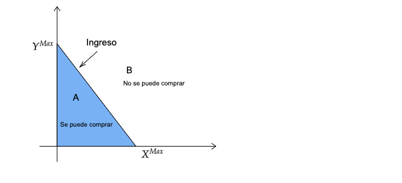
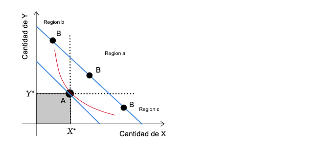

name: xaringan-title
class: left, middle


# Principios de Microeconomía
<br>
## Elección y preferencias
<br>
<br>


### Carlos Yanes | Departamento de Economía | `r Sys.Date()`

```{r Setup, include = F}
options(htmltools.dir.version = FALSE)
library(pacman)
p_load(broom, latex2exp, ggplot2, ggthemes, ggforce, viridis, dplyr, magrittr, knitr, parallel)

library(tidyverse)
library(babynames)
library(fontawesome) # from github: https://github.com/rstudio/fontawesome
library(DiagrammeR)
library(hrbrthemes)
library(econocharts)
library(plotly)
library(kableExtra)

# Knitr options

opts_chunk$set(
  comment = "#>",
  fig.align = "center",
  fig.height = 7,
  fig.width = 7,
  warning = F,
  message = F
)
```

---
class: middle, inverse

.left-column[

# `r emo::ji("crossed_fingers")`

]

.right-column[
# Preguntas de la clase anterior?
]

---
class: title-slide-section-blue

--

# Donde estan?

--

.pull-left[
```{r, echo=FALSE, warning=FALSE, message=FALSE}
# Supongamos que tienes un dataframe llamado 'datos'
datos <- data.frame(
  personas = c("Ginella Cervantes", "Stefania Santodomingo", "Jesús Mendez"),
  tiempo = c(1.18, 1.47, 2.38),
  programa = c("Negocios Internacionales", "Ingeniería Ind.", "Contaduría")
)

# Ordenar el dataframe por la columna 'tiempo'
#datos_ordenados <- datos[order(-datos$tiempo), ]

# Crear el gráfico de barras horizontales con información adicional
grafico <- plot_ly(
  data = datos,
  x = ~tiempo,
  y = ~personas,
  text = ~programa,  # Información adicional para mostrar al pasar el cursor
  type = "bar",
  orientation = 'h'
) |>
  layout(xaxis= list(categoryorder = "total ascending"))

# Mostrar el gráfico interactivo
grafico

```

]

--

.pull-right[]

---
class: title-slide-section-blue, middle

# Uno mas de Elasticidad

<br>


---
# Uno mas de Elasticidad

--

*Recuerde*: La elasticidad puede ser .RUred[elástica] o .black[inelástica]. Esto suele depender del ratio de la formula.

--

$$\text{Elasticidad}= \frac{\text{Cambio porcentual de Q}}{\text{Cambio porcentual de P}}=\frac{\color{#ee3636}{\text{pequeño}}\;\text{cambio}}{\color{#111FC5}{\text{Gran}\;}cambio}= \color{#ee3636}{\text{Inelastico}} $$
--

$$\text{Elasticidad}= \frac{\text{Cambio porcentual de Q}}{\text{Cambio porcentual de P}}=\frac{\color{#8411C5}{\text{Gran}}\;\text{cambio}}{\color{#ee3636}{\text{pequeño}\;}cambio}= \color{#8411C5}{\text{Elastico}}$$

--

`r fa("satellite-dish", fill="blue")` La respuesta (magnitud) de la elasticidad, brinda tambien información referente a cuando un bien posee muchos **sustitutos** o pocos.

---
# Uno mas de Elasticidad

--

```{r, include=FALSE}
datab <-
  data.frame(
    Elasticidad = c(
      "Perfectamente Inelástica",
      "Relativamente Inelástica",
      "Unitaria",
      "Relativamente Elastica",
      "Perfectamente Elástica"
    ),
    Coeficiente = c(
      "E=0 ",
      "0>E>-1",
      "E=-1",
      "-1>E>-inf",
      "E=Infinito"
    ),
    Interpretacion = c("Precio no importa", 
                       "Precio es menos importante que la cantidad comprada",
                       "Precio y cantidad igual de importantes",
                       "Precio es muy importante",
                       "El precio lo es todo")
    )
```

```{r,echo=FALSE}
tab01 <- as.data.frame(datab)
kbl(tab01) %>%
  kable_classic("hover")
```


---
class: title-slide-section-grey, middle

# Elasticidad con mas componentes

<br>


---
# Elasticidad con mas componentes

--

`r fa("burn", fill="red")` Suponga que la cantidad de demanda de un bien X se representa así:

--

$$Q^{d}=14-3P+I+2P_{S}-P_{C}$$
--

.RUred[Ahora conteste lo siguiente:]

--


`r fa("angle-double-right", fill="red")` ¿Que significa cada uno de los elementos de la ecuación?

--

`r fa("angle-double-right", fill="red")` Calcule elasticidad precio de la demanda, elasticidad del ingreso y elasticidad cruzada, cuando:

--

$$P=1,\; I=10,\; P_{S}=2 \; \text{y} \; P_{C}=1$$ 

---
# Elasticidad con mas componentes

--

`r fa("angle-double-right", fill="blue")` Lo primero es reemplazar todos los valores en la ecuación central:

--

$$Q^{d}=14-3(1)+10+2(2)-1=24$$
--

- _La cantidad que se demanda es de 24 unidades cuando cada una de las variables de control tienen un valor_

--

`r fa("angle-double-right", fill="blue")` Luego se aplica cada una de las formulas:

--

$$\epsilon^{d}= \dfrac{P}{Q}\dfrac{\partial Q}{\partial P } ; \quad  \epsilon^{I}= \dfrac{I}{Q}\dfrac{\partial Q}{\partial I } ; \quad \epsilon^{P_{s}}= \dfrac{P_{s}}{Q}\dfrac{\partial Q}{\partial P_{s}}; \quad \epsilon^{P_{c}}= \dfrac{P_{c}}{Q}\dfrac{\partial Q}{\partial P_{c}}$$

---
# Elasticidad con mas componentes

--

Reemplazando y obteniendo los resultados:

--

$$\epsilon^{d}= \dfrac{P}{Q}\dfrac{\partial Q}{\partial P} = \dfrac{1}{24}(-3)=-\dfrac{1}{8}$$
--

$$\epsilon^{I}= \dfrac{I}{Q}\dfrac{\partial Q}{\partial I} = \dfrac{10}{24}(1)=\dfrac{5}{12}$$
--

$$\epsilon^{P_{s}}= \dfrac{P_{s}}{Q}\dfrac{\partial Q}{\partial P_{s}} = \dfrac{2}{24}(2)=\dfrac{1}{6}$$
--

$$\epsilon^{P_{c}}= \dfrac{P_{c}}{Q}\dfrac{\partial Q}{\partial P_{c}} = \dfrac{1}{24}(-1)=-\dfrac{1}{24}$$

---
class: title-slide-section-grey, middle

# Elección y preferencias

<br>


---
# Elección y preferencias

--

<midd-blockquote>**Axiomas** Una _proposición_ que no requiere ser demostrada. Es tan .black[evidente] el enunciado que su verdad parte de su naturaleza y por ende es razonable.</midd-blockquote>

--

<div align="center">
### ..."Algo que no necesita ser demostrado"...
</div align="center">

--

## Axiomas de un consumidor

--

`r fa("bullseye", fill="red")` Completitud

--

`r fa("bullseye")` Transitividad

--

`r fa("bullseye", fill="red")` Insaciabilidad

---
# Elección y preferencias

--

<midd-blockquote>Las .black[preferencias] son un .black[conjunto (X)], donde teniendo una .black[función (f)] se le asigna a cualquier .black[pareja (x,y)] de los distintos elementos de (X) exactamente tres (3) condiciones que implican racionalidad</midd-blockquote>

--

`r fa("bullseye", fill="red")` Completitud: $x\succeq y \quad \color{#03396c}{\text{o tambien}}  \quad y\succeq x \quad \color{#03396c}{\text{entonces va ocurrir que}} \quad y \sim x$.

--

`r fa("bullseye")` Transitividad: Si $f(x,y)= x \succ y \quad \color{#03396c}{\text{y}} \quad f(y,z)= y \succ z \quad \color{#03396c}{\text{entonces}} \; f(x,z)= x\succ z$.

--

`r fa("bullseye", fill="red")` Insaciabilidad:  $f(x_{i},y_{i}) > f(x_{1},y_{1})$

---
class: inverse, middle

# Qué es todo esto?

---
class: title-slide-section-grey, middle, center
background-image: url(https://media.giphy.com/media/xT9KVeFE2nVjxCFPJm/giphy.gif)
background-size: cover
---
# Un ejemplo

--

```{r tpl1, echo=FALSE, out.width="80%"}

```

---
# Un ejemplo

```{r tpl2, echo=FALSE, out.width="80%"}

```

---
# Un ejemplo

```{r tpl3, echo=FALSE, out.width="80%"}

```

---
class: title-slide-section-grey, middle

# Elección

<br>


---
# Elección

--

`r fa("check-circle", fill="blue")` **Preferencias**: Se puede "ordenar" todas las posibles **opciones** que se nos presentan, de mas a menos preferidas.
  
--

`r fa("check-circle", fill="blue")` **Restricciones**: Tiempo, ingresos, cultura, leyes, normas.

--

`r fa("check-circle", fill="blue")` **Utilidad**: Mayor "ranking" está .RUred[asociado] a mayor "utilidad" o nivel de .black[satisfacción].

--

La utilidad aumenta en *cantidades* cada vez menores (rendimientos marginales decrecientes).
  
<div align="center">

</div>

---
# Elección

--

| **Cantidad** | **Utilidad** | **Umg** |
|:-------------------:|:---------------------:|:----------------:|
| 0                   | 0                     | --               |
| 1                   | 15                    | 15               |
| 4                   | 20                    | 5                |
| 5                   | 20                    | 0                |
| 8                   | 19                    | -1               |

--

La **Utilidad marginal** se hace negativa en la medida que los individuos se saturan al consumir siempre de lo mismo.

--

<div align="center">

</div>


---
# Elección

--

`r fa("child", fill="red")` Los consumidores ordenan sus **preferencias** mas o menos de la siguiente forma

--

| **Hamburguesas** | **Bebidas** | **Combinaciones** |
|:-----------------------:|:--------------------:|:--------------------------:|
| 1                       | 4                    | A                          |
| 2                       | 3                    | B                          |
| 3                       | 2                    | C                          |
| 4                       | 1                    | F                          |

--

- Siempre deben sacrificar algo de un bien para obtener otro.

<div align="center">

</div>

---
# Elección

--

```{r kd1, echo=FALSE, out.width="80%"}

```

---
# Elección

```{r kd2, echo=FALSE, out.width="80%"}

```

---
# Elección

```{r kd3, echo=FALSE, out.width="80%"}

```

---
class: title-slide-section-blue, middle

# Curvas de indiferencia

<br>


---
# Curvas de indiferencia

--

### Propiedades de las curvas de indiferencia

--

`r fa ("chevron-circle-right")` Las curvas son .black[densas] con pendientes negativas (siempre hay que sacrificar algo).

--

`r fa ("chevron-circle-right")` No se pueden .black[interceptar]. (Se viola la transición)

--

`r fa ("chevron-circle-right")` De acuerdo a la clasificación de bienes pueden tener distintas formas.

---
# Curvas de indiferencia

--

```{r tgb12, echo=FALSE, out.width="60%"}

```

---
class: title-slide-section-blue, middle

# Curvas de indiferencia e Ingreso

<br>


---
# Curvas de indiferencia e Ingreso

--

```{r tgb123, echo=FALSE, out.width="80%"}

```

---
# Curvas de indiferencia e Ingreso

--

`r fa ("cc-visa", fill="red")` Es importante tener presente que un determinador de la utilidad es la capacidad .black[monetaria] o ingreso de un individuo.

--

`r fa ("cc-visa", fill="red")` Los consumidores, empresarios y agentes económicos se enfrentan siempre a restricciones.

--

$$I=P_{x}X+P_{y}Y$$
--

`r fa ("cc-visa", fill="red")` Todo debe ser gastado en los bienes que se tenga a disposición.

---
# Curvas de indiferencia e Ingreso

--

```{r tgb1234, echo=FALSE, out.width="80%"}

```

---
# Curvas de indiferencia e Ingreso

--

La tasa por la cual se .black[sacrifica] un bien por otro manteniendo *constante* el nivel de utilidad se denomina **tasa marginal de sustitución**.

--

$$Umg_{x}=Umg_{y}$$

--

Viene a ser:

--

$$T.M.S= \dfrac{Umg_{x}}{Umg_{y}}$$
---
# Curvas de indiferencia e Ingreso

--

`r fa("bullhorn", fill="red")` Piense por un momento en la siguiente función de utilidad de un individuo:

--

$$U=U(X,Y)$$

--

La derivada .black[total] de $U$ viene a ser:

--

$$U= \frac{\partial U}{\partial x}dx+\frac{\partial U}{\partial y}dy$$
--

A lo largo de cualquier curva de .black[indiferencia], la utilidad es **constante**.

--

$$dU=0$$

--

$$TMS= - \frac{dy}{dx} \biggr\rvert_{U = Constante}  =\frac{\frac{\partial U}{\partial x}}{\frac{\partial U}{\partial y}}$$
--

La TMS es la tasa o relación entre utilidades **marginales** de $X$ y $Y$.

---
class: inverse, middle

# Miremos un ejemplo...

---
# TMS un ejemplo

--

`r fa("burn", fill="red")` Piense por un momento que tiene la función de *utilidad* de un individuo cuando consume dos bienes $(x,y)$ y es:

--

$$U(x,y)= x^{0.5}y^{0.5}$$

--

*Lo unico que hay que hacer es derivar*

--

$$\frac{dU}{dx}=0.5x^{-0.5}y^{0.5}$$
--

*Hacer lo mismo con y*

--

$$\frac{dU}{dy}=0.5x^{0.5}y^{-0.5}$$

--

*Solo nos queda dividir*

--

$$T.M.S=\frac{0.5x^{-0.5}y^{0.5}}{0.5x^{0.5}y^{-0.5}}$$
---
# TMS un ejemplo

--

*Se van un montón de cosas*

--

$$T.M.S=\frac{y^{0.5}y^{0.5}}{x^{0.5}x^{0.5}}=\frac{y}{x}$$
--

`r fa("battery-quarter", fill="red") ` la relación es 1 a 1, lo que quiere decir que el individuo solo sacrificará una unidad de (y) para adquirir una de (x).

--
`r fa("battery-quarter", fill="red") ` Tenga muy en cuenta las **preferencias** de los individuos, estas pueden cambiar de forma muy fuerte y para renunciar a algo deban darle algo adicional o demás ya que no querrá desprenderse de lo que mas valora.

---
class: center, middle, inverse
# Una persona que come pizzas y toma Pepsi ¿Cómo puede mirar lo anterior? 🙈 

---
# Ejemplo

--

`r fa("stamp", fill="blue")` Tomemos que el precio de la **Pepsi** es de 1$ (us) y de la .RUred[pizza] es del doble 2 (us)

--

| Cantidad Pepsi | Utilidad | **Umg (pepsi)** | Cantidad Pizza | Utilidad | **Umg (pizza)** |
| -------------- | -------- | ----------- | -------------- | -------- | ----------- |
| 1              | 9        | 9           | 1              | 20       | 10          |
| 2              | 8        | 8           | 2              | 16       | 8           |
| 3              | 7        | 7           | **3**          | 12       |.hi-red[ 6]  |
| **4**          | 6        | .hi-red[6]  | 4              | 8        | 4           |
| 5              | 5        | 5           | 5              | 4        | 2           |
| 6              | 4        | 4           | 6              | 0        | 0           |
| 7              | 3        | 3           | 7              | \-4      | \-2         |
| 8              | 2        | 2           | 8              | \-8      | \-4         |
| 9              | 1        | 1           | 9              | \-12     | \-6         |
| 10             | 0        | 0           | 10             | \-16     | \-8         |

--

*En la parte de Umg estamos dividiendo su utilidad con respecto al precio*


---
# Ejemplo 

--

El cuadro de decisión nos permite hallar:

--

| Combinaciones                                       | Utilidad Total      |
| --------------------------------------------------- | --------------------|
| 5 Porciones de pizza (20+16+12+8+4)                 | 60 Útiles           |
| 2 Pepsis (9+8) y 4 Pizzas (20+16+12+8)              | 73 Útiles           |
| .RUred[4 Pepsis (9+8+7+6) y 3 Pizzas (20+16+12) ]  | .RUred[78 Útiles]  |
| 6 Pepsis (9+8+7+6+5+4) y 2 Pizzas (20+16)           | 75 Útiles           |
| 8 Pepsis (9+8+7+6+5+4+3+2) y 1 Pizzas (20)          | 64 Útiles           |
| 10 Pepsis (9+8+7+6+5+4+3+2+1+0)                     | 45 Útiles           |

--

La **utilidad marginal** por cada dolar/peso gastado incide en la optimización de que es lo mejor para el .RUred[individuo]. La relación no puede ser la misma para otros, sin embargo, puede optimizar de acuerdo a sus .blue[gustos]. Tomar **4** Pepsis y **3** Pizzas conlleva al individuo a optimizar 

---
class: center, middle, inverse
# Y como inciden los distintos tipos de bienes

---
# Tipos de bienes 

--

$$\textrm{Tipos de Bienes}
\begin{cases}
P_{x}\uparrow  & \Rightarrow  x\downarrow \text{Normal} \\ 
I_{x}\uparrow  & \Rightarrow  x\uparrow \text{Normal} \\ 
P_{x}\uparrow  & \Rightarrow  x\uparrow \text{Lujo}  \\ 
I_{x}\uparrow  & \Rightarrow  x\downarrow \text{Inferior} 
\end{cases}$$

--

`r fa("satellite-dish", fill="red")` hay otros bienes como los **Giffen**, **Neutrales** y bienes que son considerados como **Males**.

--

En cursos mas *avanzados* le enseñaran a clasificarlos mediante las derivadas.

--

$$\frac{\partial Q_{i}}{\partial P}= (-)$$

--

Que nos indica que frente a una variación en el .hi-red[precio] la **cantidad de demanda** se .ul[reduce]


---
class: title-slide-section-grey, middle, center

# Otras funciones de utilidad

---
# Funciones de utilidad

--

`r fa("scroll", fill="blue")` Dependen del tipo de bienes que enfrenta cada **consumidor**. Desde luego las tasas marginales de sustitución cambian.

--

**Complementarios** con función  $U(x,y)= min \{x,y\}$

--

**Sustitutos perfectos** con función $U(x,y)= Ax+By$


---
class: title-slide-section-grey, middle, center
background-image: url(https://media.giphy.com/media/LTFbyWuELIlqlXGLeZ/giphy.gif)
background-size: cover

---
class: title-slide-section-grey
# Bibliografía

`r fa('book')` Acemoglu, D., Laibson, D., & List, J. (2021). *Economics*, eBook. Pearson Higher Ed.

`r fa('book')` Krugman, P., & Wells, R. (2014). *Microeconomics (for AP)*. New York: Worth Publishers.

`r fa('book')` Muñoz-Garcia, F. (2017). *Advanced microeconomic theory: an intuitive approach with examples*. MIT Press.


---
class: title-slide-final, middle

# Gracias por su atención!

## Alguna pregunta adicional?

### Carlos Andres Yanes Guerra
`r fa("envelope", fill="red")` cayanes@uninorte.edu.co
`r fa("university", fill="blue")` Universidad del Norte