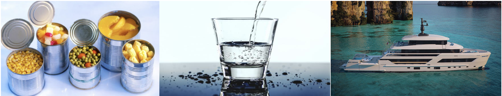
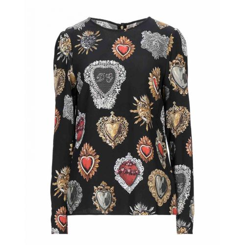
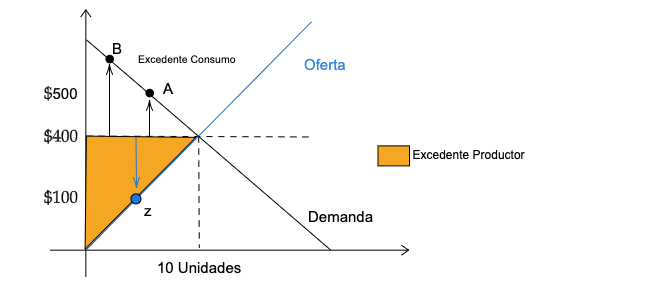

name: xaringan-title
class: left, middle


# Principios de Microeconomía
<br>
## Ingreso-Consumo y Excedentes
<br>
<br>


### Carlos Yanes | Departamento de Economía | `r Sys.Date()`

```{r Setup, include = F}
options(htmltools.dir.version = FALSE)
library(pacman)
p_load(broom, latex2exp, ggplot2, ggthemes, ggforce, viridis, dplyr, magrittr, knitr, parallel, extrafont)

library(tidyverse)
library(babynames)
library(fontawesome) # from github: https://github.com/rstudio/fontawesome
library(DiagrammeR)
library(hrbrthemes)
library(econocharts)
library(plotly)
library(kableExtra)

# colors

red_pink <- "#e64173"
met_slate <- "#272822" # metropolis font color 
purple <- "#9370DB"
green <- "#007935"
light_green <- "#7DBA97"
orange <- "#FD5F00"
turquoise <- "#44C1C4"
red <- "#b92e34"

# Knitr options

opts_chunk$set(
  comment = "#>",
  fig.align = "center",
  fig.height = 7,
  fig.width = 7,
  warning = F,
  message = F
)

theme_simple <- theme_bw() + theme(
  axis.line = element_line(color = met_slate),
  panel.grid = element_blank(),
  rect = element_blank(),
  strip.text = element_blank(),
  text = element_text(family = "Fira Sans", color = met_slate, size = 17),
  # axis.text.x = element_text(size = 12),
  # axis.text.y = element_text(size = 12),
  axis.ticks = element_blank()
)
theme_market <- theme_bw() + theme(
  axis.line = element_line(color = met_slate),
  panel.grid = element_blank(),
  rect = element_blank(),
  strip.text = element_blank(),
  text = element_text(family = "Fira Sans", color = met_slate, size = 17),
  axis.title.x = element_text(hjust = 1, size = 17),
  axis.title.y = element_text(hjust = 1, angle = 0, size = 17),
  # axis.text.x = element_text(size = 12),
  # axis.text.y = element_text(size = 12),
  axis.ticks = element_blank()
)
theme_gif <- theme_bw() + theme(
  axis.line = element_line(color = met_slate),
  panel.grid = element_blank(),
  rect = element_blank(),
  text = element_text(family = "Fira Sans", color = met_slate, size = 17),
  axis.text.x = element_text(size = 12),
  axis.text.y = element_text(size = 12),
  axis.ticks = element_blank()
)
wrapper <- function(x, ...) paste(strwrap(x, ...), collapse = "\n")
```

---
class: middle, inverse

.left-column[

# `r emo::ji("cool")`

]

.right-column[
# Preguntas de la clase anterior?
]

---
class: title-slide-section-blue, middle

## Felicitaciones a

--

.pull-left[
- .white[Orlando Lora 🥇🥇 1:46]
- .white[Marianna Salazar L. 2:17]
- .white[Natalia Peinado R. 2:19]
- .white[Maria Almanza H. 2:23]
]

]

.pull-right[]


---
class: title-slide-section-grey, middle

# Medidas del Bienestar

<br>


---
# Medidas de bienestar

--

`r fa("sketch", fill="blue")` La **demanda** de bienes data lo que podemos consumir de acuerdo al nivel de precios de una economía. *Un primer indicador*

--

`r fa("sketch", fill="blue")` En la medida que los **costos de oportunidad** también son acogidos y llevados a su militarización tambien se genera bienestar.

--

`r fa("sketch", fill="blue")` Hoy intentaremos mirar la parte de las medidas de .RUred[**Ingreso-consumo**] y lo que hace referencia a los .RUred[**Excedentes**]

---
class: inverse, middle

--

# Como va lo de la elasticidad con el ingreso? 🎤

---
# Elasticidad Ingreso

--

`r fa("tablet", fill="red")` Somos conscientes que la elasticidad con el **ingreso** siempre es positiva, por su relación con el consumo de bienes.

--

| Elasticidad      | Tipo de Bienes | Ejemplo   |
|------------------|----------------|-----------|
| $\epsilon_i <0$  | Inferior       | Enlatados |
| $0<\epsilon_i <1$| Normal         | Agua      |
| $\epsilon_i >1$  | Lujo           | Yates     |

--

<br>

<div align="center">


---
# Curva Ingreso - Consumo

--

Para esto, hay que mirar gráficamente:

--

.pull-left[
```{r hic, out.width="200%", echo=FALSE}

```
]

--

.pull-right[
+ En el punto .black[A] parte el consumo inicial del individuo.
{{content}}
]

--

+ Cuando aumenta el ingreso a $\color{#d11913}{M_{2}}$, se desplaza el óptimo al punto **B** (sigue dándose tangencia).
{{content}}

--

+ Si el ingreso aún sigue aumentando a $\color{#d11913}{M_{3}}$ la canasta del punto **C** sigue siendo óptima y es mas preferida.
{{content}}

---
# Curva Ingreso - Consumo

--

Otra cosa son los **segmentos**, si la pendiente se vuelve:

--

.pull-left[
```{r hic1, out.width="200%", echo=FALSE}

```
]

--

.pull-right[
+  **Segmento (A-B)** <span style="color:green">positivo</span>, el consumo se incrementa en una misma *proporción* y se compra de ambos bienes $x,y \rightarrow$ **normal**.
{{content}}
]

--

+ **Segmento (B-C)** <span style="color:red">positivo</span>, el consumo NO se incrementa en una misma *proporción* y se compra mas del bien $y \rightarrow x$ podría ser **inferior**.
{{content}}

---
# Curva Ingreso - Consumo

--

<midd-blockquote> **Curva de Engel** Muestra como el _ingreso_ afecta la demanda de un bien</midd-blockquote>

--

Podemos graficarlo de la siguiente forma

--

```{r hic2,out.width="80%", echo=FALSE}

```

---
# Curva Ingreso - Consumo

--
`r fa("atom", fill="orange")` Para la parte .black[(A)] el consumo se incrementa cuando el *ingreso* lo hace. _P.e: Los bienes inmuebles_.

--

  + La **pendiente** es .black[positiva].

--

`r fa("atom", fill="orange")` Para la parte .black[(B)] el consumo se incrementa cuando el ingreso lo hace pero solo hasta cuando el individuo es lo suficientemente rico. _P.e: Los enlatados y el transporte público_.

--

  + La **pendiente** empieza a ser .black[positiva] y luego se contrae hasta llegar a ser .black[negativa]. _Es un bien de entrada normal, pero luego puede ser inferior_.
  
---
class: title-slide-section-grey, middle

# Excedentes (Consumidor y Productor)

<br>


---
# Excedente del Consumidor

--

<midd-blockquote>Es el **valor** que paga un consumidor de acuerdo a su disposición por pagar para adquirir un producto, bien o servicio.</midd-blockquote>

--

En otros **términos** la diferencia entre lo que esta dispuesto(a) a pagar y lo que realmente paga (precio de mercado)

--

#### Si una persona le dan 200 dolares al mes estaría dispuesta a dejar de fumar?

--

La .RUred[disposición] siempre impacta tambien en lo que es los precios/salarios de **reserva**.

--

|           | Disponibilidad | Precio Pagado | Excedente |
| --------- | -------------- | ------------- | --------- |
| Byron     | 50             | 30            | 20        |
| Carla     | 45             | 30            | 15        |
| Jefferson | 43             | 30            | 13        |
| Luis      | 35             | 30            | 5         |
| Maira     | 28             |               |           |
| Estefania | 20             |               |           |


---
# Excedente del Consumidor

--

| Nombre        | Disponibilidad a pagar          |
|---------------|---------------------------------|
| Andres        | $1'200.000                      |
| Angie         | 1'100.000                       |
| Laura         | 1'050.000                       |
| Maggy         | 1'000.000                       |

---
# Excedente del Consumidor

--

```{r exc1, echo=FALSE}

```

---
# Excedente del Consumidor

--

Precio             | Quien compra          | Demanda de celulares   |
-------------------|-----------------------|------------------------|
Mas de $1'200.     | Ninguno               | 0                      |
De $1'200 a 1'101  | Andrés                | 1                      |
De $1'101 a 1'051  | Andrés y Angie        | 2                      |
De $1'051 a 1'001  | Andrés, Angie y Laura | 3                      |
1'000 a menos      | Todo(a)s              | 4                      |

---
# Excedente del Consumidor

--

```{r exc2, echo=FALSE}

```

---
class: inverse, middle

# Como es el asunto con el Productor?

---
# Excedente del Productor

--

<midd-blockquote>Es el **valor** que recibe un vendedor de acuerdo a su disposición por venta y/o de ofrecer un producto, bien o servicio.</midd-blockquote>

--

| Nombre        | Disponibilidad a ofrecer  |
|---------------|---------------------------|
| Borja         | $210.000                  |
| Viera         |  180.000                  |
| Cariaco       |  150.000                  |

---
# Excedente del Productor

--

```{r exp1, echo=FALSE}

```

---
# Excedente del Productor

--

```{r exp2, echo=FALSE}

```

---
class: inverse, middle, center
background-image: url(https://upload.wikimedia.org/wikipedia/commons/b/b1/Dolce_and_Gabbana.svg)
background-size: contain

# Suponga el siguiente ejemplo

---
# Pregunta

### Al público

--

.black[Tatiana] decide comprar una blusa en _Falabella_ de **Dolce & Gabbana** por valor de $800.000. Ella estaba dispuesta a pagar hasta 1'000.000 por ella. Cuando la compra y se la muestra a su mejor amiga .black[Adriana], ésta se enamora de la blusa y como le gusta tanto - la valora en 1'500.000- . Le hace una oferta a su amiga por valor de 1'200.000, la cual, accede a venderle la blusa de lo mas de contenta.

--

### ¿Cuánto es el excedente total de la transacción?

--

<div align="center">


---
# Respuesta

--

`r fa("box-open", fill="blue")` El excedente es:

--

$$\text{Excedente total}\Rightarrow \underbrace{200.000}_{\text{Exc Productor Tatiana}}  + \underbrace{300.000}_{\text{Exc. Consumidor Adriana}} = 500.000$$

--

Si creía que era de $400.000 esta errado(a).

--

El **Excedente total** es la suma del excedente del productor mas el del consumidor en la última etapa de la venta.
---
# Suma de excedentes

--

```{r exptot, echo=FALSE}

```
---
# Otro ejemplo

--

Suponga que tiene un mercado cuya función de demanda es $Q_d=30-2P$ y la oferta es $Q_s=20P$. Cuanto es el excedente del consumidor?

--

$$\begin{aligned}
30-2P=&20P\\
30=&22P\\
1.36=&P^{*}
\end{aligned}$$


--

Demanda será en efecto $Q=27.27$ y el excedende es:

--

$$Exc=\frac{b*a}{2}\Rightarrow \frac{(27.27)(15-1.36)}{2}=13.64$$
--

Esta viene a ser el área de bienestar del individuo. Puede crecer o ser mas grande en la medida que baja el precio.


---
class: inverse, middle

--

# Cómo es eso de los impuestos? 

---
# Impuestos

--

Por qué nuestros gobernantes nos implantan .RUred[Impuestos] y proveen de .black[subsidios]?

--

.pull-left[
## .RUred[Impuestos]

1. Recaudar ingresos para bienes públicos.

2. Desincentivar los "malos" comportamientos.

3. Redistribuir la renta o la riqueza.
]

.pull-right[
## .blue[Subsidios]

1. Proporcionar estímulo económico.

2. Fomentar los "buenos" comportamientos.

3. Redistribuir la renta o la riqueza.
]

---
# Impuestos

--

+ Impuestos por unidad

  - Impuestos al tabaco, el cannabis y el alcohol.
  - Impuestos especiales sobre el alojamiento, la gasolina y otros bienes. 
  - Impuesto sobre las ventanas en el Reino Unido (1696-1851).

--

+ Impuestos ad valorem

    - Impuestos sobre las ventas.
    - Impuestos sobre nóminas e ingresos.
    - Impuestos sobre la propiedad.

--
    
+ Impuestos lump-sum.

    - Tasas de registro mercantil.
    - Sobre tasa gasolina.

---
# Impuestos

--

.left-column[

**P:** ¿Cómo afecta un impuesto por unidad a los productores, al precio y la cantidad de equilibrio?

```{R, echo = F, escape = F}
tab <- data.frame(
  v1 = c("Mercado",  "P_Cons", "P_Prod"),
  v2 = c(4.5, "$5.50", "$5.50"),
  v3 = c("", "", "")
) %>% kable(
  escape = F,
  col.names = c("Impuesto", "$0.00", "$3.00"),
  align = c("l", "c", "c")
) %>%
  kable_styling() %>% 
  row_spec(1:3, extra_css = "line-height: 110%;")
tab 
```
]

.right-column[
```{r, echo = FALSE, fig.height = 5, fig.width = 5, dev = "svg"}
demand <- function(x) 10 - x
supply <- function(x) 1 + x
tax <- 3
supply_tax <- function(x) supply(x) + tax
x <- 0:10
q <- uniroot(function(x) demand(x) - supply(x), range(x))$root
q_2 <- uniroot(function(x) demand(x) - supply_tax(x), range(x))$root
p <- supply(q)
ps_2 <- supply(q_2)
pd_2 <- demand(q_2)
z <- seq(0, q, 0.01)
base <- ggplot() +
  scale_x_continuous(limits = c(0, 10.5), expand = c(0, 0), breaks = seq(0, 10, 1)) +
  scale_y_continuous(limits = c(0, 10.5), expand = c(0, 0), breaks = seq(0, 10, 1)) +
  labs(x = "Q", y = "P")+theme_classic()

base +
  stat_function(fun = supply, color = "purple", size = 1) + # supply function
  stat_function(fun = demand, color = "pink", size = 1) + # demand function
  annotate("text", label = expression(D), x = 9, y = 1.6, color = "red", size = 9) +
  annotate("text", label = expression(S), x = 9, y = 9.5, color = "purple", size = 9) +
  geom_segment(aes(x = q, y = 0, xend = q, yend = p), linetype  = "dashed", color = "black", size = 1) + # Q*
  geom_segment(aes(x = 0, y = p, xend = q, yend = p), linetype  = "dashed", color = "black", size = 1) + # P*
  geom_point(aes(x = q, y = p), color = "purple", size = 2) # equilibrium bundle

```
]
---
# Impuestos

.left-column[

**P:** ¿Cómo afecta un impuesto por unidad a los productores, al precio y la cantidad de equilibrio?

```{R, echo = F, escape = F}
tab <- data.frame(
  v1 = c("Mercado",  "P_Cons", "P_Prod"),
  v2 = c(4.5,  "$5.50", "$5.50"),
  v3 = c(3, "$7.00", "$4.00")
) %>% kable(
  escape = F,
  col.names = c("Impuesto", "$0.00", "$3.00"),
  align = c("l", "c", "c")
) %>%
  kable_styling() %>% 
  row_spec(1:3, extra_css = "line-height: 110%;")
tab 
```

]


.right-column[
```{r, echo = FALSE, fig.height = 5, fig.width = 5, dev = "svg"}
base +
  stat_function(fun = supply, color = "purple", size = 1) + # supply function
  stat_function(fun = supply_tax, color = "purple", size = 1) + # supply function (tax)
  stat_function(fun = demand, color = "pink", size = 1) + # demand function
  annotate("text", label = expression(D), x = 9, y = 1.6, color = "pink", size = 9) +
  annotate("text", label = expression(S), x = 9, y = 9.5, color = "purple", size = 9) +
  annotate("text", label = expression(S[Imp]), x = 9 - tax + 0.55, y = 9.5, color = "purple", size = 9) +
  geom_segment(aes(x = q, y = 0, xend = q, yend = p), linetype  = "dashed", color = "black", size = 1, alpha = 0.5) + # Q*
  geom_segment(aes(x = 0, y = p, xend = q, yend = p), linetype  = "dashed", color = "black", size = 1, alpha = 0.5) + # P*
  geom_point(aes(x = q, y = p), color = met_slate, size = 2, alpha = 0.5) +
  
  geom_segment(aes(x = q_2, y = ps_2, xend = q_2, yend = pd_2), linetype  = "dashed", color = "black", size = 1) + 
  geom_segment(aes(x = 0, y = pd_2, xend = q_2, yend = pd_2), linetype  = "dashed", color = "black", size = 1) + 
  geom_point(aes(x = q_2, y = pd_2), color = met_slate, size = 2) +
  
  geom_segment(aes(x = q_2, y = 0, xend = q_2, yend = ps_2), linetype  = "dashed", color = "black", size = 1) + 
  geom_segment(aes(x = 0, y = ps_2, xend = q_2, yend = ps_2), linetype  = "dashed", color = "black", size = 1) + 
  geom_point(aes(x = q_2, y = ps_2), color = met_slate, size = 2)
```
]

---
# Impuestos
.left-column[

**P:** ¿Cómo afecta un impuesto por unidad a los productores, al precio y la cantidad de equilibrio?

```{R, echo = F, escape = F}
tab <- data.frame(
  v1 = c("Mercado",  "P_Cons", "P_Prod"),
  v2 = c(4.5, "$5.50", "$5.50"),
  v3 = c(3, '<font color="#e64173">$7.00</font>', '<font color="#e64173">$4.00</font>')
) %>% kable(
  escape = F,
  col.names = c("Impuesto", "$0.00", "$3.00"),
  align = c("l", "c", "c")
) %>%
  kable_styling() %>% 
  row_spec(1:3, extra_css = "line-height: 110%;")
tab 
```
]

.right-column[
```{r, echo = FALSE, fig.height = 5, fig.width = 5, dev = "svg"}
base +
  stat_function(fun = supply, color = "purple", size = 1) + # supply function
  stat_function(fun = supply_tax, color = "purple", size = 1) + # supply function (tax)
  stat_function(fun = demand, color = "pink", size = 1) + # demand function
  annotate("text", label = expression(D), x = 9, y = 1.6, color = "pink", size = 9) +
  annotate("text", label = expression(S), x = 9, y = 9.5, color = "purple", size = 9) +
  annotate("text", label = expression(S[Imp]), x = 9 - tax + 0.55, y = 9.5, color = "purple", size = 9) +
  # geom_segment(aes(x = q, y = 0, xend = q, yend = p), linetype  = "dashed", color = met_slate, size = 1, alpha = 0.5) + # Q*
  # geom_segment(aes(x = 0, y = p, xend = q, yend = p), linetype  = "dashed", color = met_slate, size = 1, alpha = 0.5) + # P*
  # geom_point(aes(x = q, y = p), color = met_slate, size = 2, alpha = 0.5) +
  
  geom_segment(aes(x = q_2, y = ps_2, xend = q_2, yend = pd_2), linetype  = "solid", color = "black", size = 1) + 
  geom_segment(aes(x = 0, y = pd_2, xend = q_2, yend = pd_2), linetype  = "dashed", color = "black", size = 1) + 
  geom_point(aes(x = q_2, y = pd_2), color = "black", size = 2) +
  
  geom_segment(aes(x = q_2, y = 0, xend = q_2, yend = ps_2), linetype  = "dashed", color = "black", size = 1) + 
  geom_segment(aes(x = 0, y = ps_2, xend = q_2, yend = ps_2), linetype  = "dashed", color = "black", size = 1) + 
  geom_point(aes(x = q_2, y = ps_2), color = "black", size = 2) +
  annotate("text", label = "Imp", x = q_2 + 0.45, y = p, size = 5, angle = 0, color = "black") 
```
]
---
# Impuestos

--

.left-column[

**P:** ¿Cómo el impuesto tiene inferencia en el excedente de mercado?

```{R, echo = F, escape = F}
tab <- data.frame(
  v1 = c("EC", "EP", "Gob", "ST"),
  v2 = c("$10.125", "$10.125", "$0.00", "$20.25"),
  v3 = c("", "", "", "\\( \\qquad \\, \\ \\ \\)")
) %>% kable(
  escape = F,
  col.names = c("Impuesto", "$0.00", "$3.00"),
  align = c("l", "c", "c")
) %>%
  kable_styling() %>% 
  row_spec(1:3, extra_css = "line-height: 110%;")
tab 
```
]

.right-column[
```{r, echo = FALSE, fig.height = 5, fig.width = 5, dev = "svg"}
base +
  stat_function(fun = supply, color = "purple", size = 1) + # supply function
  #stat_function(fun = supply_tax, color = "purple", size = 1) + # supply function (tax)
  stat_function(fun = demand, color = "pink", size = 1) + # demand function
  annotate("text", label = expression(D), x = 9, y = 1.6, color = "pink", size = 9) +
  annotate("text", label = expression(S), x = 9, y = 9.5, color = "purple", size = 9) +
  #annotate("text", label = expression(S[Impuesto]), x = 9 - tax + 0.55, y = 9.5, color = "purple", size = 9) +
  geom_segment(aes(x = q, y = 0, xend = q, yend = p), linetype  = "dashed", color = "black", size = 1, alpha = 0.5) + # Q*
  geom_segment(aes(x = 0, y = p, xend = q, yend = p), linetype  = "dashed", color = "black", size = 1, alpha = 0.5) + # P*
  geom_point(aes(x = q, y = p), color = "black", size = 2, alpha = 1) +
  geom_ribbon(aes(x = z, ymin = supply(z), ymax = p), fill = purple, alpha = 0.2, linetype = "blank") + # PS
  annotate("text", label = "EP", x = q/3, y = p - 1.5, color = purple, family = "Fira Sans", size = 6) +
  geom_ribbon(aes(x = z, ymin = p, ymax = demand(z)), fill = red_pink, alpha = 0.2, linetype = "blank") + # CS
  annotate("text", label = "EC", x = q/3, y = p + 1.5, color = red_pink, family = "Fira Sans", size = 6) 

```
]
---
# Impuestos

.left-column[

**P:** ¿Cómo el impuesto tiene inferencia en el excedente de mercado?

```{R, echo = F, escape = F}
tab <- data.frame(
  v1 = c("EC", "EP", "Gob", "ST"),
  v2 = c("$10.125", "$10.125", "$0.00", "$20.25"),
  v3 = c("$4.50", "$4.50", "$9.00", "$18.00")
) %>% kable(
  escape = F,
  col.names = c("Impuesto", "$0.00", "$3.00"),
  align = c("l", "c", "c")
) %>%
  kable_styling() %>% 
  row_spec(1:3, extra_css = "line-height: 110%;")
tab 
```
]

.right-column[
```{r, echo = FALSE, fig.height = 5, fig.width = 5, dev = "svg"}
w <- seq(0, q_2, 0.01)
base +
  stat_function(fun = supply, color = purple, size = 1) + # supply function
  stat_function(fun = supply_tax, color = purple, size = 1) + # supply function (tax)
  stat_function(fun = demand, color = red_pink, size = 1) + # demand function
  annotate("text", label = expression(D), x = 9, y = 1.6, color = red_pink, family = "Fira Sans", size = 9) +
  annotate("text", label = expression(S), x = 9, y = 9.5, color = purple, family = "Fira Sans", size = 9) +
  annotate("text", label = expression(S[Imp]), x = 9 - tax + 0.55, y = 9.5, color = purple, family = "Fira Sans", size = 9) +
  
  geom_ribbon(aes(x = w, ymin = supply(w), ymax = ps_2), fill = purple, alpha = 0.2, linetype = "blank") + # PS
  annotate("text", label = "EP", x = q_2/3, y = ps_2 - 1, color = purple, family = "Fira Sans", size = 6) +
  geom_ribbon(aes(x = w, ymin = pd_2, ymax = demand(w)), fill = red_pink, alpha = 0.2, linetype = "blank") + # CS
  annotate("text", label = "EC", x = q_2/3, y = pd_2 + 1, color = red_pink, family = "Fira Sans", size = 6) +
  geom_ribbon(aes(x = w, ymin = ps_2, ymax = pd_2), fill = green, alpha = 0.2, linetype = "blank") + # GR
  annotate("text", label = expression(Gob), x = q_2/3, y = p + 0.2, color = green, family = "Fira Sans", size = 6) +
  
  geom_segment(aes(x = q_2, y = ps_2, xend = q_2, yend = pd_2), linetype  = "solid", color = met_slate, size = 1) +
  geom_segment(aes(x = 0, y = pd_2, xend = q_2, yend = pd_2), linetype  = "dashed", color = met_slate, size = 1) +
  geom_point(aes(x = q_2, y = pd_2), color = met_slate, size = 2) +
  geom_segment(aes(x = q_2, y = 0, xend = q_2, yend = ps_2), linetype  = "dashed", color = met_slate, size = 1) +
  geom_segment(aes(x = 0, y = ps_2, xend = q_2, yend = ps_2), linetype  = "dashed", color = met_slate, size = 1) +
  geom_point(aes(x = q_2, y = ps_2), color = met_slate, size = 2) 

```
]
---
# Impuestos

--

.left-column[

**P:** ¿Qué ocurre con la eficiencia del mercado?

]

.right-colum[
```{r, echo = FALSE, fig.height = 5, fig.width = 5, dev = "svg"}
w <- seq(0, q_2, 0.01)
w_2 <- seq(q_2, q, 0.01)
base +
  stat_function(fun = supply, color = purple, size = 1) + # supply function
  stat_function(fun = supply_tax, color = purple, size = 1) + # supply function (tax)
  stat_function(fun = demand, color = red_pink, size = 1) + # demand function
  annotate("text", label = expression(D), x = 9, y = 1.6, color = red_pink, family = "Fira Sans", size = 9) +
  annotate("text", label = expression(S), x = 9, y = 9.5, color = purple, family = "Fira Sans", size = 9) +
  annotate("text", label = expression(S[Impuesto]), x = 9 - tax + 0.55, y = 9.5, color = purple, family = "Fira Sans", size = 9) +
  
  geom_segment(aes(x = q_2, y = ps_2, xend = q_2, yend = pd_2), linetype  = "solid", color = met_slate, size = 1) +
  geom_segment(aes(x = 0, y = pd_2, xend = q_2, yend = pd_2), linetype  = "dashed", color = met_slate, size = 1) +
  geom_point(aes(x = q_2, y = pd_2), color = met_slate, size = 2) +
  geom_segment(aes(x = q_2, y = 0, xend = q_2, yend = ps_2), linetype  = "dashed", color = met_slate, size = 1) +
  geom_segment(aes(x = 0, y = ps_2, xend = q_2, yend = ps_2), linetype  = "dashed", color = met_slate, size = 1) +
  geom_point(aes(x = q_2, y = ps_2), color = met_slate, size = 2) +
  geom_ribbon(aes(x = w_2, ymin = supply(w_2), ymax = p), fill = orange, alpha = 0.2, linetype = "blank") +
  geom_ribbon(aes(x = w_2, ymin = p, ymax = demand(w_2)), fill = orange, alpha = 0.2, linetype = "blank") +
  annotate("text", label = "Ineficiencia", x = (q + q_2)/2 - 0.125, y = p, color = orange, family = "Fira Sans", size = 6)
```
]
---
class: inverse, middle

--

# Y si solo buscaramos afectar al consumidor? 👀

---
# Impuesto al consumidor

.left-column[

**P:** ¿Cómo afecta un impuesto por unidad a los consumidores, al precio y la cantidad de equilibrio?

```{R, echo = F, escape = F}
tab <- data.frame(
  v1 = c("Mercado",  "P_Cons", "P_Prod"),
  v2 = c(4.5, "$5.50", "$5.50"),
  v3 = c("","","")
) %>% kable(
  escape = F,
  col.names = c("Impuesto", "$0.00", "$3.00"),
  align = c("l", "c", "c")
) %>%
  kable_styling() %>% 
  row_spec(1:3, extra_css = "line-height: 110%;")
tab 
```
]

.right-column[
```{r, echo = FALSE, fig.height = 5, fig.width = 5, dev = "svg"}
 demand <- function(x) 10 - x
supply <- function(x) 1 + x
tax <- 3
demand_tax <- function(x) demand(x) - tax
x <- 0:10
q <- uniroot(function(x) demand(x) - supply(x), range(x))$root
q_2 <- uniroot(function(x) demand_tax(x) - supply(x), range(x))$root
p <- supply(q)
ps_2 <- supply(q_2)
pd_2 <- demand(q_2)
z <- seq(0, q, 0.01)
base <- ggplot() +
  scale_x_continuous(limits = c(0, 10.5), expand = c(0, 0), breaks = seq(0, 10, 1)) +
  scale_y_continuous(limits = c(0, 10.5), expand = c(0, 0), breaks = seq(0, 10, 1)) +
  labs(x = "Q", y = "P") +
  theme_market
base +
  stat_function(fun = supply, color = purple, size = 1) + # supply function
  stat_function(fun = demand, color = red_pink, size = 1) + # demand function
  annotate("text", label = expression(D), x = 9, y = 1.6, color = red_pink, family = "Fira Sans", size = 9) +
  annotate("text", label = expression(S), x = 9, y = 9.5, color = purple, family = "Fira Sans", size = 9) +
  geom_segment(aes(x = q, y = 0, xend = q, yend = p), linetype  = "dashed", color = met_slate, size = 1) + # Q*
  geom_segment(aes(x = 0, y = p, xend = q, yend = p), linetype  = "dashed", color = met_slate, size = 1) + # P*
  geom_point(aes(x = q, y = p), color = met_slate, size = 2) # equilibrium bundle
```
]
---
# Impuesto al consumidor

.left-column[

**P:** ¿Cómo afecta un impuesto por unidad a los consumidores, al precio y la cantidad de equilibrio?

```{R, echo = F, escape = F}
tab <- data.frame(
  v1 = c("Mercado",  "P_Cons", "P_Prod"),
  v2 = c(4.5, "$5.50", "$5.50"),
  v3 = c(3, "$7.00", "$4.00")
) %>% kable(
  escape = F,
  col.names = c("Impuesto", "$0.00", "$3.00"),
  align = c("l", "c", "c")
) %>%
  kable_styling() %>% 
  row_spec(1:3, extra_css = "line-height: 110%;")
tab 
```
]

.right-column[
```{r, echo = FALSE, fig.height = 5, fig.width = 5, dev = "svg"}
base +
  stat_function(fun = supply, color = purple, size = 1) + # supply function
  stat_function(fun = demand, color = red_pink, size = 1) + # demand function
  stat_function(fun = demand_tax, color = red_pink, size = 1) +
  annotate("text", label = expression(D), x = 9, y = 1.6, color = red_pink, family = "Fira Sans", size = 9) +
  annotate("text", label = expression(S), x = 9, y = 9.5, color = purple, family = "Fira Sans", size = 9) +
  annotate("text", label = expression(D[Imp]), x = 9 - tax + 0.4, y = 1.6, color = red_pink, family = "Fira Sans", size = 9) +
  geom_segment(aes(x = q, y = 0, xend = q, yend = p), linetype  = "dashed", color = met_slate, size = 1, alpha = 0.5) + # Q*
  geom_segment(aes(x = 0, y = p, xend = q, yend = p), linetype  = "dashed", color = met_slate, size = 1, alpha = 0.5) + # P*
  geom_point(aes(x = q, y = p), color = met_slate, size = 2, alpha = 0.5) +
  
  geom_segment(aes(x = q_2, y = ps_2, xend = q_2, yend = pd_2), linetype  = "dashed", color = met_slate, size = 1) + 
  geom_segment(aes(x = 0, y = pd_2, xend = q_2, yend = pd_2), linetype  = "dashed", color = met_slate, size = 1) + 
  geom_point(aes(x = q_2, y = pd_2), color = met_slate, size = 2) +
  
  geom_segment(aes(x = q_2, y = 0, xend = q_2, yend = ps_2), linetype  = "dashed", color = met_slate, size = 1) + 
  geom_segment(aes(x = 0, y = ps_2, xend = q_2, yend = ps_2), linetype  = "dashed", color = met_slate, size = 1) + 
  geom_point(aes(x = q_2, y = ps_2), color = met_slate, size = 2)
```
]
---
# Impuesto al consumidor

.left-column[

**P:** ¿Cómo afecta un impuesto por unidad a los consumidores, al precio y la cantidad de equilibrio?

```{R, echo = F, escape = F}
tab <- data.frame(
  v1 = c("Mercado",  "P_Cons", "P_Prod"),
  v2 = c(4.5, "$5.50", "$5.50"),
  v3 = c(3, '<font color="#e64173">$7.00</font>', '<font color="#e64173">$4.00</font>')
) %>% kable(
  escape = F,
  col.names = c("Impuesto", "$0.00", "$3.00"),
  align = c("l", "c", "c")
) %>%
  kable_styling() %>% 
  row_spec(1:3, extra_css = "line-height: 110%;")
tab 
```
]

.right-column[
```{r, echo = FALSE, fig.height = 5, fig.width = 5, dev = "svg"}
base +
  stat_function(fun = supply, color = purple, size = 1) + # supply function
  stat_function(fun = demand, color = red_pink, size = 1) + # demand function
  stat_function(fun = demand_tax, color = red_pink, size = 1) +
  annotate("text", label = expression(D), x = 9, y = 1.6, color = red_pink, family = "Fira Sans", size = 9) +
  annotate("text", label = expression(S), x = 9, y = 9.5, color = purple, family = "Fira Sans", size = 9) +
  annotate("text", label = expression(D[Imp]), x = 9 - tax + 0.4, y = 1.6, color = red_pink, family = "Fira Sans", size = 9) +
  geom_segment(aes(x = q_2, y = ps_2, xend = q_2, yend = pd_2), linetype  = "solid", color = met_slate, size = 1) + 
  geom_segment(aes(x = 0, y = pd_2, xend = q_2, yend = pd_2), linetype  = "dashed", color = met_slate, size = 1) + 
  geom_point(aes(x = q_2, y = pd_2), color = met_slate, size = 2) +
  
  geom_segment(aes(x = q_2, y = 0, xend = q_2, yend = ps_2), linetype  = "dashed", color = met_slate, size = 1) + 
  geom_segment(aes(x = 0, y = ps_2, xend = q_2, yend = ps_2), linetype  = "dashed", color = met_slate, size = 1) + 
  geom_point(aes(x = q_2, y = ps_2), color = met_slate, size = 2) +
  annotate("text", label = "Imp", x = q_2 + 0.45, y = p, family = "Fira Sans", size = 5, angle = 0, color = met_slate) 
```
]
---
# Impuesto al consumidor

.left-column[

**P:** ¿Cómo afecta un impuesto por unidad a los consumidores, al precio y la cantidad de equilibrio?

```{R, echo = F, escape = F}
tab <- data.frame(
  v1 = c("EC", "EP", "Gob", "ST", "DWL"),
  v2 = c("$10.125", "$10.125", "$0.00", "$20.25", "$0.00"),
  v3 = c("", "", "", "\\( \\qquad \\, \\ \\ \\)", "")
) %>% kable(
  escape = F,
  col.names = c("Imp", "$0.00", "$3.00"),
  align = c("l", "c", "c")
) %>%
  kable_styling() %>% 
  row_spec(1:3, extra_css = "line-height: 110%;")
tab 
```
]

.right-column[
```{r, echo = FALSE, fig.height = 5, fig.width = 5, dev = "svg"}
base +
  stat_function(fun = supply, color = purple, size = 1) + # supply function
  stat_function(fun = demand, color = red_pink, size = 1) + # demand function
  annotate("text", label = expression(D), x = 9, y = 1.6, color = red_pink, family = "Fira Sans", size = 9) +
  annotate("text", label = expression(S), x = 9, y = 9.5, color = purple, family = "Fira Sans", size = 9) +
  # annotate("text", label = expression(S[Tax]), x = 9 - tax + 0.55, y = 9.5, color = purple, family = "Fira Sans", size = 9) +
  geom_segment(aes(x = q, y = 0, xend = q, yend = p), linetype  = "dashed", color = met_slate, size = 1, alpha = 1) + # Q*
  geom_segment(aes(x = 0, y = p, xend = q, yend = p), linetype  = "dashed", color = met_slate, size = 1, alpha = 1) + # P*
  geom_point(aes(x = q, y = p), color = met_slate, size = 2, alpha = 1) +
  
  geom_ribbon(aes(x = z, ymin = supply(z), ymax = p), fill = purple, alpha = 0.2, linetype = "blank") + # PS
  annotate("text", label = "EP", x = q/3, y = p - 1.5, color = purple, family = "Fira Sans", size = 6) +
  geom_ribbon(aes(x = z, ymin = p, ymax = demand(z)), fill = red_pink, alpha = 0.2, linetype = "blank") + # CS
  annotate("text", label = "EC", x = q/3, y = p + 1.5, color = red_pink, family = "Fira Sans", size = 6) 
```
]
---
# Impuesto al consumidor

.left-column[

**P:** ¿Cómo afecta un impuesto por unidad a los consumidores, al precio y la cantidad de equilibrio?

```{R, echo = F, escape = F}
tab <- data.frame(
  v1 = c("EC", "EP", "Gob", "ST", "DWL"),
  v2 = c("$10.125", "$10.125", "$0.00", "$20.25", "$0.00"),
  v3 = c("$4.50", "$4.50", "$9.00", "$18.00", "$2.25")
) %>% kable(
  escape = F,
  col.names = c("Imp", "$0.00", "$3.00"),
  align = c("l", "c", "c")
) %>%
  kable_styling() %>% 
  row_spec(1:3, extra_css = "line-height: 110%;")
tab 
```
]

.right-column[
```{r, echo = FALSE, fig.height = 5, fig.width = 5, dev = "svg"}
w <- seq(0, q_2, 0.01)
base +
  stat_function(fun = supply, color = purple, size = 1) + # supply function
  stat_function(fun = demand, color = red_pink, size = 1) + # demand function
  stat_function(fun = demand_tax, color = red_pink, size = 1) +
  annotate("text", label = expression(D), x = 9, y = 1.6, color = red_pink, family = "Fira Sans", size = 9) +
  annotate("text", label = expression(S), x = 9, y = 9.5, color = purple, family = "Fira Sans", size = 9) +
  annotate("text", label = expression(D[Imp]), x = 9 - tax + 0.4, y = 1.6, color = red_pink, family = "Fira Sans", size = 9) +
  
  geom_ribbon(aes(x = w, ymin = supply(w), ymax = ps_2), fill = purple, alpha = 0.2, linetype = "blank") + # PS
  annotate("text", label = "EP", x = q_2/3, y = ps_2 - 1, color = purple, family = "Fira Sans", size = 6) +
  geom_ribbon(aes(x = w, ymin = pd_2, ymax = demand(w)), fill = red_pink, alpha = 0.2, linetype = "blank") + # CS
  annotate("text", label = "EC", x = q_2/3, y = pd_2 + 1, color = red_pink, family = "Fira Sans", size = 6) +
  geom_ribbon(aes(x = w, ymin = ps_2, ymax = pd_2), fill = green, alpha = 0.2, linetype = "blank") + # GR
  annotate("text", label = expression(Gob), x = q_2/3, y = p - 0.2, color = green, family = "Fira Sans", size = 6) +
  
  geom_segment(aes(x = q_2, y = ps_2, xend = q_2, yend = pd_2), linetype  = "solid", color = met_slate, size = 1) +
  geom_segment(aes(x = 0, y = pd_2, xend = q_2, yend = pd_2), linetype  = "dashed", color = met_slate, size = 1) +
  geom_point(aes(x = q_2, y = pd_2), color = met_slate, size = 2) +
  geom_segment(aes(x = q_2, y = 0, xend = q_2, yend = ps_2), linetype  = "dashed", color = met_slate, size = 1) +
  geom_segment(aes(x = 0, y = ps_2, xend = q_2, yend = ps_2), linetype  = "dashed", color = met_slate, size = 1) +
  geom_point(aes(x = q_2, y = ps_2), color = met_slate, size = 2) +
  geom_ribbon(aes(x = w_2, ymin = supply(w_2), ymax = p), fill = orange, alpha = 0.2, linetype = "blank") +
  geom_ribbon(aes(x = w_2, ymin = p, ymax = demand(w_2)), fill = orange, alpha = 0.2, linetype = "blank") +
  annotate("text", label = "DWL", x = (q + q_2)/2 - 0.125, y = p, color = orange, family = "Fira Sans", size = 6)
```
]
---
class: inverse, middle

# En quien impacta mas el impuesto entonces? 🕵🏼

---
# Incidencia

.left-column[
**P** Sobre quien recae el impuesto (carga)?
```{R, echo = F, escape = F}
tab <- data.frame(
  v1 = c("Carga Consumidor", "Carga Productor", "Gob"),
  v2 = c("", "", "$9.00")
) %>% kable(
  escape = F,
  col.names = c("Imp", "$3.00"),
  align = c("l", "c")
) %>%
  kable_styling() %>% 
  row_spec(1:3, extra_css = "line-height: 110%;")
tab 
```
]

.right-column[
```{r, echo = FALSE, fig.height = 5, fig.width = 5, dev = "svg"}
demand <- function(x) 10 - x
supply <- function(x) 1 + x
tax <- 3
supply_tax <- function(x) supply(x) + tax
x <- 0:10
q <- uniroot(function(x) demand(x) - supply(x), range(x))$root
q_2 <- uniroot(function(x) demand(x) - supply_tax(x), range(x))$root
p <- supply(q)
ps_2 <- supply(q_2)
pd_2 <- demand(q_2)
z <- seq(0, q, 0.01)
w <- seq(0, q_2, 0.01)
base <- ggplot() +
  scale_x_continuous(limits = c(0, 10.5), expand = c(0, 0), breaks = seq(0, 10, 1)) +
  scale_y_continuous(limits = c(0, 10.5), expand = c(0, 0), breaks = seq(0, 10, 1)) +
  labs(x = "Q", y = "P") +
  theme_market
base +
  stat_function(fun = supply, color = purple, size = 1) + # supply function
  stat_function(fun = supply_tax, color = purple, size = 1) + # supply function (tax)
  stat_function(fun = demand, color = red_pink, size = 1) + # demand function
  annotate("text", label = expression(D), x = 9, y = 1.6, color = red_pink, family = "Fira Sans", size = 9) +
  annotate("text", label = expression(S), x = 9, y = 9.5, color = purple, family = "Fira Sans", size = 9) +
  annotate("text", label = expression(S[Imp]), x = 9 - tax + 0.55, y = 9.5, color = purple, family = "Fira Sans", size = 9) +
  
  geom_ribbon(aes(x = w, ymin = supply(w), ymax = ps_2), fill = purple, alpha = 0.2, linetype = "blank") + # PS
  annotate("text", label = "EP", x = q_2/3, y = ps_2 - 1, color = purple, family = "Fira Sans", size = 6) +
  geom_ribbon(aes(x = w, ymin = pd_2, ymax = demand(w)), fill = red_pink, alpha = 0.2, linetype = "blank") + # CS
  annotate("text", label = "EC", x = q_2/3, y = pd_2 + 1, color = red_pink, family = "Fira Sans", size = 6) +
  geom_ribbon(aes(x = w, ymin = ps_2, ymax = pd_2), fill = green, alpha = 0.2, linetype = "blank") + # GR
  annotate("text", label = expression(Gob), x = q_2/3, y = p + 0.2, color = green, family = "Fira Sans", size = 6) +
  
  geom_segment(aes(x = q_2, y = ps_2, xend = q_2, yend = pd_2), linetype  = "solid", color = met_slate, size = 1) +
  geom_segment(aes(x = 0, y = pd_2, xend = q_2, yend = pd_2), linetype  = "dashed", color = met_slate, size = 1) +
  geom_point(aes(x = q_2, y = pd_2), color = met_slate, size = 2) +
  geom_segment(aes(x = q_2, y = 0, xend = q_2, yend = ps_2), linetype  = "dashed", color = met_slate, size = 1) +
  geom_segment(aes(x = 0, y = ps_2, xend = q_2, yend = ps_2), linetype  = "dashed", color = met_slate, size = 1) +
  geom_point(aes(x = q_2, y = ps_2), color = met_slate, size = 2) +
  geom_ribbon(aes(x = w_2, ymin = supply(w_2), ymax = p), fill = orange, alpha = 0.2, linetype = "blank") +
  geom_ribbon(aes(x = w_2, ymin = p, ymax = demand(w_2)), fill = orange, alpha = 0.2, linetype = "blank") +
  annotate("text", label = "DWL", x = (q + q_2)/2 - 0.125, y = p, color = orange, family = "Fira Sans", size = 6)
```
]
---
# Incidencia

.left-column[
**P** Sobre quien recae el impuesto (carga)?
```{R, echo = F, escape = F}
tab <- data.frame(
  v1 = c("Carga Consumidor", "Carga Productor", "Gob"),
  v2 = c("$4.50", "$4.50", "$9.00")
) %>% kable(
  escape = F,
  col.names = c("Imp", "$3.00"),
  align = c("l", "c")
) %>%
  kable_styling() %>% 
  row_spec(1:3, extra_css = "line-height: 110%;")
tab 
```
]

.right-column[
```{r, echo = FALSE, fig.height = 5, fig.width = 5, dev = "svg"}
base +
  stat_function(fun = supply, color = purple, size = 1) + # supply function
  stat_function(fun = supply_tax, color = purple, size = 1, alpha = 0.5) + # supply function (tax)
  stat_function(fun = demand, color = red_pink, size = 1) + # demand function
  annotate("text", label = expression(D), x = 9, y = 1.6, color = red_pink, family = "Fira Sans", size = 9) +
  annotate("text", label = expression(S), x = 9, y = 9.5, color = purple, family = "Fira Sans", size = 9) +
  annotate("text", label = expression(S[Imp]), x = 9 - tax + 0.55, y = 9.5, color = purple, family = "Fira Sans", size = 9, alpha = 0.5) +
  
  geom_ribbon(aes(x = w, ymin = supply(w), ymax = ps_2), fill = purple, alpha = 0.2, linetype = "blank") + # PS
  annotate("text", label = "EP", x = q_2/3, y = ps_2 - 1, color = purple, family = "Fira Sans", size = 6) +
  geom_ribbon(aes(x = w, ymin = pd_2, ymax = demand(w)), fill = red_pink, alpha = 0.2, linetype = "blank") + # CS
  annotate("text", label = "EC", x = q_2/3, y = pd_2 + 1, color = red_pink, family = "Fira Sans", size = 6) +
  
  geom_segment(aes(x = q_2, y = ps_2, xend = q_2, yend = pd_2), linetype  = "solid", color = met_slate, size = 1) +
  geom_segment(aes(x = 0, y = pd_2, xend = q_2, yend = pd_2), linetype  = "dashed", color = met_slate, size = 1) +
  geom_point(aes(x = q_2, y = pd_2), color = met_slate, size = 2) +
  geom_segment(aes(x = q_2, y = 0, xend = q_2, yend = ps_2), linetype  = "dashed", color = met_slate, size = 1) +
  geom_segment(aes(x = 0, y = ps_2, xend = q_2, yend = ps_2), linetype  = "dashed", color = met_slate, size = 1) +
  geom_point(aes(x = q_2, y = ps_2), color = met_slate, size = 2) +
  geom_ribbon(aes(x = w_2, ymin = supply(w_2), ymax = p), fill = orange, alpha = 0.2, linetype = "blank") +
  geom_ribbon(aes(x = w_2, ymin = p, ymax = demand(w_2)), fill = orange, alpha = 0.2, linetype = "blank") +
  annotate("text", label = "DWL", x = (q + q_2)/2 - 0.125, y = p, color = orange, family = "Fira Sans", size = 6) +
  
  geom_segment(aes(x = 0, y = p, xend = q_2, yend = p), linetype  = "dashed", color = met_slate, size = 1) +
  geom_ribbon(aes(x = w, ymin = ps_2, ymax = p), fill = purple, alpha = 0.1, linetype = "blank") + 
  annotate("text", label = "Carga (P)", x = q_2/2, y = p - 0.75, color = purple, family = "Fira Sans", size = 4) +
  
  geom_ribbon(aes(x = w, ymin = p, ymax = pd_2), fill = red_pink, alpha = 0.1, linetype = "blank") + 
  annotate("text", label = "Carga (C)", x = q_2/2, y = p + 0.75, color = red_pink, family = "Fira Sans", size = 4)
```
]
---
# Incidencia

.left-column[
.blue[La incidencia fiscal **no** depende de si el Gobierno grava a los productores o a los consumidores.] 

]

.right-column[
```{r, echo = FALSE, fig.height = 5, fig.width = 5, dev = "svg"}
base +
  stat_function(fun = supply, color = purple, size = 1) + # supply function
  stat_function(fun = demand, color = red_pink, size = 1) + # demand function
  annotate("text", label = expression(D), x = 9, y = 1.6, color = red_pink, family = "Fira Sans", size = 9) +
  annotate("text", label = expression(S), x = 9, y = 9.5, color = purple, family = "Fira Sans", size = 9) +
  geom_ribbon(aes(x = w, ymin = supply(w), ymax = ps_2), fill = purple, alpha = 0.2, linetype = "blank") + # PS
  annotate("text", label = "EP", x = q_2/3, y = ps_2 - 1, color = purple, family = "Fira Sans", size = 6) +
  geom_ribbon(aes(x = w, ymin = pd_2, ymax = demand(w)), fill = red_pink, alpha = 0.2, linetype = "blank") + # CS
  annotate("text", label = "EC", x = q_2/3, y = pd_2 + 1, color = red_pink, family = "Fira Sans", size = 6) +
  
  geom_segment(aes(x = q_2, y = ps_2, xend = q_2, yend = pd_2), linetype  = "solid", color = met_slate, size = 1) +
  geom_segment(aes(x = 0, y = pd_2, xend = q_2, yend = pd_2), linetype  = "dashed", color = met_slate, size = 1) +
  geom_point(aes(x = q_2, y = pd_2), color = met_slate, size = 2) +
  geom_segment(aes(x = q_2, y = 0, xend = q_2, yend = ps_2), linetype  = "dashed", color = met_slate, size = 1) +
  geom_segment(aes(x = 0, y = ps_2, xend = q_2, yend = ps_2), linetype  = "dashed", color = met_slate, size = 1) +
  geom_point(aes(x = q_2, y = ps_2), color = met_slate, size = 2) +
  geom_ribbon(aes(x = w_2, ymin = supply(w_2), ymax = p), fill = orange, alpha = 0.2, linetype = "blank") +
  geom_ribbon(aes(x = w_2, ymin = p, ymax = demand(w_2)), fill = orange, alpha = 0.2, linetype = "blank") +
  annotate("text", label = "DWL", x = (q + q_2)/2 - 0.125, y = p, color = orange, family = "Fira Sans", size = 6) +
  
  geom_segment(aes(x = 0, y = p, xend = q_2, yend = p), linetype  = "dashed", color = met_slate, size = 1) +
  geom_ribbon(aes(x = w, ymin = ps_2, ymax = p), fill = purple, alpha = 0.1, linetype = "blank") + 
  annotate("text", label = "Carga (P)", x = q_2/2, y = p - 0.75, color = purple, family = "Fira Sans", size = 4) +
  
  geom_ribbon(aes(x = w, ymin = p, ymax = pd_2), fill = red_pink, alpha = 0.1, linetype = "blank") + 
  annotate("text", label = "Carga (C)", x = q_2/2, y = p + 0.75, color = red_pink, family = "Fira Sans", size = 4)
```
]
---
# Incidencia

.left-column[
**P:** Si por estatuto no se puede hacer, que es lo que lo hace?

```{R, echo = F, escape = F}
tab <- data.frame(
  v1 = c("Carga Consumidor", "Carga Productor", "Gob"),
  v2 = c("$2.50", "$12.50", "$15.00")
) %>% kable(
  escape = F,
  col.names = c("Imp", "$3.00"),
  align = c("l", "c")
) %>%
  kable_styling() %>% 
  row_spec(1:3, extra_css = "line-height: 110%;")
tab 
```
]

.right-column[
```{r, echo = FALSE, fig.height = 5, fig.width = 5, dev = "svg"}
x <- 0:10
t <- 3
demand <- function(x) 10 - (1/5)*x
supply <- function(x) 1 + x
supply_tax <- function(x) 1 + t + x
q <- uniroot(function(x) demand(x) - supply(x), range(x))$root
q_2 <- uniroot(function(x) demand(x) - supply_tax(x), range(x))$root
p <- supply(q)
ps_2 <- supply(q_2)
pd_2 <- demand(q_2)
w <- seq(0, q_2, 0.01)
z <- seq(q_2, q, 0.01)
base <- ggplot() +
  scale_x_continuous(limits = c(0, 10.5), expand = c(0, 0), breaks = seq(0, 10, 1)) +
  scale_y_continuous(limits = c(0, 10.5), expand = c(0, 0), breaks = seq(0, 10, 1)) +
  labs(x = "Q", y = "P") +
  theme_market
base +
  stat_function(fun = supply, color = purple, size = 1) + # supply function
  stat_function(fun = demand, color = red_pink, size = 1) + # demand function
  annotate("text", label = expression(D), x = 9, y = 8.65, color = red_pink, family = "Fira Sans", size = 9) +
  annotate("text", label = expression(S), x = 9, y = 9.5, color = purple, family = "Fira Sans", size = 9) +
  geom_ribbon(aes(x = w, ymin = supply(w), ymax = ps_2), fill = purple, alpha = 0.2, linetype = "blank") + # PS
  annotate("text", label = "EP", x = 1, y = ps_2 - 1, color = purple, family = "Fira Sans", size = 6) +
  geom_ribbon(aes(x = w, ymin = pd_2, ymax = demand(w)), fill = red_pink, alpha = 0.2, linetype = "blank") + # CS
  annotate("text", label = "EC", x = 1, y = pd_2 + 0.5, color = red_pink, family = "Fira Sans", size = 6) +
  
  geom_segment(aes(x = q_2, y = ps_2, xend = q_2, yend = pd_2), linetype  = "solid", color = met_slate, size = 1) +
  geom_segment(aes(x = 0, y = pd_2, xend = q_2, yend = pd_2), linetype  = "dashed", color = met_slate, size = 1) +
  geom_point(aes(x = q_2, y = pd_2), color = met_slate, size = 2) +
  geom_segment(aes(x = q_2, y = 0, xend = q_2, yend = ps_2), linetype  = "dashed", color = met_slate, size = 1) +
  geom_segment(aes(x = 0, y = ps_2, xend = q_2, yend = ps_2), linetype  = "dashed", color = met_slate, size = 1) +
  geom_point(aes(x = q_2, y = ps_2), color = met_slate, size = 2) +
  
  geom_segment(aes(x = 0, y = p, xend = q_2, yend = p), linetype  = "dashed", color = met_slate, size = 1) +
  geom_ribbon(aes(x = w, ymin = ps_2, ymax = p), fill = purple, alpha = 0.1, linetype = "blank") + 
  annotate("text", label = "Carga (P)", x = q_2/2, y = (p + ps_2)/2, color = purple, family = "Fira Sans", size = 4) +
  
  geom_ribbon(aes(x = w, ymin = p, ymax = pd_2), fill = red_pink, alpha = 0.1, linetype = "blank") + 
  annotate("text", label = "Carga (C)", x = q_2/2, y = (p + pd_2)/2, color = red_pink, family = "Fira Sans", size = 4)
```
]
---
# Incidencia

.left-column[
**P:** Si por estatuto no se puede hacer, que es lo que lo hace?

```{R, echo = F, escape = F}
tab <- data.frame(
  v1 = c("Carga Consumidor", "Carga Productor", "Gob"),
  v2 = c("$4.00", "$2.00", "$6.00")
) %>% kable(
  escape = F,
  col.names = c("Imp", "$3.00"),
  align = c("l", "c")
) %>%
  kable_styling() %>% 
  row_spec(1:3, extra_css = "line-height: 110%;")
tab 
```

]

.right-column[
```{r, echo = FALSE, fig.height = 5, fig.width = 5, dev = "svg"}
x <- 0:10
t <- 3
demand <- function(x) 10 - 2*x
supply <- function(x) 1 + x
supply_tax <- function(x) 1 + t + x
q <- uniroot(function(x) demand(x) - supply(x), range(x))$root
q_2 <- uniroot(function(x) demand(x) - supply_tax(x), range(x))$root
p <- supply(q)
ps_2 <- supply(q_2)
pd_2 <- demand(q_2)
w <- seq(0, q_2, 0.01)
z <- seq(q_2, q, 0.01)
base <- ggplot() +
  scale_x_continuous(limits = c(0, 10.5), expand = c(0, 0), breaks = seq(0, 10, 1)) +
  scale_y_continuous(limits = c(0, 10.5), expand = c(0, 0), breaks = seq(0, 10, 1)) +
  labs(x = "Q", y = "P") +
  theme_market
base +
  stat_function(fun = supply, color = purple, size = 1) + # supply function
  stat_function(fun = demand, color = red_pink, size = 1) + # demand function
  annotate("text", label = expression(D), x = 5.1, y = 0.65, color = red_pink, family = "Fira Sans", size = 9) +
  annotate("text", label = expression(S), x = 9, y = 9.5, color = purple, family = "Fira Sans", size = 9) +
  geom_ribbon(aes(x = w, ymin = supply(w), ymax = ps_2), fill = purple, alpha = 0.2, linetype = "blank") + # PS
  annotate("text", label = "EP", x = q_2/3, y = ps_2 - 0.5, color = purple, family = "Fira Sans", size = 6) +
  geom_ribbon(aes(x = w, ymin = pd_2, ymax = demand(w)), fill = red_pink, alpha = 0.2, linetype = "blank") + # CS
  annotate("text", label = "EC", x = q_2/3, y = pd_2 + 1, color = red_pink, family = "Fira Sans", size = 6) +
  
  geom_segment(aes(x = q_2, y = ps_2, xend = q_2, yend = pd_2), linetype  = "solid", color = met_slate, size = 1) +
  geom_segment(aes(x = 0, y = pd_2, xend = q_2, yend = pd_2), linetype  = "dashed", color = met_slate, size = 1) +
  geom_point(aes(x = q_2, y = pd_2), color = met_slate, size = 2) +
  geom_segment(aes(x = q_2, y = 0, xend = q_2, yend = ps_2), linetype  = "dashed", color = met_slate, size = 1) +
  geom_segment(aes(x = 0, y = ps_2, xend = q_2, yend = ps_2), linetype  = "dashed", color = met_slate, size = 1) +
  geom_point(aes(x = q_2, y = ps_2), color = met_slate, size = 2) +
  
  geom_segment(aes(x = 0, y = p, xend = q_2, yend = p), linetype  = "dashed", color = met_slate, size = 1) +
  geom_ribbon(aes(x = w, ymin = ps_2, ymax = p), fill = purple, alpha = 0.1, linetype = "blank") + 
  annotate("text", label = "Carga (P)", x = q_2/2, y = (p + ps_2)/2, color = purple, family = "Fira Sans", size = 4) +
  
  geom_ribbon(aes(x = w, ymin = p, ymax = pd_2), fill = red_pink, alpha = 0.1, linetype = "blank") + 
  annotate("text", label = "Carga (C)", x = q_2/2, y = (p + pd_2)/2, color = red_pink, family = "Fira Sans", size = 4)
```
]
---
# Incidencia

.left-column[

**P:** Si por estatuto no se puede hacer, que es lo que lo hace?

**R:** .RUred[La elasticidad de la demanda y oferta!]
<br> --> El lado inelástico del mercado soporta más la carga.]
.right-column[
```{r, echo = FALSE, fig.height = 5, fig.width = 5, dev = "svg"}
x <- 0:10
t <- 3
demand <- function(x) 10 - 2*x
supply <- function(x) 1 + x
supply_tax <- function(x) 1 + t + x
q <- uniroot(function(x) demand(x) - supply(x), range(x))$root
q_2 <- uniroot(function(x) demand(x) - supply_tax(x), range(x))$root
p <- supply(q)
ps_2 <- supply(q_2)
pd_2 <- demand(q_2)
w <- seq(0, q_2, 0.01)
z <- seq(q_2, q, 0.01)
base <- ggplot() +
  scale_x_continuous(limits = c(0, 10.5), expand = c(0, 0), breaks = seq(0, 10, 1)) +
  scale_y_continuous(limits = c(0, 10.5), expand = c(0, 0), breaks = seq(0, 10, 1)) +
  labs(x = "Q", y = "P") +
  theme_market
base +
  stat_function(fun = supply, color = purple, size = 1) + # supply function
  stat_function(fun = demand, color = red_pink, size = 1) + # demand function
  annotate("text", label = expression(D), x = 5.1, y = 0.65, color = red_pink, family = "Fira Sans", size = 9) +
  annotate("text", label = expression(S), x = 9, y = 9.5, color = purple, family = "Fira Sans", size = 9) +
  geom_ribbon(aes(x = w, ymin = supply(w), ymax = ps_2), fill = purple, alpha = 0.2, linetype = "blank") + # PS
  annotate("text", label = "EP", x = q_2/3, y = ps_2 - 0.5, color = purple, family = "Fira Sans", size = 6) +
  geom_ribbon(aes(x = w, ymin = pd_2, ymax = demand(w)), fill = red_pink, alpha = 0.2, linetype = "blank") + # CS
  annotate("text", label = "EC", x = q_2/3, y = pd_2 + 1, color = red_pink, family = "Fira Sans", size = 6) +
  
  geom_segment(aes(x = q_2, y = ps_2, xend = q_2, yend = pd_2), linetype  = "solid", color = met_slate, size = 1) +
  geom_segment(aes(x = 0, y = pd_2, xend = q_2, yend = pd_2), linetype  = "dashed", color = met_slate, size = 1) +
  geom_point(aes(x = q_2, y = pd_2), color = met_slate, size = 2) +
  geom_segment(aes(x = q_2, y = 0, xend = q_2, yend = ps_2), linetype  = "dashed", color = met_slate, size = 1) +
  geom_segment(aes(x = 0, y = ps_2, xend = q_2, yend = ps_2), linetype  = "dashed", color = met_slate, size = 1) +
  geom_point(aes(x = q_2, y = ps_2), color = met_slate, size = 2) +
  
  geom_segment(aes(x = 0, y = p, xend = q_2, yend = p), linetype  = "dashed", color = met_slate, size = 1) +
  geom_ribbon(aes(x = w, ymin = ps_2, ymax = p), fill = purple, alpha = 0.1, linetype = "blank") + 
  annotate("text", label = "Carga (P)", x = q_2/2, y = (p + ps_2)/2, color = purple, family = "Fira Sans", size = 4) +
  
  geom_ribbon(aes(x = w, ymin = p, ymax = pd_2), fill = red_pink, alpha = 0.1, linetype = "blank") + 
  annotate("text", label = "Carga (C)", x = q_2/2, y = (p + pd_2)/2, color = red_pink, family = "Fira Sans", size = 4)
```
]
---
class: title-slide-section-grey
# Bibliografía

`r fa('book')` Coppock, L., & Mateer, D. (2018). *Principles of Economics (Second edition)*. W.W. Norton & Company, inc. 

`r fa('book')` Krugman, P., & Wells, R. (2014). *Microeconomics (for AP)*. New York: Worth Publishers.


---
class: title-slide-final, middle

# Gracias por su atención!

## Alguna pregunta adicional?

### Carlos Andres Yanes Guerra
`r fa("envelope", fill="red")` cayanes@uninorte.edu.co
`r fa("university", fill="blue")` Universidad del Norte