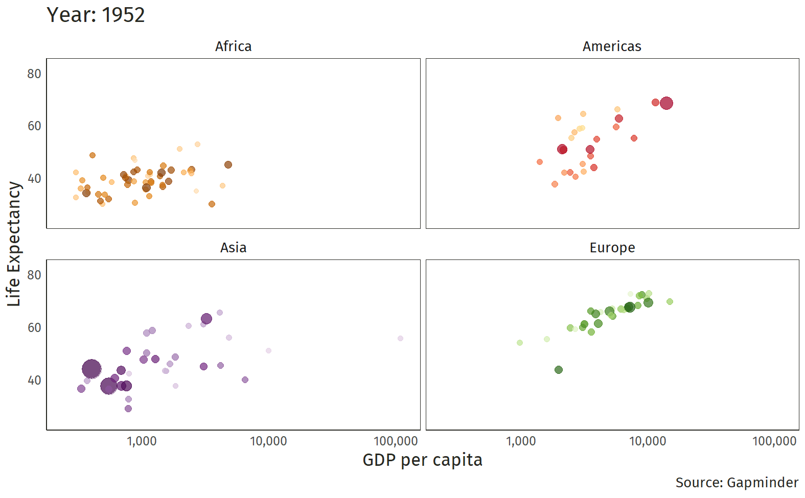

name: xaringan-title
class: left, middle


# Principios de Microeconomía
<br>
## Introducción: Presentación General
<br>
<br>


### Carlos Yanes | Departamento de Economía | `r Sys.Date()`

```{r Setup, include = F}
options(htmltools.dir.version = FALSE)
library(pacman)
p_load(broom, latex2exp, ggplot2, ggthemes, ggforce, viridis, dplyr, magrittr, knitr, parallel, gapminder)

library(tidyverse)
library(babynames)
library(fontawesome) # from github: https://github.com/rstudio/fontawesome
library(DiagrammeR)
library(hrbrthemes)
library(econocharts)
library(plotly)

# Definir colores
red_pink <- "#e64173"
met_slate <- "#272822" # metropolis font color 
purple <- "#9370DB"
green <- "#007935"
light_green <- "#7DBA97"
orange <- "#FD5F00"
turquoise <- "#44C1C4"
# Notes directory
dir_slides <- "~/Documents/Trabajo en R/Con Mac/Microeconomics/pmicroeconomics/Files/Clase 1/"


# Knitr options

opts_chunk$set(
  comment = "#>",
  fig.align = "center",
  fig.height = 7,
  fig.width = 10.5,
  warning = F,
  message = F
)

theme_gif <- theme_bw() + theme(
  axis.line = element_line(color = met_slate),
  panel.grid = element_blank(),
  rect = element_blank(),
  text = element_text(family = "Fira Sans", color = met_slate, size = 17),
  axis.text.x = element_text(size = 12),
  axis.text.y = element_text(size = 12),
  axis.ticks = element_blank()
)
wrapper <- function(x, ...) paste(strwrap(x, ...), collapse = "\n")
```


---
class: right, middle

# Yo

`Profesor<-c('Carlos A. Yanes')` 
`r fa('address-book')` [Carlos Andrés Yanes Guerra](https://www.linkedin.com/in/carlos-andres-yanes-guerra-0026bb31/?originalSubdomain=co)

`r fa('envelope')` [cayanes@uninorte.edu.co](mailto:cayanes@uninorte.edu.co)

`r fa('github')` [Github](https://github.com/keynes37)

`r fa('google')` [Google Scholar](https://scholar.google.com/citations?user=NlFSQDwAAAAJ&hl=es)


`r fa('graduation-cap')` Profesor Asistente en el Departamento de Economía Universidad del Norte **Bloque D**.

(Econometría, Microeconomía y algo de Ciencia de Datos) 

---
# Lo importante de la sesión:

<span style="color:blue"> **Aprender, preguntar y seguir aprendiendo** </span>

Siempre tengan en cuenta:

- Respeto hacia los demás y a sus opiniones 
- Asistir a todas las sesiones de la clase
- Conocer el [Syllabus](https://uninorte.edu.co/) de la asignatura en **Brightspace**
- Tener presente los recursos de la biblioteca [Karl Parrish](https://www.uninorte.edu.co/web/biblioteca/)

---
---
class: title-slide-section-blue
# En cuanto a las notas:


```{r tab1, echo=FALSE}
library(kableExtra)
text_tbl <- data.frame(
  Items = c("Parcial 1", "Parcial 2","Talleres (Trabajos) y Quizes", " Examen Final"),
  Condicion = c(
    "Hasta la semana 5 (21 de Agosto)",
    "Hasta la semana 9 (18 de Septiembre)", 
    "A lo largo de todo el semestre",
    "Fecha prevista por registro academico"
  ),
  Porcentaje = c ("25%","25%","20%","30%")
)

kbl(text_tbl) %>%
  kable_paper(full_width = F) %>%
  column_spec(1, bold = T, color = "white", border_right = T) %>%
  column_spec(2, width = "30em", background = "yellow") %>%
  column_spec(3, bold = F, color = "white", border_left = T)
```

--

- .lightgrey[De acuerdo al buen .white[*rendimiento académico*] de los estudiantes del curso, pueden darse *incentivos* a mejoras de notas. Como por ejemplo: .white[BONOS] que son totalmente individuales].

--

### Advertencias legales:

--

- .RUred[Artículo 70:] .lightgrey[Cuando el estudiante .RUred[falta el 25% de las clases], .white[no] tiene derecho a presentar el examen final y su nota será de 0.0 (cero punto cero).]

--

- .RUred[Artículo 96:] .lightgrey[*Fraude* tendrá penalidad de nota de cero ya sea en Parcial, Evaluación Final, Taller, Quíz o actividad desarrollada en clases. La reincidencia será entendida como el desarrollo de un proceso disciplinario con los entes de la Universidad.]


---
class: title-slide-section-grey, middle, center
background-image: url(https://upload.wikimedia.org/wikipedia/commons/f/f6/Lol_question_mark.png)
background-size: cover
# ¿Cree usted que en Colombia las cosas estan mejorando o empeorando?


---
# Bueno ahora mire lo siguiente:

--

```{r, dataplot, echo=FALSE}
cat<-c('Empeorando', 'Mejorando', 'Ns/Nr')
dat<-c(764, 278, 116)
table<-data.frame(cat,dat)

colores<-c('rgb(211,94,96)', 'rgb(128,133,133)', 'rgb(144,103,167)')

fig <- plot_ly(table, labels = ~cat, values = ~dat, type = 'pie',
        textposition = 'inside',
        textinfo = 'label+percent',
        insidetextfont = list(color = '#FFFFFF'),
        hoverinfo = 'text',
        text = ~paste('N=', dat, ' Personas'),
        marker = list(colors = colors,
                      line = list(color = '#FFFFFF', width = 1)),
                      #The 'pull' attribute can also be used to create space between the sectors
        showlegend = FALSE)
fig <- fig %>% layout(title = '¿Cree usted que en Colombia las cosas estan mejorando o empeorando?',
         xaxis = list(showgrid = FALSE, zeroline = FALSE, showticklabels = FALSE),
         yaxis = list(showgrid = FALSE, zeroline = FALSE, showticklabels = FALSE)) %>% layout(annotations = 
 list(x = 1, y = -0.1, text = "Fuente: Invamer, dic 2022", 
      showarrow = F, xref='paper', yref='paper', 
      xanchor='right', yanchor='auto', xshift=0, yshift=0,
      font=list(size=15, color="red"))
 ) 
fig
```
---
# Bueno ahora mire lo siguiente:

--

<iframe src='https://flo.uri.sh/visualisation/12174300/embed' title='Interactive or visual content' class='flourish-embed-iframe' frameborder='0' scrolling='no' style='width:90%;height:500px;' sandbox='allow-same-origin allow-forms allow-scripts allow-downloads allow-popups allow-popups-to-escape-sandbox allow-top-navigation-by-user-activation'></iframe><div style='width:90%!;margin-top:4px!important;text-align:right!important;'><a class='flourish-credit' href='https://public.flourish.studio/visualisation/12174300/?utm_source=embed&utm_campaign=visualisation/12174300' target='_top' style='text-decoration:none!important'> </a></div>

---
class: title-slide-section-grey, middle, center
background-image: url(https://upload.wikimedia.org/wikipedia/commons/f/f6/Lol_question_mark.png)
background-size: cover

# En su opinión ¿cuál es el valor más importante de los colombianos?

---
# Miremos

```{r, plot2, echo=FALSE}
library(plotly)
x <- c('Esperanza', 'Alegría', 'Solidaridad', 'Familia', 'Amor', 'justicia')
y <- c(248, 235, 234, 206, 176, 59)
data <- data.frame(x, y)

fig2 <- plot_ly(data, x = ~x, y = ~y, type = 'bar',
        marker = list(color = c('rgba(222,45,38,0.8)', 'rgba(204,204,204,1)', 'rgba(204,204,204,1)',
                                'rgba(204,204,204,1)', 'rgba(204,204,204,1)',
                                'rgba(0,0,0,1)')))
fig2 <- fig2 %>% layout(title = "Sentimiento Colombianos",
         xaxis = list(title = ""),
         yaxis = list(title = ""))

fig2
```
---
class: title-slide-section-grey, middle, center
background-image: url(https://upload.wikimedia.org/wikipedia/commons/f/f6/Lol_question_mark.png)
background-size: cover

# A que va todo esto 🥲?

---
# En Economía

--

`r fa("donate", fill="red")` El principal .RUred[problema] en economía es que hay que reconocer que todo es **escaso**.

--

- El agua, los bosques, el cobre, los osos pandas, el aire limpio.

--

- El tiempo, la calidad de de vida (*medido en esperanza*), la concentración.

--

### Escasez 

--

> No existen los suficientes bienes para satisfacer las necesidades ilimitadas de los individuos.

--

- Sin embargo... por lo pronto nos las arreglamos

---
.center[**Estándar de vida creciendo**]
.center[]


---
class: title-slide-section-grey, middle, center

# Comos nos organizamos en economía

---
# Como nos organizamos

--

En teoría buscamos responder a tres (3) preguntas fundamentales:

--

1. Qué .RUred[producir]?
2. Cómo .RUred[producirlo]?
3. Para quién .RUred[producir]?

--

> La forma en que las sociedades actúan ante estas cuestiones tiene importantes consecuencias para mitigar los costos de la escasez.

---
# Como nos organizamos

--

Un par de dichos:

--

### Karl Marx:

> "De cada uno, según su capacidad; a cada uno, según su necesidad."

--

### Juan el Bautista:

> "El que tiene dos túnicas debe compartirlas con el que no tiene ninguna; y el que tiene comida debe hacer lo mismo."

--

### Winston Churchill:

> "El vicio inherente del capitalismo es el reparto desigual de las bendiciones; la virtud inherente al socialismo es el reparto igualitario de las miserias."


---
# Como nos organizamos

--

### Feudalismo
> Un sistema económico basado en jerarquías rígidas y en la tradición.
- Si tus padres eran siervos, tú también lo eras.
- Sistema económico dominante en Europa durante la Edad Media.

--

### Mercantilismo
> Sistema económico en el que el gobierno distribuye derechos para determinadas actividades económicas.
- El comercio de pieles.
- El gobierno decide qué, cómo y para quién producir.
- Sistema económico dominante durante el Renacimiento.

---
# Como nos organizamos

--

### Capitalismo
> Sistema económico basado en la propiedad privada, los mercados y las empresas.
Anima a los individuos a actuar en su propio interés, mientras que las fuerzas del mercado de la oferta y la demanda coordinan las actividades individuales.
- Los bienes se distribuyen a cada uno según su capacidad, esfuerzo y propiedad heredada.
- En principio, los individuos determinan qué, cómo y para quién producir.
- Sistema económico dominante desde la Revolución Industrial.

---
# Como nos organizamos

--

### Socialismo
> Un sistema económico basado en la buena voluntad de los individuos hacia los demás, no en su propio interés.
- No hay propiedad privada: el Estado es propietario de los medios de producción.
- En principio, la sociedad determina qué, cómo y para quién producir.
- Sistema económico dominante en Europa del Este, China y algunas partes de África, el Sudeste Asiático y América Latina durante la década de 1900.


---
# Descripción

--

<midd-blockquote>Este curso proporciona una introducción a la microeconomía, centrado exclusivamente en los conceptos de la economía en general utilizando elementos básicos de **cálculo diferencial** 😢y de alguna manera de la .RUred[estadística] 😬</midd-blockquote>

--

`r fa("exclamation-triangle")` Se hace énfasis en el lenguaje .RUred[matemático].

---
class: title-slide-section-grey, middle, center
background-image: url(https://upload.wikimedia.org/wikipedia/commons/d/dc/Beziehungen_zwischen_Nutzenmaximierungs-_und_Ausgabenminimierungsproblem.png)
background-size: cover
# Qué es la Microeconomía? 

---
# Qué es la Microeconomía?

--

- **Economía**: *Un sistema donde se coordinan las actividades productivas de una sociedad*

--

- **Economía de Mercado**: *Es una economía donde se toman decisiones de producción y consumo de bienes y servicios*

--

- **Mano invisible**: *La forma en la cual los individuos persiguen a como de lugar su propio bienestar, sin embargo eso conlleva a resultados mejores para una sociedad como un todo*

---
# Qué es la Microeconomía?

--

> **Microeconomía** tiene que ver con entender el comportamiento "individual".

--

`r fa("rocket", fill="blue")` **Consumidores** *Tienen decisiones de compra*

--

- Si tu cantante (artista) favorito llega a la ciudad, comprarías una boleta en $797.000?

--

`r fa("rocket", fill="red")` **Empresas** *Tienen decisiones de compra de insumos*

--

- Cuantos trabajadores vas a contratar y cuanto de maquinaria vas adquirir?

--

`r fa("rocket", fill="grey")` **Reguladores** *El estado puede anticipar cuantas firmas y consumidores habrá en los distintos mercados*

--

- Pueden las herramientas de política pública, tales como los impuestos, tasas, sobretasas ser beneficiosos para la sociedad?

---
# Qué es la Microeconomía?

--

> El comportamiento de los *agentes económicos* es investigado bajo la hipotesis de la **Racionalidad**:

--

- Cada *agente* busca .RUred[maximizar] su bienestar (p.e., la utilidad de los consumidores, o beneficios de la empresa), dados ciertos recursos (restricciones) y la información con la que se cuenta o se tiene acceso.

--

## Dos contextos:

--

`r fa("plane", fill="grey")` Cuando un agente busca maximizar su propio bienestar (sobre todo el material) y no le interesa lo demás.

--

`r fa("plane", fill="blue")` Cuando maximiza su bienestar y el de otros agentes (permitiendo incluso el altruismo).

---
# El tema de la escasez

--

> La **escasez** se da porque en el mundo todo tiene un .RUred[límite]!!. Los *recursos* son limitados y no se pueden satisfacer todas las necesidades que se tienen.

--

### Pregunta:

--

`r fa("user-tie", fill="grey")` Qué señales de escasez percibe usted?, que indicador es el mas apropiado para medirla?
---
# El tema de la escasez

--

### Qué tan escasos son estos productos?

--

```{r bq, echo=FALSE}

```
---
# Estática comparativa

--

<midd-blockquote>La estática comparativa nos permite medir los cambios en el comportamiento de un **consumidor** cuando varia *solo una* variable (p.e., el precio de algo)</midd-blockquote>

--

- Si tu cantante (artista) favorito llega a la ciudad, comprarias una boleta en $797.000?

--

- .RUred[R./] SI

--

- Puede ser diferente su decisión si entonces la (misma) boleta *aumenta* a $1'365.000?

---
# Estática comparativa

--

### Elección bajo incertidumbre

--

Existen elementos y situaciones que hacen que el consumidor se enfrente a hechos con incertidumbre.

--

**P.e**: Qué resulta mejor: Aceptar un trabajo donde .RUred[fijo] por año se gana 75 millones/año -lo que es aprox. 6'250.000/mes- (100% de prob.) o trabajar para una empresa (start-up) que paga 120 millones/año si en la *bolsa de valores* crecen sus acciones (30% probabilidad) o 40 millones/año si esto no ocurre (70% de probabilidad)  

--

Opción A: $$75'000.000 \times (1)=75'000.000$$ 

--

Opción B: $$120'000.000 \times (0.3)+ 40'000.000 \times (0.7)=64'000.000$$ 

--

**P:** Cuál elige?

---
# Estática comparativa

--

+ Actitudes frente al .RUred[riesgo]

--

+ Medidas de aversión al riesgo. (Primas de riesgo)


--

+ Las funciones matemáticas nos dice un poco como se comportan las personas y si prefieren ser .RUred[riesgosas] o si prefieren ser aversas al riesgo.

+ Algunas `funciones` de riesgo se asocian al estilo de una $f(x)$. Si mira el tipo de función que es una persona. Entonces tendremos funciones de utilidad como:

--

$$\text{Amante al riesgo}= U(x)=x^{3}\;o\; e^{x} \quad \text{Averso}= U(x)=\sqrt{x}\;o\;Ln(x)$$

---
# Estatica comparativa (Averso al riesgo)

--

```{R, echo=FALSE}
# Cargamos el paquete "ggplot2" para graficar
library(ggplot2)

# Definimos la función de utilidad de von Neumann-Morgenstern
utility_von_neumann <- function(x, gamma) {
  return(x^(1 - gamma) / (1 - gamma))
}

# Creamos un vector de valores de x para graficar
x <- seq(0, 10, by = 0.1)

# Valores de gamma que queremos graficar
gamma_values <- c(0.5, 1, 2, 5)

# Creamos una lista para almacenar las gráficas
plots <- list()

# Generamos una gráfica para cada valor de gamma
for (gamma in gamma_values) {
  y <- utility_von_neumann(x, gamma)
  
  # Creamos el gráfico y lo almacenamos en la lista
  plot <- ggplot(data = data.frame(x = x, y = y), aes(x = x, y = y)) +
    geom_line() +
    labs(title = paste("Función de utilidad con γ =", gamma),
         x = "Cantidad de dinero",
         y = "Utilidad") +
    theme_minimal()
  
  plots[[as.character(gamma)]] <- plot
}

# Visualizamos las gráficas en una matriz
gridExtra::grid.arrange(grobs = plots, ncol = 2)
```

---
# Estatica comparativa (Gusto al riesgo)

--

```{R, echo=FALSE}
# Cargamos el paquete "ggplot2" para graficar (si aún no lo has instalado)
library(ggplot2)

# Definimos la función de utilidad de von Neumann-Morgenstern para una persona amante al riesgo
utility_amante_al_riesgo <- function(x, gamma) {
  return(-x^(1 + gamma) / (1 + gamma))
}

# Creamos un vector de valores de x para graficar
x <- seq(0, 10, by = 0.1)

# Valores de gamma que queremos graficar para una persona amante al riesgo
gamma_values <- c(-0.5, -1, -2, -5)

# Creamos una lista para almacenar las gráficas
plots <- list()

# Generamos una gráfica para cada valor de gamma
for (gamma in gamma_values) {
  y <- utility_amante_al_riesgo(x, gamma)
  
  # Creamos el gráfico y lo almacenamos en la lista
  plot <- ggplot(data = data.frame(x = x, y = y), aes(x = x, y = y)) +
    geom_line() +
    labs(title = paste("Función de utilidad con γ =", gamma),
         x = "Cantidad de dinero",
         y = "Utilidad") +
    theme_minimal()
  
  plots[[as.character(gamma)]] <- plot
}

# Visualizamos las gráficas en una matriz
gridExtra::grid.arrange(grobs = plots, ncol = 2)
```

---
# Midiendo con riesgo

--

Asuma que la **función de utilidad** es de: $U(x)=\sqrt{x}$

--

Opción A: $$\sqrt{75'000.000} \times (1)=8660$$ 

--

Opción B: $$\sqrt{120'000.000} \times (0.3)+ \sqrt{40'000.000} \times (0.7)=7713$$ 

--

**P:** Cuál elige ahora?

--

**R./** Como es averso/a al riesgo entonces se queda con la A.

---
# Midiendo con riesgo

--

Asuma que la **función de utilidad** es de: $U(x)=x^{3}$

--

Opción A: $$75'000.000^{3} \times (1)=4.21^{+}23$$ 

--

Opción B: $$120'000.000^3 \times (0.3)+ 40'000.000^{3} \times (0.7)=5.63^{+}23$$ 

--

**P:** Cuál elige ahora?

--

**R./** Como es amante al riesgo entonces se va con la B.
---
class: title-slide-section-grey, middle, center
background-image: url(https://media.giphy.com/media/10EhgJKAOVJ6/giphy.gif)
background-size: cover
# Como toman decisiones los individuos? 


---
# Como toman decisiones los individuos?

--

- Enfrentando disyuntivas, p.e., *Escoger una carrera profesional*

--

- Teniendo en cuenta los .RUred[costos] (no necesariamente monetarios)

--

- Incentivos

--

- Pensamiento marginal

--

- Razones de intercambio

---
# Costo de oportunidad: Ejemplo 1

--

```{r datagr1, include=FALSE}
p <- ppf(x = 4:6, # Intersections
         main = "Frontera de posibilidad de Producción",
         geom = "text",
         generic = TRUE, # Generic labels
         labels = c("A", "B", "C"), # Custom labels
         xlab = "Motos",
         ylab = "Carros",
         acol = 3)      # Color of the area
```

```{r, ex1, echo=FALSE, fig.height=6}
p$p + geom_point(data = data.frame(x = 5, y = 5), size = 5) +
  geom_point(data = data.frame(x = 2, y = 2), size = 5) +
  annotate("segment", x = 3.1, xend = 4.25, y = 5, yend = 5,
           arrow = arrow(length = unit(0.5, "lines")), colour = 3, lwd = 1) +
  annotate("segment", x = 4.25, xend = 4.25, y = 5, yend = 4,
           arrow = arrow(length = unit(0.5, "lines")), colour = 3, lwd = 1)
```
---
# Costo de oportunidad: Ejemplo 1

--

Suponga que un **país** cuenta con producción especifica de Automomoviles y Computadores.

--

*Opción A*: Producir 20 Autos y 200 computadores
*Opción B*: Producir 25 Autos y 160 computadores

--

Calcule el costo de oportunidad de un automóvil frente a los (computadores):

--

$$\frac{(25-20)}{(160-200)}=\frac{5}{-40}=-0.125$$
--

Ahora el costo de oportunidad de los computadores frente a los autos:

--

$$\frac{(160-200)}{(25-20)}=\frac{-40}{5}=-8$$

--

<midd-blockquote>Para producir un automóvil debe renunciar a 8 unidades de computadores</midd-blockquote>

--

Ademas en sentido contrario

--

<midd-blockquote>Para producir un computador debe renunciar a 0.125 unidades de Autos</midd-blockquote>

---
# Costo de oportunidad: Ejemplo 2

--

```{r f1, echo=FALSE}

```

---
class: inverse, middle, center
background-image: url(https://upload.wikimedia.org/wikipedia/commons/e/ee/La_econom%C3%ADa_circular_50.jpg)
background-size: cover
# Un Vistazo a los temas del curso

---
# Teoría del Consumidor

--

> Un modelo que represente al **consumidor**.

--

- Nociones de cestas de bienes y servicios

--

- Como manejar las preferencias

--

- Como se representan, que es una función de bienestar y/o utilidad

--

- Decisiones optimas de compra

--

- Curvas de Demanda y Oferta, equilibrio de mercado.

---
# Teoría del Productor

--

> Un modelo que represente al **Productor** y/o **Empresa**.

--

- Decisión optima de producción

--

- Restricción tecnológica 

--

- Costos de Producción

--

> Un sistema de **Mercado**

--

- Mercado de competencia

--

- Monopolio

--

- Otras formas del mercado


---
class: title-slide-section-grey
# Bibliografía

`r fa('book')` Mankiw, N. G. (2005). *Principios de microeconomía* /N. Gregory Mankiw (No. 338.5 M55Y.).

`r fa('book')` Pindyck, R. S., Rubinfeld, D. L., & Rabasco, E. (2013). *Microeconomía*. Pearson Italia..

`r fa('book')` Krugman, P., & Wells, R. (2014). *Microeconomics (for AP)*. New York: Worth Publishers.

`r fa('book')` Muñoz-Garcia, F. (2017). *Advanced microeconomic theory: an intuitive approach with examples*. MIT Press.


---
class: title-slide-final, middle

# Gracias por su atención!

## Alguna pregunta adicional?

### Carlos Andres Yanes Guerra
`r fa("envelope", fill="red")` cayanes@uninorte.edu.co
`r fa("university", fill="blue")` Universidad del Norte