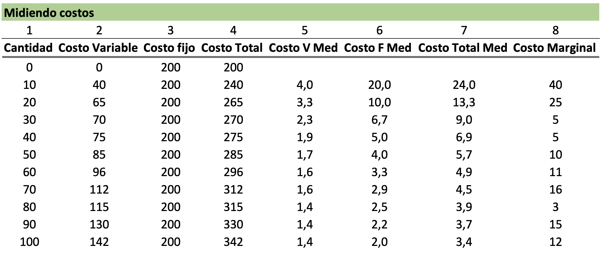
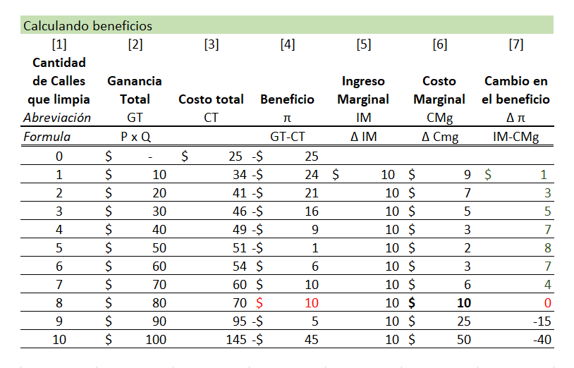

name: xaringan-title
class: left, middle


# Principios de Microeconomía
<br>
## Teoría del Productor (Costos II)
<br>
<br>


### Carlos Yanes | Departamento de Economía | `r Sys.Date()`

```{r Setup, include = F}
options(htmltools.dir.version = FALSE)
library(pacman)
p_load(broom, latex2exp, ggplot2, ggthemes, ggforce, viridis, dplyr, magrittr, knitr, parallel)

library(tidyverse)
library(babynames)
library(fontawesome) # from github: https://github.com/rstudio/fontawesome
library(DiagrammeR)
library(hrbrthemes)
library(econocharts)
library(plotly)
library(kableExtra)
library(flextable)

# Knitr options

opts_chunk$set(
  comment = "#>",
  fig.align = "center",
  fig.height = 7,
  fig.width = 7,
  warning = F,
  message = F
)
```

---
class: middle, inverse

.left-column[

# `r emo::ji("fire")`

]

.right-column[
# Preguntas generales?
]

---
# Donde estan?

--

.pull-left[
```{R, graphoui, echo = F, fig.height = 5, fig.width = 9, dev = "svg"}
# Datos
pop_df = 
  data.frame(
  lang = c("Martin Muñoz", "Jesus Mendez", "Ricardo Aaron"),
  n_jobs = c(100, 98, 97),
  free = c(T, F, F)
  )
## Graficando
pop_df %>% 
  mutate(lang = lang %>% factor(ordered = T)) %>%
  ggplot(aes(x = lang, y = n_jobs, fill = free)) +
  geom_col() +
  geom_hline(yintercept = 0) +
  aes(x = reorder(lang, -n_jobs), fill = reorder(free, -free)) +
  xlab("Estudiantes") +
  scale_y_continuous(label = scales::comma) +
  ylab("Podium") +
  labs(
    title = "Participación Control",
    subtitle = "Nota de Control 08"
    ) +
  scale_fill_manual(
    "Mejor tiempo?",
    labels = c("Si", "No"),
    values = c("#f92672", "darkslategray")
    ) +
  ggthemes::theme_pander(base_size = 17) +
  # theme_ipsum() +
  theme(legend.position = "bottom")
```
]

--

.pull-right[

]


---
# Repaso

--

Dada la siguiente función de costos:

--
        
$$CT= 500+45Q+36Q^{2}$$

--

1. ¿Cuál es el costo medio?

--

2. ¿Cuál es el costo marginal?

--

3. ¿Cuál es el costo fijo?

---
class: inverse, middle

# Pienselo bien...

---
# Resultado

--

$$CT= 500+45Q+36Q^{2}$$

--
        
+ ¿Cuál es el costo medio?

--

$$Cme= \frac{500}{Q}+45+36Q$$
--

+ ¿Cuál es el costo marginal?

--

$$Cmg= \frac{\partial CT}{\partial Q}= 45+ 72Q$$
--

+ ¿Cuál es el costo fijo?

--
$$CF=500$$
---
class: inverse, middle

# Mas de los costos
---
# Costos

--

### Ejercicio 1

--

¿Cuál es el punto optimo de producción de esta firma?

--

<center>

</center>

---
# Costos

--

`r fa("sketch", fill="blue")` Recuerde que es importante tener presente los **costos** debido a que nos pueden modificar la estructura de operación de la firma.

--

$$\text{Ganancia (Perdida)}= \color{#030ffc}{\text{Ganancia total}}-\text{Costos totales}$$

--

*Piense por un segundo que si tiene un negocio, es muy facil obtener el beneficio ya que multiplica el precio del mercado por las cantidades que respectivamente vende*

--

| Producto            | Precios | Unidades | Beneficio |
| ------------------- | ------- | -------- | --------- |
| Hamburguesas        | 18000   | 100      | 1800000   |
| Papas a la francesa | 8000    | 42       | 336000    |
| Gaseosa             | 3600    | 100      | 360000    |
| Salchipapa          | 18900   | 70       | 1323000   |
| Total               |         |          | 3819000   |

--

Es muy facil desde luego tener los .blue[beneficios] pero no tan sencillo la parte de los **costos**.

---
# Costos

--

| Costos explicitos      | Costos implicitos                                            |
| ---------------------- | ------------------------------------------------------------ |
| Recibo de luz          | Trabajo propio del dueño sin salario                         |
| Salario de una persona | Costo de oportunidad de invertir en otra parte               |
| Publicidad             | El uso del carro propio u otras cosas que no son de la firma |

--

$$\color{#fc0328}{\text{Costo total}}= \color{#030ffc}{\text{Costos explicitos}}+\text{Costos implicitos}$$
--

### Diferencia entre costo contable y economico

--

$$\text{Beneficio contable}= \text{Ganancia}-\text{Costo explicito}$$

--

$$\text{Beneficio economico}= \text{Ganancia}-(\text{Costo explicito}+\text{Costo implicito})$$
--

Lo que finalmente nos dice que:

--

$$\text{Beneficio economico}=\color{#030ffc}{\text{Beneficio contable}}-\text{Costo implicito}$$
---
# Costos

--

### Ejercicio 2

`r fa("palette", fill="red")` Piense por un segundo que Laura es una estudiante universitaria y que trabajo todo un mes (temporal) en un restaurante y ganó `$1.970.000`. El punto es que ella tiene una habilidad de pintar y por hacerlo en este mes ganó la suma de `$3.000.100`. Los materiales para pintar le cuestan alrededor de `$975.000`. .RUred[Cuanto es su beneficio contable?]

--

$$\begin{aligned}
\text{Beneficio contable}=& \text{Ganancia}-\text{Costo explicito}\\
\color{#030ffc}{2.025.100}=& 3.000.100-975.000
\end{aligned}$$

--

Si ahora le pidieran evaluar el .RUred[Beneficio económico]. Cuál sería?

--

$$\begin{aligned}
\color{#ad07a5}{\text{Beneficio economico}}=& \text{Ganancia}-(\text{Costo explicito}+\text{Costo implicito})\\
\color{#030ffc}{55.100}=& 3.000.100-(\;\;975.000\quad + \quad 1.970.000)
\end{aligned}$$

---
class: title-slide-section-blue, middle

# Un caso mas (complementando lo de costos)

<br>


---
class: title-slide-section-grey, middle, center
background-image: url(https://media.giphy.com/media/vHhPgrhvo1FJu/giphy.gif)
background-size: cover
# Recuerda a Don barredora?
---
# Caso de costos

--

.blue[*Ejemplo 1*]: Suponga que a usted le paguen por limpiar una calle llena de nieve por el valor de nada mas y nada que $10US y claro esta, debe enfrentar ciertos .RUred[costos] de operación de la actividad económica.

--
<center>

</center>
---
# Caso de costos

--

`r fa("clipboard-check", fill="blue")` El punto .black[optimo] que puede alcanzar el empresario es donde limpia .RUred[8 calles]. Ahí, no solo obtiene ganancias por valor de $US10 después de atender a sus costos, si no que es mas *eficiente* que en los demás puntos.

--

`r fa("clipboard-check", fill="blue")` Hay un proceso clave y es aquel donde el .black[ingreso marginal] debe igualar al .grey[costo marginal]. Entendido esos puntos, la lógica indicará que se ganará mas en el punto de intercepción.

--

`r fa("clipboard-check", fill="blue")` Habrá empresas que antes de alcanzar su punto de ingreso superior, su .black[ingreso marginal] no sea cero y mas bien sea positivo. _Don barredora pudo haberse quedado en limpiar solo 7 calles_


---
class: title-slide-section-grey, middle

# Equilibrio parcial

<br>


---
# Mercados Competitivos

--

### Los mercados "perfectamente" competitivos tienen las siguientes características:

--

`r fa("coins", fill="blue")` .black[Fragmentados]: muchas firmas o empresas pequeñas (hasta 30 trabajadores). Un incremento de la producción de una empresa o de cada firma no .RUred[altera] los precios de mercado.

--

`r fa("coins", fill="blue")` .black[Productos poco diferenciados]: Los productos que forman parte de la oferta del sector productivo son similares para todos los consumidores.

--

`r fa("coins", fill="blue")` .black[Información perfecta del precio]: Las comparaciones que realizan los consumidores son fáciles de comparar y no generan altos costos.

--

`r fa("coins", fill="blue")` .black[Libre entrada/salida]: En el largo plazo, las empresas se mantendrán en el mercado si los .black[beneficios] son positivos y es fácil salir del mercado si incurre en perdidas.

--

.RUred[*Los mercados de commodities del sector agrario (p.e. El trigo)*]

---
class: title-slide-section-grey, middle

# Problema de maximización del beneficio

<br>


---
# Problema de maximización del beneficio

--

+ En un mercado .black[competitivo], todas las empresas son .RUred[precio-aceptantes] de acuerdo a un precio establecido por el mercado.

--

+ Cada firma tiene un (PMB) de tal manera que:

--

$$\max_{q}\pi=BT(q) - CT(q)=p\times q- CT(q)$$

--

+ La firma escoge el nivel de producto que maximiza su beneficio, el cual es la diferencia entre su ganancia total y sus costos totales.

---
# Problema de maximización del beneficio

--

+ El PMB puede ser obtenido mediante 3- etapas de proceso:

--

    1. Encontrar los insumos de L y K que minimizan el costo. Una combinación de insumos que permitan tener el Cme=Cmg
    
    2. Con los insumos hallados, introducirlos en $CT=wL+rK$
    
    3. Luego finalmente introducir esto en la función de beneficio de la firma.

--

+ Despues de tener el proceso de PMB podriamos mirar el marginal de la siguiente manera (solo derivar la función con respecto a q).

--

$$p- \frac{\partial CT}{\partial q}=0 \quad \Rightarrow p= Cmg(q)$$
---
# Problema de maximización del beneficio

--

+ El resultado de $P=Cmg(q)$ nos indica que al maximizar los beneficios, la firma o empresa incrementa su producción hasta que:

--

    + El Precio de vender una unidad adicional coincida con el costo *adicional* de producir esa unidad.
    
--

+ Tome por ejemplo lo siguiente: Una empresa cuya función de costos es: $CT=40q$, a que precio debe vender?

--

$$P=Cmg \quad \Rightarrow P=40 $$

--

La firma siempre venderá después que $P\geq 40$. De lo contrario, no esta en intenciones de hacerlo. Los beneficios siempre serán mayores siempre y cuando se satisfaga lo anterior.

---
# Problema de maximización del beneficio

--

Suponga que actualmente una empresa vende 40 aviones a un P=$100, pero la curva de demanda nos dice que para vender un avión adicional debemos bajar el precio a P= 99.

--

Cuánto es el ingreso .RUred[marginal] de esa firma?

--

+ Ingresos de antes: 40 x $100=4000

--

+ Los ingresos de... ahora: 41 x $99=4059

--

+ El ingreso marginal es $59.

--

+ Miren que el $Img < Precio$.

---
class: title-slide-section-grey

# Bibliografía

`r fa('book')` Coppock, L., & Mateer, D. (2018). *Principles of Economics (Second edition)*. W.W. Norton & Company, inc. 

`r fa('book')` Krugman, P., & Wells, R. (2014). *Microeconomics (for AP)*. New York: Worth Publishers.

`r fa('book')` Muñoz-Garcia, F. (2017). *Advanced microeconomic theory: an intuitive approach with examples*. MIT Press.

---
class: title-slide-final, middle

# Gracias por su atención!

## Alguna pregunta adicional?

### Carlos Andres Yanes Guerra
`r fa("envelope", fill="red")` cayanes@uninorte.edu.co
`r fa("university", fill="blue")` Universidad del Norte


