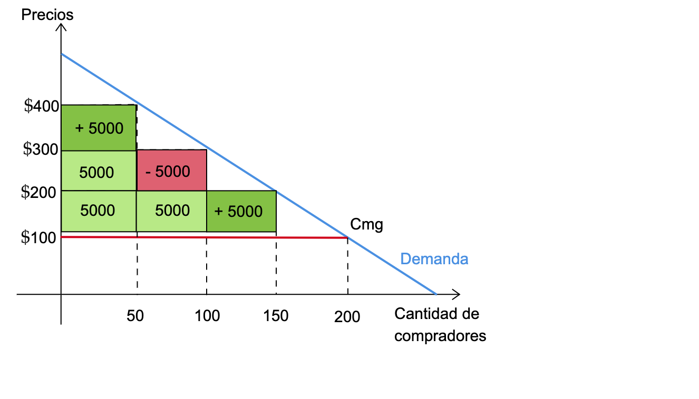

name: xaringan-title
class: left, middle


# Principios de Microeconomía
<br>
## Estructuras de Mercado (Oligopolios)
<br>
<br>


### Carlos Yanes | Departamento de Economía | `r Sys.Date()`

```{r Setup, include = F}
options(htmltools.dir.version = FALSE)
library(pacman)
p_load(broom, latex2exp, ggplot2, ggthemes, ggforce, viridis, dplyr, magrittr, knitr, parallel)

library(tidyverse)
library(babynames)
library(fontawesome) # from github: https://github.com/rstudio/fontawesome
library(DiagrammeR)
library(hrbrthemes)
library(econocharts)
library(plotly)
library(kableExtra)
library(flextable)

# Knitr options

opts_chunk$set(
  comment = "#>",
  fig.align = "center",
  fig.height = 7,
  fig.width = 7,
  warning = F,
  message = F
)
```

---
class: middle, inverse

.left-column[

# `r emo::ji("fire")`

]

.right-column[
# Preguntas generales?
]
---
# Repaso

--

.blue[*Ejemplo 1*]: Digamos que una persona vende un producto (*único y especial*) y debe conocer a que nivel maximiza su .black[ganancia].

--
<center>

</center>

---
# Repaso

--

```{r, tt1, echo=FALSE, warning=FALSE}
library(flextable)
library(dplyr)
df<-structure(list(` ` = c("Objetivo Firma", "Regla Maximización", 
"Ganancias Corto Plazo", "Número de firmas", "Ingreso Marginal",
"Precio","Produce bienestar aumentando producto", "Entrada largo plazo",
"Ganancias largo plazo", "Posible discriminación de precios"), 
`Competencia` = c("Maximizar beneficios", "Img=Cmg ", "Si", "Muchas", "Img=P", 
"P=Cmg","Si", "Si", "No", "No"), `Monopolio` = c("Maximizar beneficios", "Img=Cmg ", "Si","Una sola", "Img<P", "P>Cmg", 
"No", "No", "Si", "Si")), row.names = c(NA, -10L), class = c("tbl_df", 
"tbl", "data.frame"))

df %>%
  # adding a grouping variable
  mutate(Caracteristica = c('Similitudes','Similitudes','Similitudes','Diferencias','Diferencias',
                            'Diferencias','Diferencias','Diferencias',
                            'Diferencias','Diferencias')) %>%
  # define as grouped data
  as_grouped_data(groups = c("Caracteristica"), columns = NULL) %>%
  # equal to your code
  flextable()  %>%
  add_footer_lines("Principios de Microeconomía. Mankiw(2011)") %>%
  color(part = "footer", color = "#800000") %>%
  bold( bold = TRUE,part="header")  %>%
  width(j = NULL, width = 1, unit = "in")  %>%
  autofit()
```
---
# Repaso

--

### Un monopolista

--

<center>

</center>
---
# Repaso

--

### Un monopolista discriminador

--

<center>

</center>
---
class: title-slide-section-grey, middle

# Oligopolio

<br>


---
# Oligopolio

--

- Estudiamos .RUred[Competencia perfecta]: **Muchos** compradores y **Muchos** vendedores.

--

- Estudiamos .RUred[Monopolio]: **Muchos** compradores y un **único** vendedor.

--

- Ahora estudiaremos (preliminarmente) el .RUred[Oligopolio]: **Muchos** compradores y unos **cuantos** vendedores.

--

<center>

</center>

---
# Oligopolio

--

- Es un .RUred[mercado] en que los .black[productores] tienen .black[poder] de mercado.

--

- Sin embargo, se mantiene la competencia perfecta entre los **demandantes**.

--

- Se producen .black[interacciones] estratégicas entre productores.

--

- La herramienta de análisis, es el .black[equilibrio de Nash].

--

- Solo unas .RUred[pocas] firmas producen la mayor parte del mercado.

--

- El producto puede ser no **diferenciado**.

--

- Existen .RUred[barreras] a la entrada de nuevas empresas.

--

- La .black[condición de óptimo] se da cuando el **ingreso marginal** se iguala a .black[costo marginal].

---
# Oligopolio

--

## Le suena Nash?

--

.pull-left[La ha visto o escuchado algo al respecto]

.pull-right[]

---
class: inverse, middle, center
background-image: url(https://upload.wikimedia.org/wikipedia/commons/a/ae/Paramount_Pics_logo.png)
background-size: cover
# Ayy Profe ese no es el mismo...
---
class: title-slide-section-grey, middle, center
background-image: url(https://media.giphy.com/media/d7mMzaGDYkz4ZBziP6/giphy.gif)
background-size: cover
---
# John Nash

--

.pull-left[

## 1923-2015]

--

.pull-right[]


---
# Los dos estamentos importantes en economía

--

.pull-left[.black[Optimización]

- Los individuos tienen .RUred[objetivos] que valoran

- Los individuos poseen .RUred[restricciones]

- Hacen .RUred[intercambios] para maximizar su utilidad de acuerdo a las restricciones
]

.pull-right[.black[Equilibrio]

- Los individuos .RUred[compiten] por recursos que son **escasos**

- Los individuos .RUred[ajustan] sus comportamientos de acuerdo a los **Precios**

- Los .RUred[resultados] son estables y se mantienen en el tiempo 
]

---
# Los dos estamentos importantes en economía

--

.pull-left[]

--

.pull-right[
- Los modelos en economía hacen uso de la .RUred[Teoría de la decisión]

- En la parte concerniente a **modelos de equilibrio** se asume que hay tantos individuos que ninguno de ellos tiene suficiente .black[poder] para afectar el resultado final

- En el .RUred[equilibrio] nadie tiene una *mejor* alternativa
]
---
class: title-slide-section-blue, middle

# Duopolio

<br>

---
# Duopolio

--

`r fa("angle-double-right", fill="blue")` Piense por un momento que tenemos dos empresas competidoras en un único mercado.

--

| Empresa 1 | Empresa 2 |
| --------- | --------- |
| 100       | 0         |
| 75        | 25        |
| 50        | 50        |
| 25        | 75        |
| 0         | 100       |

--

`r fa("angle-double-right", fill="blue")` Cada una .RUred[reaccionará] de acuerdo a lo mejor que haga la otra firma. Muchas consideraciones van de acuerdo a las ventajas que tenga una empresa sobre la otra.

--

`r fa("angle-double-right", fill="blue")` En algunas ocasiones habrá desde luego una posicion .black[dominante] de una sobre la otra.

---
# Duopolio

--

.blue[*Ejemplo 2*]: Considere que existe la siguiente .RUred[función de demanda]:

--

$$p=30-q$$
--

La cantidad que se produce por la existencia de .RUred[dos firmas] es:

$$q=q_{1}+q_{2}$$

--

Asuma que el costo marginal de las firmas es similar y que en este caso es $\color{#25408B}{Cmg_{1}=Cmg_{2}=0}$ 

---
# Duopolio

--

Tomamos el ingreso .RUred[total] de la empresa (1):

--

$$\begin{aligned}
    I_{1} =&pq_{1}\\
    =&( 30-q) q_{1}\\
    =&30q_{1} -( q_{1} +q_{2}) q_{1}\\
    =&30q_{1} -q^{2}_{1} -q_{1} q_{2}
    \end{aligned}$$

--

Por el lado del ingreso marginal:

--

$$Img_{1} =\frac{\partial I_{1}}{\partial q_{1}} =30-2q_{1} -q_{2}$$

---
# Duopolio

--

Para el nivel de producto óptimo, se encuentra la condición de:

--

$$Img=Cmg$$

--

Por tanto la **curva de reacción** de la .black[empresa (1)] es:

--

$$q_{1}= 15 -0.5q_{2}$$
--

De forma _similar_ o simétrica funciona para .black[la firma (2)]:

--

$$q_{2}= 15 -0.5q_{1}$$
--

Ahora... solo queda .RUred[enfrentar] las dos funciones...

---
# Duopolio

--

El resultado de introducir la función de $q_{2}$ en $q_{1}$ es:


$$\begin{aligned}
q_{1} =&15-0.5( 15-0.5q_{1})\\
q_{1} =&15-7.5+0.25q_{1}\\
q_{1} =&7.5+0.25q_{1}\\
q_{1} -0.25q_{1} =&7.5\\
q_{1}( 1-0.25) =&7.5\\
q_{1}( 0.75) =&7.5\\
q_{1} =&\frac{7.5}{0.75} =10
\end{aligned}$$

--

En este caso por la simetría de la composición la respuesta de producción de cada una de las firmas va ser: $q_{1}=q_{2}=10$ y el mercado completo es $Q=20$ con un precio de .blue[$10].

---
class: title-slide-section-grey, middle

# Teoría de Juegos

<br>


---
# Teoría de Juegos

--

`r fa("coins", fill="blue")` Se que estará tentado(a) a pensar que es:

--
<center>

</center>
---
# Teoría de Juegos

--

`r fa("coins", fill="blue")` Pero en realidad es algo mucho mas formal y nos permite por lo menos entender alguna interacción estrategica.

--

### Matematicamente es:

--

Un juego posee una estructura de forma estratégica si:

--

$$G= \left \langle J, \left \{ S_{i}\right \}_{i=1,\dots,N}, \left \{ \pi_{i} \right \}_{i=1,\dots,N}   \right \rangle$$
--

Donde:

--

  + $J$ es un conjunto de jugadores, $J=\left \{ 1,2,\dots,N \right \}$.
  + $S_{i}$ un conjunto de acciones (estrategias) para cada jugador.
  + $\pi_{i}: \prod \limits_{i=1}^{N} S_{i} \rightarrow R$, que es el pago neto o utilidad de cada jugador.

---
# Teoría de Juegos

--

.blue[*Ejemplo 3*]: Piense que existe un **juego** que tiene dos jugadores que se llaman .RUred[Maria] y .RUred[Andrés]. Suponga además que .RUred[Maria] tiene .black[tres acciones] disponibles: *izquierda, mitad, derecha*. Por tanto su espacio estratégico $S_{M}$ es:

--

$$S_{M}= \left \{ izquierda, \; mitad,\; derecha \right \}$$
--

Análogamente suponga que .RUred[Andrés] tiene .black[dos acciones] disponibles. Lo que indica que su espacio estratégico $S_{A}$ es

--

$$S_{A}= \left \{ arriba,\; abajo \right \}$$
---
# Teoría de Juegos

--

.RUred[Piense que]:

--

Si Maria juega $S_{M}=Mitad$ y Andrés escoge $S_{A}=abajo$, el perfil estratégico será:

--

$$S= \left ( mitad,\ abajo \right )$$
--

El espacio de todos los perfiles .black[estratégico] por ejemplo es:

--

$$S=S_{M}\;\times\;S_{A}= \left \{ \left( mitad, arriba \right),\left( \dots \right),\left( derecha, arriba \right), \dots   \right \}$$
---
# Teoría de Juegos

--

De forma que matricialmente o forma **normal** es:

--

<center>

</center>

--

1. ¿Qué resultado tiene ese juego?

--

1. ¿Qué piensa que va ocurrir?

---
# Teoría de Juegos

--

Una forma **extensiva** (algo similar a un árbol) es:

--

<center>

</center>

---
# Teoría de Juegos

--

Los juegos o interacciones se resuelven con algunos criterios base:

--

`r fa("exclamation-circle", fill="blue")` Estrategias **estrictamente** dominantes

--

`r fa("exclamation-circle", fill="blue")` Estrategias **débilmente** dominantes

--

`r fa("exclamation-circle", fill="blue")` Equilibrio de **Nash**

--

### Enteder esto mejor es:

--

+ Si usted tiene dos decisiones $(a,b)$, si $u(a)>u(b)$ entonces usted elige $a$.

--

+ En cambio si $u(a)\geq u(b)$ usted prefiere $a$ pero no todas las veces.

--

+ Por otro lado, si $a=b$, entonces usted es indiferente $u(a)\sim u(b)$ y cambiará de acuerdo a las preferencias de otra persona.


---
# Teoría de Juegos

--

.blue[*Ejemplo 4*]: Supongamos que las empresas .RUred[A] y **B** venden .black[productos rivales] y tienen que decidir si .RUred[realizan] o no una .black[campaña publicitaria]. La decisión que tome cada una afectará a la de la otra. Observe que si las dos empresas deciden hacer *publicidad*, la .RUred[A] obtendrá unos beneficios de 10 y la **B** obtendrá unos beneficios de 5. Si .RUred[A] hace publicidad y la **B** no, .RUred[A] ganará 15 y la **B** no ganará nada. Mientras que si .RUred[A] decide no hacer _publicidad_ sus beneficios serán de 6 y **B** obtendrá 8. Por ultimo, si tanto .RUred[A] como **B** _no realizan campaña_ de publicidad .RUred[A] tendrá 10 y **B** tan solo 2.

--

Esto de forma normal es:

--

<center>

</center>

---
# Teoría de Juegos

--

El resultado es:

--

<center>

</center>

--

Ambas terminaran por hacer publicidad y el resultado será la tupla $\{P,P\}$, que viene a ser un equilibrio de estrategias **estrictamente dominantes**, ademas es un equilibrio de Nash.


---
class: title-slide-section-grey

# Bibliografía

`r fa('book')` Coppock, L., & Mateer, D. (2018). *Principles of Economics (Second edition)*. W.W. Norton & Company, inc.

`r fa('book')` Mankiw, N. G. (2005). *Principios de microeconomía* /N. Gregory Mankiw (No. 338.5 M55Y.).

`r fa('book')` Muñoz-Garcia, F. (2017). *Advanced microeconomic theory: an intuitive approach with examples*. MIT Press.

---
class: title-slide-final, middle

# Gracias por su atención!

## Alguna pregunta adicional?

### Carlos Andres Yanes Guerra
`r fa("envelope", fill="red")` cayanes@uninorte.edu.co
`r fa("university", fill="blue")` Universidad del Norte