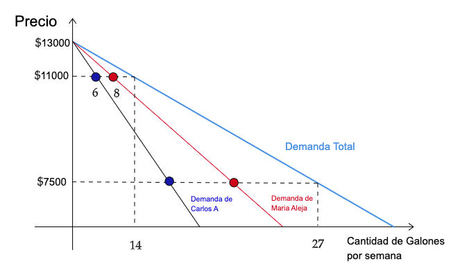
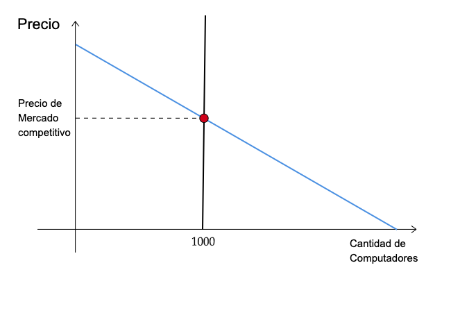
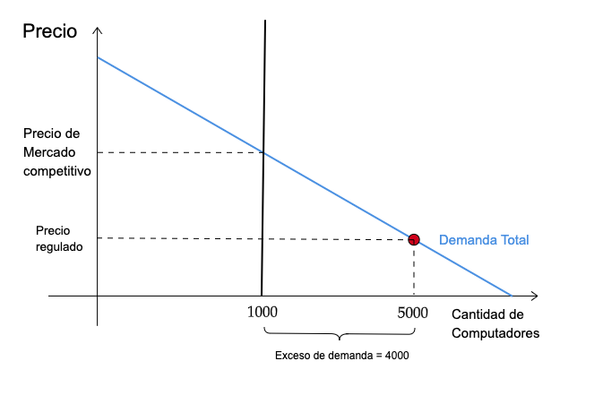
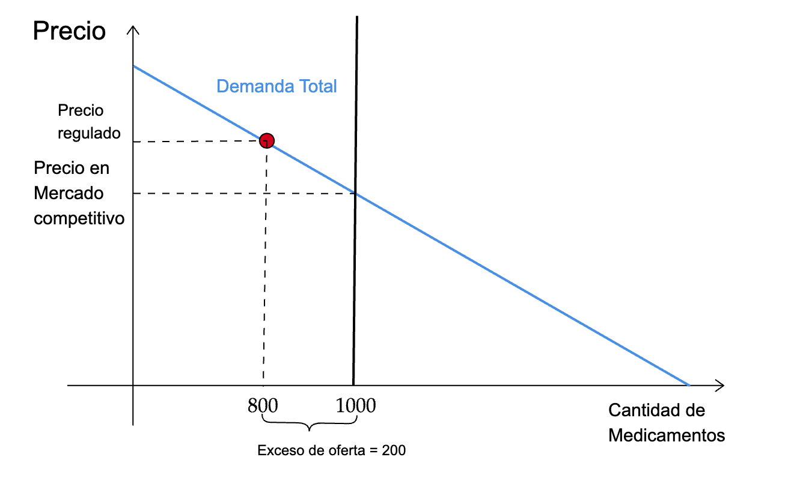
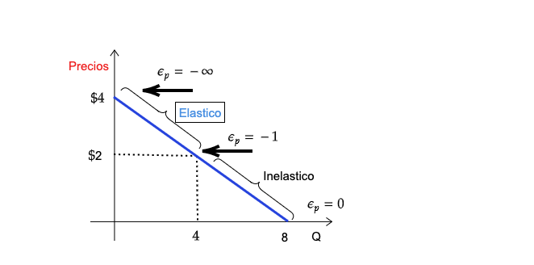

name: xaringan-title
class: left, middle


# Principios de Microeconomía
<br>
## Elasticidad de la Demanda
<br>
<br>


### Carlos Yanes | Departamento de Economía | `r Sys.Date()`

```{r Setup, include = F}
options(htmltools.dir.version = FALSE)
library(pacman)
p_load(broom, latex2exp, ggplot2, ggthemes, ggforce, viridis, dplyr, magrittr, knitr, parallel)

library(tidyverse)
library(babynames)
library(fontawesome) # from github: https://github.com/rstudio/fontawesome
library(DiagrammeR)
library(hrbrthemes)
library(econocharts)
library(plotly)
library(kableExtra)

# Knitr options

opts_chunk$set(
  comment = "#>",
  fig.align = "center",
  fig.height = 7,
  fig.width = 7,
  warning = F,
  message = F
)
```

---
class: middle, inverse

.left-column[

# `r emo::ji("smile")`

]

.right-column[
# Preguntas de las sesiones anteriores?
]
---
# Rendimiento participativo

--

.pull-left[
```{R, graph, echo = F, fig.height = 5, fig.width = 9, dev = "svg"}
# Datos
pop_df = 
  data.frame(
  lang = c("Natalia de la Hoz", "Catalina Anaya", "Diana Guette"),
  n_jobs = c(100, 97, 90),
  free = c(T, F, F)
  )
## Graficando
pop_df %>% 
  mutate(lang = lang %>% factor(ordered = T)) %>%
  ggplot(aes(x = lang, y = n_jobs, fill = free)) +
  geom_col() +
  geom_hline(yintercept = 0) +
  aes(x = reorder(lang, -n_jobs), fill = reorder(free, -free)) +
  xlab("Estudiantes") +
  scale_y_continuous(label = scales::comma) +
  ylab("Podium") +
  labs(
    title = "Participación Global",
    subtitle = "Notas de Oralidad"
    ) +
  scale_fill_manual(
    "",
    labels = c("Primer", "Th"),
    values = c("#f92672", "darkslategray")
    ) +
  ggthemes::theme_pander(base_size = 17) +
  # theme_ipsum() +
  theme(legend.position = "bottom")
```
]

--

.pull-right[

]

---
class: title-slide-section-grey, middle

# Demanda Agregada

<br>


---
# Demanda Agregada

--

> Las demandas **individuales** pueden ser sumadas o adheridas para obtener la demanda *total* del mercado.

--

Suponga lo siguiente:

--

```{r, tab32, echo=FALSE}
# Datos
precio<-c('$11000', '$10000', '$9000', '$8000', '$7500')
demanda1<-c(6, 8, 10, 11, 12)
demanda2<-c(8, 10, 12, 14, 15)
total<-demanda1+demanda2
df=data.frame(precio,demanda1,demanda2,total)
names(df) <- c('Precio', 'Carlos A.', 'Maria Alejandra', 'Demanda Total')

# Salida
kbl(df, caption = "Consumo de Gasolina por semana") %>%
  kable_paper("striped", full_width = F)
```

---
# Demanda Agregada

--

```{r bq, echo=FALSE, out.width="70%"}

```

---
# Demanda Agregada

--

`r fa("burn", fill="red")` Si fueran **funciones de demanda**, entonces estas se suman así:

--

### Ejemplo 1:

--

Un consumidor tiene una *función de demanda* de tal manera que:

--

$$q_{1}=300-22p$$
--

Ahora tenemos otro consumidor, pero su *función* es:

--

$$q_{2}=200-20p$$
--

La .black[demanda total] entonces de este mercado viene a ser (la suma) $Q=q_1+q_2$:

--

$$q_1+q_2=Q=500-42p$$
---
# Demanda Agregada

--

> Si no se encuentra seguro(a) de la función anterior, entonces lo lógico es contrastar y comprobar lo obtenido.

--

.black[*Comprobando*]: Tenemos un precio de P=$5. El .RUred[individuo (1)] tiene una demanda entonces de:

--

$$\color{#ee3636}{300-22(5)=190}$$

--

El .grey[individuo (2)] su demanda es:

--

.grey[$$200-20(5)=100$$]

--

La .black[demanda total] es en este caso de $Q=\color{#ee3636}{190}+\color{#504747}{100}=290$

--

`r fa("arrow-alt-circle-right", fill="red")` Utilizando la función de .black[demanda total], esto es:

--

$$500-42(5)=290$$
---
# Demanda Agregada

--

`r fa("edit", fill="blue")` Suponga que tiene un mercado que lo integran solo 45 personas. Un grupo de 10 de ellas tienen una **función de demanda** de tal forma que es igual a $q_{i}=1200-35p$, y el resto tiene una de $q_{j}=1500-22p$ 

--

`r fa("dice-one", fill="red")` Encuentre la **función de demanda total**.

--

`r fa("dice-two", fill="red")` Suponga que el precio del mercado es $20, ¿cuantas unidades consume tan solo un individuo del grupo de referencia (i)? 

--

`r fa("dice-three", fill="red")` Con un precio de $30, ¿cuantas unidades se consumen por cada grupo y cuantas en el mercado total?

---
# Demanda Agregada

--

`r fa("dice-one", fill="red")` La función de demanda **total** se encuentra sumando las funciones de cada grupo $Q=\color{#b717f0}{q_i}+\color{#ef9704}{q_j}$ siendo $\color{#b717f0}{i}\neq \color{#ef9704}{j}$.

--

Antes que nada primero debemos .black[multiplicar] cada grupo por su respectiva función.

--

Para el grupo $\color{#b717f0}{i=10}$ y el grupo $\color{#ef9704}{j=35}$, por ende las funciones quedan $\color{#b717f0}{12000-350p}$ y $\color{#ef9704}{52500-770p}$

--

Ahora no queda mas que sumar ambas funciones:

--

$$\begin{array}
 212000 - 350p &=  q_i \\ 
 52500 - 770p &=  q_j \\
 \hline
 64500 -1120p &= q_{i+j}
\end{array}$$

---
# Demanda Agregada

--

`r fa("dice-two", fill="red")` Como solo nos solicitan de un (1) individuo del grupo (i).

--

$$q_1=1200-35(\$ \color{#b717f0}{20})=\color{#b717f0}{500}$$

--

*Por ende un solo individuo a ese precio consume 500 unidades.*

--

`r fa("dice-three", fill="red")` Se deben tomar las demandas por grupo y luego si mirar la parte de la demanda final si .black[coinciden].

--

$$12000 - 350(\$ \color{#2f06e0}{30})=1500$$
--

$$52500 - 770(\$ \color{#c67b06}{30})=29400$$
--

Solo nos queda la demanda total

--

$$64500 -1120(\$\color{#d40920}{30})=30900$$
--

La .black[demanda total] nos da .black[30900] *unidades* que es la misma suma de $1500+29400=30900$ respectivamente.

---
class: title-slide-section-grey, middle

# Ejercicio 😼

---
# Ejercicio 1

--

`r fa("staylinked", fill="blue")` Suponga que un mercado tiene 10 consumidores. Cada uno tiene una demanda $P=10-5q_i$, donde $P$ es el precio por unidad y $q_i$ es el número de unidades demandadas a la semana por el *i-esimo* consumidor. Nos piden que hallemos la curva de demanda del mercado.

--

.RUred[R/.] Debemos primero despejar $q_i$ ya que tenemos una demanda inversa.

--

$$q_i=2-\frac{1}{5}P$$
--

Luego multiplicamos por el total de consumidores (n=10) y entonces:

--

$$Q_i=n \times q_i= 10 \times q_i = 10 \left( 2 -\frac{1}{5}P \right)$$
--

Lo que nos da finalmente

--

$$Q_t=20-2P$$


---
class: title-slide-section-blue, middle

# Controles de precios

<br>


---
# Controles de precios

--

<midd-blockquote>El **Estado** en principio puede entrar a regular precios de un mercado, mediante decretos o leyes puede establecer  precios máximos o precios mínimos</midd-blockquote>

--


- Lo mercados pueden ser **regulados**, sin embargo, es la última recomendación para hacer, siempre es bueno dejar que las fuerzas del mercado intenten equilibrarse.

--

- La fuerza de la *demanda* puede verse afectada por carencias del mercado e incluso por las decisiones propias de los individuos que la conforman. La *oferta* no se queda atras, funciona de manera similar.

---
# Controles de precios

--

`r fa("gem", fill="blue")` Tome la siguiente información donde un mercado de .black[computadores] entra a ser regulado

--

```{r bhj, echo=FALSE, out.width="70%"}

```
---
# Controles de precios

`r fa("gem", fill="blue")` Tome la siguiente información donde un mercado de .black[computadores] entra a ser regulado

```{r bhj2, echo=FALSE, out.width="70%"}

```

---
# Controles de precios

--

### Que ocurre entonces si se fija un **Precio máximo**?

--

+ Los precios **máximos** generan otros tipos de distorsiones que regularmente recaen mas en los productores que en los consumidores. Ya que es lo máximo que le permiten vender a alguien.

--

+ La presión de este tipo de precio sobre la oferta termina haciendo mas daño que ajustes requeridos. A veces por proteger un consumidor lo terminamos afectando mas que cuando estaba en una posición inicial con mayor beneficio.

--

+ Podemos incentivar a la creación de .black[mercados negros] ya que no habría incentivos de vender en ese mercado legal. La .RUred[calidad] y el tamaño de los bienes puede también resultar distinta de la **original** y tender a la mala opción.

---
# Controles de precios

`r fa("gem", fill="blue")` Ahora mire cuando un mercado de .black[medicamentos] entra a ser regulado

```{r mathqw, echo=FALSE, out.width="70%"}

```
---
# Controles de precios

--

### Que ocurre entonces si se fija un **Precio mínimo**?

--

+ Los precios **mínimos** generan también distorsiones que regularmente recaen mas en los consumidores. Son precios por encima del precio del mercado común y pueden incluso llevar a la creación de mercados informales. 

--

+ La presión de este tipo de precio sobre la demanda termina haciendo daño a la sobre producción. Queremos incentivar a los productores y "proteger la industria" y generamos incentivos perversos.

--

+ Por el lado **laboral** las cosas se tornan algo mas oscuras. Tendríamos por salario mínimo por encima del salario normal y entonces tener .RUred[Desempleo]. (Muchas mas personas quieren o desean trabajar). 


---
class: title-slide-section-grey, middle

# Elasticidad

<br>


---
# Elasticidad

--

<midd-blockquote> La elasticidad mide como una **variable** responde a los *cambios* de otra .RUred[variable] de interés. Para facilidad, esta puede ser expresada como el cambio porcentual de una variable por el *cambio porcentual* de la otra.</midd-blockquote>

--

$$\epsilon^{d}=\dfrac{\% \triangle Q_{d}}{\% \triangle P} = \dfrac{\dfrac{\triangle Q}{Q}}{\dfrac{\triangle P}{P}}$$

--

.RUred[*Debe saber que*] $\triangle Q= Q_2-Q_1$, donde $Q_2$ *es el presente de la variable o tiempo actual y* $Q_1$ *viene siendo el pasado*.

---
# Elasticidad

--

>.black[Variación Porcentual (%)]: Mide los cambios **porcentuales** de una .RUred[variable característica]. Esta puede ser *positiva* o *negativa*.

--
 
$$Var\;\%=\frac{\left ( X_{Presente}-X_{Pasado} \right )}{X_{Pasado}}*100$$
--

`r fa("info-circle", fill="red")` Tenga en consideración que si los precios por decir un ejemplo eran de .black[`$`13000] y pasaron a ser de .RUred[`$`14700], entonces la variación porcentual es de:

--

$$Var\;\%=\frac{\left ( 14700-13000 \right )}{13000}*100= 13\%$$
---
# Elasticidad

--

```{r kmpl, echo=FALSE, out.width="80%"}
knitr::include_graphics("images/changes1.png")
```


---
# Elasticidad

--

### Ejemplo 2:

--

Suponga que posee la siguiente **función de demanda**:

--

$$Q_d=8-2p$$

--

`r fa("dice-one", fill="red")` Calcule la elasticidad .black[precio] de la .black[demanda] si los precios cambiaron de $2 a $1.

--

Solo debe reemplazar y analizar:

--

$$Q_d=8-2(2)= 4 \; \textrm{unidades de producto}$$
--

$$Q_d=8-2(1)= 6 \; \textrm{unidades de producto}$$
--

Entonces tenemos:

--

$$\epsilon^{d}:\dfrac{\dfrac{\triangle Q}{Q}}{\dfrac{\triangle P}{P}}= \dfrac{\dfrac{2}{4}}{\dfrac{-1}{2}}= -1$$

---
class: inverse, middle

# Qué pasa si los precios cambian de $1 a $ 2? 


---
# Elasticidad

--

`r fa("key", fill="blue")` Si la dirección del cambio es .RUred[opuesta], se recomienda hacer uso de la siguiente formula:

--

$$\epsilon^{d}= \dfrac{\dfrac{\partial Q}{Q}}{\dfrac{\partial P}{P}}= \dfrac{P}{Q}\dfrac{\partial Q}{\partial P }$$
--

Para este caso solo es **derivar** la función de demanda cuando el precio es $2:

--

$$\dfrac{2}{4} \times (-2)=-1$$
---
# Elasticidad

--

```{r kmpnjk, echo=FALSE, out.width="80%"}

```

---
# Elasticidad

--

`r fa('lightbulb')` La elasticidad de la demanda regularmente es un número .RUred[negativo].

--

`r fa('lightbulb')` $|E_{p}|>1$ nos dice que el bien es *elástico*. Lo mas probable es que tenga muchos bienes sustitutos.

--

`r fa('lightbulb')` Cuando $|E_{p}|=0$ La cantidad que se consume del bien .RUred[no] depende del precio. Por otro lado, cuando $|E_{p}|=\infty$, la cantidad de demanda es demasiado .RUred[sensible] frente a una mínima variación del precio. 

---
# Elasticidad

--

```{r tympl, echo=FALSE, out.width="80%"}
knitr::include_graphics("images/cases.png")
```

---
class: inverse, middle

Piense que el precio de un producto subió en un 1.5% y la cantidad de demanda se redujo en 3.5%. ¿Cuál es la elasticidad precio?.

--

R./ 
<font size="+5">$$\frac{-0.035}{0.015}=2.33$$</font>.

--

Desde luego es elástico.

---
# Elasticidad

--

`r fa("store", fill="red")` Desde luego hallar la **elasticidad** no es un trabajo trivial. Mostramos algunos ejemplos de articulos donde han hallado sus elasticidades:

--

| **Bien o Servicio**  | Elasticidad- Precio |
| -------------------- | ------------------- |
| Lentejas             | \-2,91              |
| Energia (Air-e)      | \-0,86              |
| Cerveza              | \-0,45              |
| Netflix              | \-1,42              |
| Viajes en avión      | \-0,77              |
| Zapato y calzado     | \-0,62              |


---
class: title-slide-section-grey, middle

# Otros tipos de Elasticidad

<br>

---
# Elasticidad del ingreso

--

El **ingreso** también puede variar y darnos algunos alcances:

--

$$\epsilon^{I}=\dfrac{\% \triangle Q_{I}}{\% \triangle I} = \dfrac{\dfrac{\triangle Q}{Q}}{\dfrac{\triangle I}{I}}$$

--

`r fa('cog')` Se lee idéntico a la elasticidad de la .RUred[demanda], funciona igual, solo que varia o se hace uso del **ingreso**. Y este siempre regularmente es .black[positivo].

---
# Elasticidad cruzada

--

El **precio** del bien sustituto, puede influir y determinar la sensibilidad del bien de interés:
--

$$\epsilon^{I}=\dfrac{\% \triangle Q_{I}}{\% \triangle P_j} = \dfrac{\dfrac{\triangle Q}{Q}}{\dfrac{\triangle P_j}{P_j}}$$

--

`r fa('cog')` Tambien se interpreta igual a la elasticidad de la .RUred[demanda], funciona de la misma forma que los anteriores, solo que varia o se hace uso del **Precio sustituto**.

---
# Elasticidad de corto y largo plazo

--

`r fa('caret-right', fill= "red")` Bienes de **Consumo** o primera necesidad: Tienden a ser elásticos en el .black[largo plazo]. En el corto plazo por ser habituales, los individuos requieren mas tiempo para poder reemplazarlos. Ejemplos: Granos, legumbres, implementos de aseo.

--

`r fa('caret-right', fill= "red")` Bienes **Durables**, suelen ser elásticos en el corto plazo. Un ejemplo de estos es los carros o vehículos. Si el precio se incrementa, las personas pueden recurrir a otros medios de transporte que comprarse un auto propio.

---
class: title-slide-section-grey, middle, center
background-image: url(https://media.giphy.com/media/joV1k1sNOT5xC/giphy.gif)
background-size: cover

---
class: title-slide-section-grey
# Bibliografía

`r fa('book')` Acemoglu, D., Laibson, D., & List, J. (2021). *Economics*, eBook. Pearson Higher Ed.

`r fa('book')` Krugman, P., & Wells, R. (2014). *Microeconomics (for AP)*. New York: Worth Publishers.

`r fa('book')` Muñoz-Garcia, F. (2017). *Advanced microeconomic theory: an intuitive approach with examples*. MIT Press.


---
class: title-slide-final, middle

# Gracias por su atención!

## Alguna pregunta adicional?

### Carlos Andres Yanes Guerra
`r fa("envelope", fill="red")` cayanes@uninorte.edu.co
`r fa("university", fill="blue")` Universidad del Norte