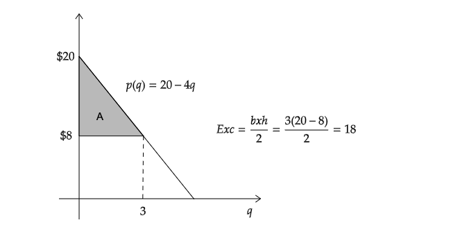
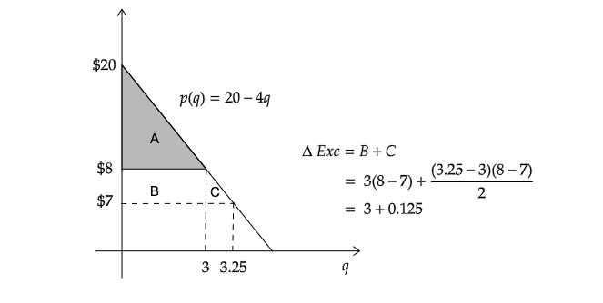
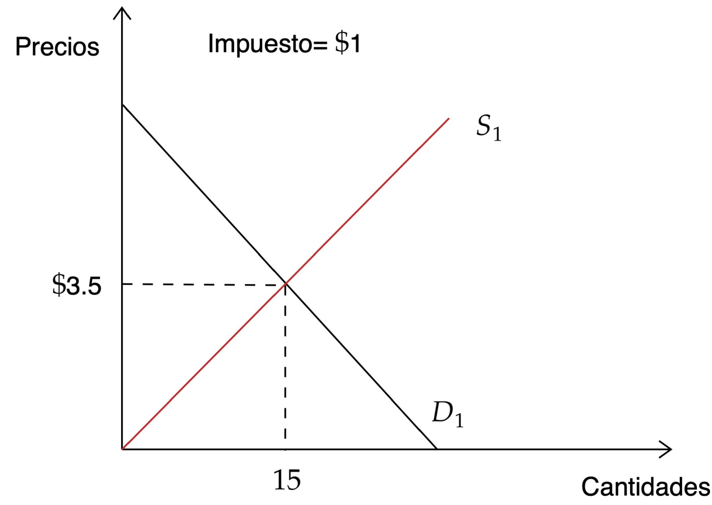
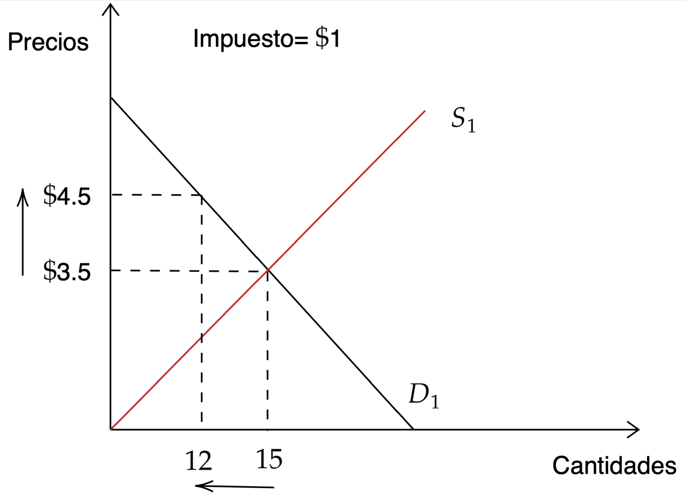
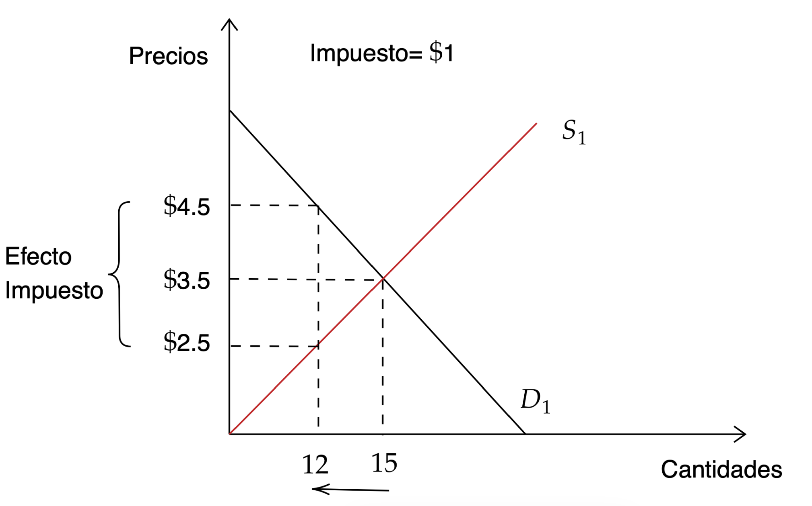
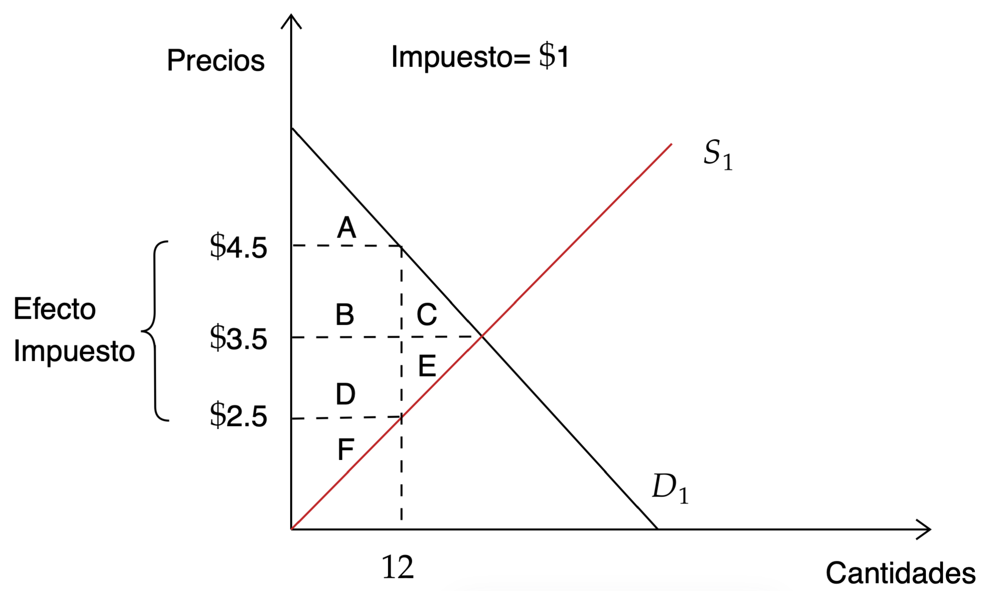
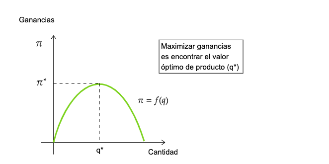
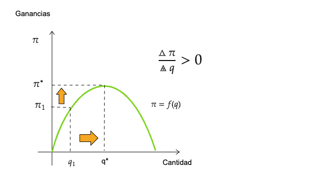
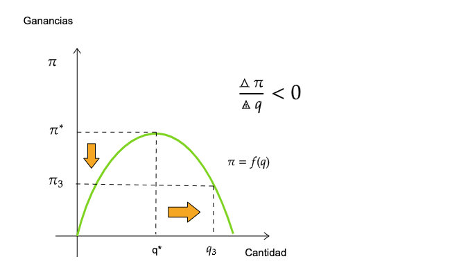

name: xaringan-title
class: left, middle


# Principios de Microeconomía
<br>
## Teoría del Productor
<br>
<br>


### Carlos Yanes | Departamento de Economía | `r Sys.Date()`

```{r Setup, include = F}
options(htmltools.dir.version = FALSE)
library(pacman)
p_load(broom, latex2exp, ggplot2, ggthemes, ggforce, viridis, dplyr, magrittr, knitr, parallel)

library(tidyverse)
library(babynames)
library(fontawesome) # from github: https://github.com/rstudio/fontawesome
library(DiagrammeR)
library(hrbrthemes)
library(econocharts)
library(plotly)
library(kableExtra)
library(flextable)
# Define colors
red_pink <- "#e64173"
met_slate <- "#272822" # metropolis font color 
purple <- "#9370DB"
green <- "#007935"
light_green <- "#7DBA97"
orange <- "#FD5F00"
turquoise <- "#44C1C4"
red <- "#b92e34"
# Notes directory
dir_slides <- "~/GitHub/Intro_Microeconomics_W20/Lectures/03-Consumer_Theory/"
# Knitr options
opts_chunk$set(
  comment = "#>",
  fig.align = "center",
  fig.height = 7,
  fig.width = 10.5,
  #dpi = 300,
  #cache = T,
  warning = F,
  message = F
)  
theme_simple <- theme_bw() + theme(
  axis.line = element_line(color = met_slate),
  panel.grid = element_blank(),
  rect = element_blank(),
  strip.text = element_blank(),
  text = element_text(family = "Fira Sans", color = met_slate, size = 17),
  # axis.text.x = element_text(size = 12),
  # axis.text.y = element_text(size = 12),
  axis.ticks = element_blank()
)
theme_market <- theme_bw() + theme(
  axis.line = element_line(color = met_slate),
  panel.grid = element_blank(),
  rect = element_blank(),
  strip.text = element_blank(),
  text = element_text(family = "Fira Sans", color = met_slate, size = 17),
  axis.title.x = element_text(hjust = 1, size = 17),
  axis.title.y = element_text(hjust = 1, angle = 0, size = 17),
  axis.ticks = element_blank()
)
theme_gif <- theme_bw() + theme(
  axis.line = element_line(color = met_slate),
  panel.grid = element_blank(),
  rect = element_blank(),
  text = element_text(family = "Fira Sans", color = met_slate, size = 17),
  axis.text.x = element_text(size = 12),
  axis.text.y = element_text(size = 12),
  axis.ticks = element_blank()
)
theme_goods <- theme_bw() + theme(
  axis.line = element_line(),
  panel.grid = element_blank(),
  rect = element_rect(size = 1),
  strip.text = element_blank(),
  text = element_text(size = 17, family = "Fira Sans"), 
  axis.text.x = element_text(size = 17),
  axis.text.y = element_text(size = 17, angle = 90, hjust = 0.5),
  axis.title.x = element_text(color = purple, size = 19),
  axis.title.y = element_text(color = red_pink, size = 19),
  axis.ticks = element_blank(),
  plot.title = element_blank(),
  legend.position = "none"
)
shift_axis <- function(p, y=0){
  g <- ggplotGrob(p)
  dummy <- data.frame(y=y)
  ax <- g[["grobs"]][g$layout$name == "axis-b"][[1]]
  p + annotation_custom(grid::grobTree(ax, vp = grid::viewport(y=1, height=sum(ax$height))), 
                        ymax=y, ymin=y) +
    geom_hline(aes(yintercept=y), data = dummy, size = 0.5, color = met_slate) +
    theme(axis.text.x = element_blank(), 
          axis.ticks.x = element_blank())
}
wrapper <- function(x, ...) paste(strwrap(x, ...), collapse = "\n")
```

---
class: title-slide-section-blue, middle

--

## Felicitaciones a: 

--

<font size="+8">$$\color{#fcfdff}{3 \; \text{estudiantes...}}$$</font>

--

🥇 Jenifer Ariza 3:52
➡️ Samir Fayad 4:14
➡️ Alexander Estupiñan 4:20

---
class: title-slide-section-grey, middle

# Excedente consumidor (cont.)

<br>

---
# Excedente del Consumidor

--

La **curva de demanda** identifica cuantas unidades de x puede comprar a un precio $P_{x}$ con un ingreso (I).

--

En el corto plazo la .black[función de demanda] representa la .black[máxima] _disponibilidad a pagar_ (DAP) por un bien.

--

Si se _compara_ la DAP contra el .RUred[precio] que realmente paga un consumidor, podemos encontrar una .black[medida] de la utilidad que gana una persona al comprar.

--

<midd-blockquote>**Técnicamente**: Es el .bold[área] por debajo de la curva de demanda y por encima del precio que los consumidores pagan por un bien.</midd-blockquote>

---
# Excedente del Consumidor

--

`r fa("tablet", fill="red")` Encuentre lo siguiente:

--

El **excedente** del consumidor de una demanda lineal.

--


`r fa("atom", fill="blue")` Considere una función de demanda inversa $p(q)=20-4q$ y los precios del mercado son P=$8.

--

```md
- Usamos la inversa por el eje (Y)
- Ya que se trabaja con la oferta. Lo correspondiente es decir: "cuanto debo cobrar si consumen 3 unidades"
- Generamos la linea de demanda con los extremos en este caso a (0) cantidades el precio es de $20.
- Como son áreas de forma geometrica, siempre es bueno mirar que formulas aplicar para hallar los excedentes.
- La suma de las áreas nos brindan el excedente total.
```

---
# Excedente del Consumidor

--

`r fa("atom", fill="blue")` El **área** .black[A] o zona del triangulo es el .grey[excedente del consumidor].

--

```{r exc1, echo=FALSE}

```

---
# Excedente del Consumidor

--

`r fa("tablet", fill="red")` Siguiendo con el ejemplo anterior, asuma que el precio cae a P=7. La demanda aumenta en $7=20-4q \Rightarrow 3.25\; \text{Unidades}$.

--

+ Se da un incremento $(\Delta \; EC)$ en las áreas de .bold[B] y .RUred[C].

--

<div align="center">

</div align="center">

--

+ Note que el nuevo .RUred[excedente] ahora es de $\color{#F02B79}{21.13}$, que es el resultado de la suma del excedente que tenia como área **A**: $18+3.125$ 

---
class: title-slide-section-blue, middle

# Un pequeño detalle de los impuestos

<br>

---
# Impuestos en economía (recordeis)

--

Los impuestos pueden ser:

```{r, taxtax, echo=FALSE}
mi_im <- data.frame(
  "A" = c(1000, 1500,3000),
  "B" = c(190, 285, 570),
  "C" = c("19%","19%", "19%"), 
  "D" = c(300,375,600),
  "E" = c("30%","25%","20%"),
  "K" = c(200,375,900),
  "G" = c("20%","25%","30%"))

ft <- flextable(mi_im)
ft<-set_header_labels(ft, A = "Ingresos", B = "Impuesto similar", C="% de impuesto", D="Impuesto regresivo", E="% de impuesto", K="Impuesto progresivo", G="% de impuesto")
ft <- theme_vanilla(ft)
ft <- add_footer_lines(ft, "En Millones de Pesos")
ft <- color(ft, part = "footer", color = "#666666")
ft <- set_caption(ft, caption = "Nivel de impuestos de una persona")
ft
```

---
layout: true
# Impuestos en economía

`r fa("tablet", fill="red")` Vamos a tomar otro ejemplo. Pensemos en un mercado que tiene los siguientes datos:

---

<div align="center">

</div align="center">

---

<div align="center">

</div align="center">
---

<div align="center">

</div align="center">
---
layout: false
class: middle, inverse

## Entonces.. cuál es el efecto?

---
# Efecto del impuesto en áreas del excedente del consumidor

--

|              | Exc Consumidor | Exc Productor | Gobierno | Total  |
| ------------ | -------------- | ------------- | -------- | ------ |
| Con Impuesto | A              | F             | BD       | ABDF   |
| Sin Impuesto | ABC            | DEF           |          | ABCDEF |
| Diferencia   | -BC            | -DE            | BD      | CE     |

--
<div align="center">

</div align="center">

---
class: title-slide-section-grey, middle

# Teoría del Productor

<br>


---
# Teoría del Productor

--

<midd-blockquote> Las firmas o empresas son organizaciones que producen bienes o servicios para vender. Para lo anterior deben transformar los .bold[Insumos] en **Productos**. La cantidad de producto depende de la cantidad de insumos que posea la firma. La relación entre ambos se denomina **Función de producción**.

--

+ `r fa("angle-down")` **Insumos fijos**: Aquel insumo cuya cantidad es fija en el corto plazo y no puede variar. Ej: Edificaciones.

--

+ `r fa("angle-down")` **Periodos de tiempo**: en economía es _Corto plazo_ donde un insumo es fijo y _largo plazo_ donde todos los factores de producción varían.

---
# Teoría del Productor

--

### función de producción tecnológica

**Producto:** Lo que las firmas producen.

--

**Insumos:** Recursos usados para la producción de bienes y servicios.

--

- Tierra: recursos naturales, sitios/lugares del negocio, *etc.*

- Trabajo: Trabajadores, Administradores, *etc.*

- Capital: Maquinaria, computadores, vehiculos, *etc.*

--

.blue[**Función de producción:** Descripción matemática de la relación entre insumos y productos en el proceso de producción de una empresa.]

--

.center[.RUred[Insumos --> tecnología de producción --> resultado]] 

---
# Teoría del Productor

La producción depende de insumos: como el *Terreno*, el *Capital* y el *Trabajo*

```{r, tab, echo=FALSE}
mi_df <- data.frame(
  "A" = rep(4,5),
  "B" = 0:4,
  "C" = c(0, 19, 36, 51, 64), 
  "D" = c(NA, 19, 17, 15,13),
  "E" = c(NA,19, 18, 17, 16))

ft <- flextable(mi_df)
ft<-set_header_labels(ft, A = "Cantidad de Maquinas", B = "Trabajadores", C="Producto", D="Producto Marginal", E="Productividad")
ft <- theme_vanilla(ft)
ft <- add_footer_lines(ft, "Datos para ejemplo")
ft <- color(ft, part = "footer", color = "#666666")
ft <- set_caption(ft, caption = "Nivel de producción de una empresa pequeña")
ft
```

+ La producción marginal siempre es decreciente


---
# Teoría del Productor

--

La función de producción es establecida entonces como:

--

$$Q=(K,L)$$

--

Estos **factores** tienen costos también, no solo monetarios si no también de oportunidad, su combinación permite maximizar la función de producción y de ingresos de una firma.

--

La formula de beneficios de la firma contiene:

--

$$\pi= P\times Q - CT(Q)$$
--

Existen desde luego .RUred[costos explícitos] y costos .RUred[implícitos]

---
# Teoría del Productor

--

`r fa("lightbulb", fill="blue")` Ejemplo:

+ Necesita 10 millones de pesos para iniciar un negocio. La tasa que se lo prestan es al 5% anual. La tasa de Ahorro es del 2%

--

**Costos nivel 1**:<br> 
Préstamo: 10.000.000 ; Costo explicito: $500.000

--

**Costos nivel 2**:<br> 
Préstamo: 6.000.000; Costo explicito: $300.000
Ahorros: 4.000.000;  Costo implícito: $80.000

.RUred[Total costos]: 380.000 en el nivel 2 y de 500.000 para el nivel 1. *La mejor opción quizas sea tomar el nivel 2*

---
class: inverse, middle

# Como es lo del producto?


---
# Producto total

--

.left-column[
## Definición
>Cantidad de un producto dado la cantidad de insumos que se tenga

**Ejemplo:** Trabajadores (L), manteniendo lo demás constante.
]

.right-column[
```{r, echo = FALSE, fig.height = 5, fig.width = 5, dev = "svg"}
x <- 0:10
total_product <- function(x) 3*x - 0.5*x^3 + 4*x^2 
ggplot(data = data.frame(x = 0), mapping = aes(x = x)) +
  scale_x_continuous(limits = c(0, 7.5), expand=c(0,0), breaks = seq(0,7,1)) +
  scale_y_continuous(limits = c(0, 65), expand=c(0,0), breaks = seq(0,60,10)) +
  theme_market +
  labs(x = "L", y = "Q") +
  stat_function(fun = total_product, color = purple, size = 1)
```
]
---
# Producto total

.left-column[
## Definición
>Cantidad de un producto dado la cantidad de insumos que se tenga 

**Ejemplo:** Trabajadores (L), manteniendo lo demas constante.
]

.right-column[
```{r, echo = FALSE, fig.height = 5, fig.width = 5, dev = "svg"}
x <- 0:10
z <- seq(0, 2.67, 0.01)
w <- seq(2.67, 5.68, 0.01)
u <- seq(5.68, 7.5, 0.01)
total_product <- function(x) 3*x - 0.5*x^3 + 4*x^2 
ggplot() +
  scale_x_continuous(limits = c(0, 7.5), expand=c(0,0), breaks = seq(0,7,1)) +
  scale_y_continuous(limits = c(0, 65), expand=c(0,0), breaks = seq(0,60,10)) +
  theme_market +
  labs(x = "L", y = "Q") +
  stat_function(fun = total_product, color = purple, size = 1) +
  geom_vline(xintercept = 2.67, color = met_slate, size = 1, linetype = "dashed") +
  geom_vline(xintercept = 5.68, color = met_slate, size = 1, linetype = "dashed") +
  annotate("label", label = wrapper("Increntos a tasa creciente", 15), x = 2.67/2, y = 58.5, color = purple, family = "Fira Sans", size = 4) +
  annotate("label", label = wrapper("Incrementos a tasa decreciente", 15), x = (2.67 + 5.68)/2, y = 58.5, color = purple, family = "Fira Sans", size = 4) +
  annotate("label", label = wrapper("Decreciendo", 15), x = (7.5 + 5.68)/2, y = 58.5, color = purple, family = "Fira Sans", size = 4) +
  geom_ribbon(aes(x = z, ymin = 0, ymax = 65), fill = purple, alpha = 0.2, linetype = "blank") + # PS
  geom_ribbon(aes(x = u, ymin = 0, ymax = 65), fill = purple, alpha = 0.2, linetype = "blank")
```
]
---
class: inverse, middle

# Recuerda el asunto de las derivadas?

---
# Maximización de las utilidades

--

`r fa("box-open", fill="blue")` Una función de ganancias esta en función de lo que produce o vende.

--

<div align="center">

</div align="center">

---
# Maximización de las utilidades

--

<div align="center">

---
# Maximización de las utilidades

--

<div align="center">

---
# Una nota con respecto a las derivadas

--

La .bold[derivada] de $\pi=f(q)$ es el límite de $\triangle \pi / \triangle q$ ante .bold[cambios] muy pequeños (infinitesimales) en $q$.
 
--


$$\frac{d \pi}{d q}=\frac{df}{dq}= \lim_{h \to 0} \frac{f(q_{1}+h)-f(q_{1})}{h}$$

--

`r fa("apple")` La derivada se puede evaluar en un punto especifico de $q$, por ejemplo, cuando $q=q_{1}$ se tiene:

--
        
$$\frac{d\pi}{dq}\Big | _{q=q_{1}}$$

--

De lo anterior podemos tener:

--

$$\boxed{\frac{d\pi}{dq}\Big | _{q=q_{1}} >0 } \qquad \boxed{\frac{d\pi}{dq}\Big | _{q=q_{3}} < 0 } \qquad \boxed{\frac{d\pi}{dq}\Big | _{q=q_{*}} =0 }$$

---
# Maximización de las utilidades

--

La **función** de una _variable_ en su valor .bold[máximo] en algún punto se obtiene cuando la derivada en ese punto es igual a cero.

--

$$\frac{d\pi}{dq}\Big | _{q=q_{*}}=0$$

--

La CPO $(d\pi/dq)$ es una **condición necesaria** para un máximo, pero .bold[no] es condición suficiente

--

  + Hay que hallar _la segunda derivada_ y esta debe ser .RUred[negativa].
  
--
  
  $$\frac{d^{2}\pi}{dq^{2}}\; o\; f''(q) < 0$$

---
# Maximización de las utilidades

--

`r fa("angellist")` Suponga la siguiente función de beneficios:

--


<font size="+5">$$\pi= 1000q -5q^{2}$$</font>

--

  + La CPO de un máximo es:
  
--
  
$$\frac{\partial \pi}{\partial q}= 1000-10q=0 \qquad donde\; q^{*}= 100$$
  
--
    
  + La segunda derivada es $-10$ y por ende, producir 100 unidades es mas que suficiente!!.

---
class: inverse, middle

# Calcule usted el beneficio de la firma si produce 110 unidades


---
# Producción Marginal

--

.pull-left[
`r fa("car")` Piense por un momento que: $q=100\sqrt{L}$:
+ En A $\Rightarrow \; L=4, \; q_{A}=200\; PMe_{L}=50$
+ En B $\Rightarrow \; L=16, \; q_{A}=400\; PMe_{L}=25$
+ _Recuerde que_ 
$$PMe=\frac{200}{4}=50$$]

.pull-right[]


---
class: title-slide-section-grey

# Bibliografía

`r fa('book')` Coppock, L., & Mateer, D. (2018). *Principles of Economics (Second edition)*. W.W. Norton & Company, inc. 

`r fa('book')` Krugman, P., & Wells, R. (2014). *Microeconomics (for AP)*. New York: Worth Publishers.

`r fa('book')` Mankiw, N. G. (2007).. *Principles of Microeconomics*. Canadá: Cengage Learning.


---
class: title-slide-final, middle

# Gracias por su atención!

## Alguna pregunta adicional?

### Carlos Andres Yanes Guerra
`r fa("envelope", fill="red")` cayanes@uninorte.edu.co
`r fa("university", fill="blue")` Universidad del Norte
