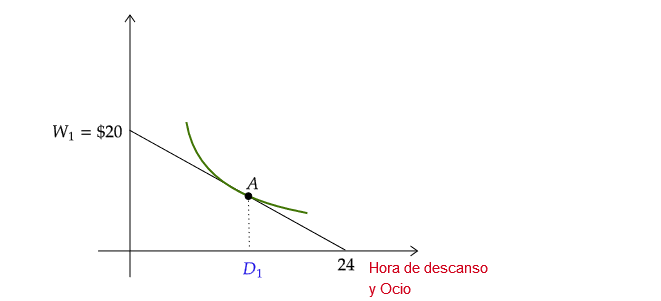
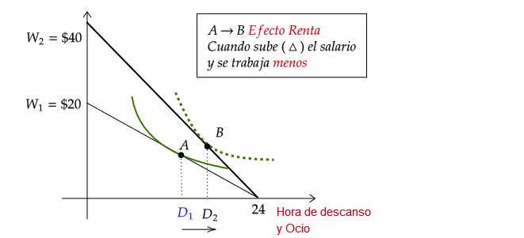
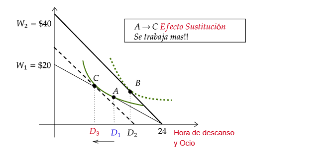

name: xaringan-title
class: left, middle


# Principios de Microeconomía
<br>
## Teoría del Productor II 
<br>
<br>


### Carlos Yanes | Departamento de Economía | `r Sys.Date()`

```{r Setup, include = F}
options(htmltools.dir.version = FALSE)
library(pacman)
p_load(broom, latex2exp, ggplot2, ggthemes, ggforce, viridis, dplyr, magrittr, knitr, parallel)

library(tidyverse)
library(babynames)
library(fontawesome) # from github: https://github.com/rstudio/fontawesome
library(DiagrammeR)
library(hrbrthemes)
library(econocharts)
library(plotly)
library(kableExtra)
library(flextable)

# Knitr options

opts_chunk$set(
  comment = "#>",
  fig.align = "center",
  fig.height = 7,
  fig.width = 7,
  warning = F,
  message = F
)
```

---
class: middle, inverse

.left-column[

# `r emo::ji("cool")`

]

.right-column[
# Preguntas de la clase anterior?
]

---
class: title-slide-section-blue, middle

--

## Esta vez solo hubo un ganador en 5.0

--

### Juan Rapalino Diaz 💥💪🏼

--

### Felicitaciones!!

---
class: title-slide-section-grey, middle

# Función de producción

<br>

---
# Función de producción

--

`r fa("angle-right", fill="blue")` **Insumos** Son los factores de producción tales como: _trabajo_, _capital_, _terreno_, y cualquier otro elemento donde una .black[firma] o empresa puede transformar en unidades de .black[producto].

--

`r fa("angle-right", fill="blue")` La .RRed[función de producción] representa cierta cantidad de insumos que son transformados dentro de una cantidad de producto (q).

--

+ Por ejemplo:

--

$$q=f(K,L)$$

--

_La función de producción describe como ciertas cantidades de K y L son transformadas dentro de una cantidad de producto (q)_

---
# Función de producción

--

Tomemos un ejemplo de una función de producción.

--

.blue[*Ejemplo 1*]: 

--

La función de producción tipo .black[Cobb-Douglas] es:

--

$$q=AK^{\alpha}L^{\beta}$$

--

*Donde A es una constante positiva y los parámetros $\alpha, \beta\;\in(0,1)$ *

--

Piense por un momento que $A=3; \alpha=\beta=0.5; K=4\; \text{maquinas y}\; L=9\; \text{trabajadores}$.

--

El máximo producto que puede *generar* la firma es de:

--

$$q=3(4)^{0.5}(9)^{0.5}=18\; \text{unidades}$$
--

Si en lugar de .blue[18 unidades], la empresa solo hiciera 14 unidades. Serie .black[ineficiente], esto es:

--

$$\frac{14}{18}=0.77\;  \Rightarrow (1-0.77)=0.33$$
---
# Función de producción

--

### Otros (ejemplos) de funciones de producción

--

`r fa("atom", fill="red")` Cuando $q=aK+bL$, entonces hace referencia a una función _lineal_.

--

`r fa("atom", fill="red")` Cuando $q=min\{aK,bL\}$, entonces es una función _complementaria_ y los factores deben ser usados en cierta proporción.

--

`r fa("atom", fill="red")` Cuando $q=aK^{\alpha}+bL$, entonces hace referencia a una función _no lineal_.

---
class: title-slide-section-grey, middle

# Producto Medio y Marginal

<br>


---
# Producto Medio

--

<midd-blockquote>El producto medio, es el total de unidades de producto de una firma por cada unidad de insumo</midd-blockquote>

--

+ Producto Medio del trabajo $(PM_L)=\frac{q}{L}$.

--

+ Producto Medio del Capital $(PM_K)=\frac{q}{K}$

--

.blue[*Ejemplo 2*]:

--

Si la firma produce 100 unidades de producto y contrata a 4 trabajadores, cuanto es su producto medio?

--

$$PM_{L}=\frac{100}{4}=25$$

--

El significado es que cada trabajador produce 25 unidades. *Es conveniente mirar que esto aun no es la productividad del trabajo, pero posiblemente una aproximación*.

---
# Producto Medio

--

## Consideraciones:

--

+ Cuando la productividad laboral cambia (crece/decrece), esto puede estar asociado a ciertos eventos:

--

1. El .RUred[producto total] aumenta manteniendo a los empleados en labores.

--

1. El .RUred[producto total] se mantiene cuando se _despidieron_ trabajadores.

--

1. Aumenta tanto la producción como los trabajadores contratados en la operación.

---
# Producto Medio

--

`r fa("car")` Recuerde nuevamente *la función de la clase pasada* donde: $q=100\sqrt{L}$:

--

+ En A $\Rightarrow \; L=4, \; q_{A}=200\; PMe_{L}=50$

--

+ En B $\Rightarrow \; L=16, \; q_{A}=400\; PMe_{L}=25$

--

+ _Recuerde que_ 

--

$$PMe=\frac{200}{4}=50$$

--


---
# Producto Medio

--

.blue[*Ejemplo 3*]:

--

`r fa("tablet", fill="red")` Considere la siguiente función $q=5L^{0.5}+3L-6$, cuál es su producto medio?

--

$$\begin{aligned}
PM_{L}&=5L^{0.5}+3L-6 \\
&=\frac{5L^{0.5}}{L}+\frac{3L}{L}-\frac{6}{L}\\
&=\frac{5}{L^{0.5}}+3-\frac{6}{L}
\end{aligned}$$

--

Cuando L aumenta, el .RUred[producto medio] solo aumenta si se cumple lo siguiente (debe derivar el producto con respecto a q) $\frac{\partial PM_L}{\partial L}\geq0$:

--

$$-\frac{5}{2L^{1.5}}+\frac{6}{L^2}\geq0$$
---
class: title-slide-section-grey

## Si se quiere mirar cuantos trabajadores (horas) contratar:

--

$$\begin{aligned}
\frac{6}{L^2}&\geq\frac{5}{2L^{1.5}} \\
\frac{L^{1.5}}{L^2}&\geq\frac{5}{12} \\
\frac{1}{L^{2-1.5}}&\geq\frac{5}{12} \\
\frac{1}{L^{0.5}}&\geq\frac{5}{12}
\end{aligned}$$

--

Ahora para que esto tenga sentido

--

$$\begin{aligned}
\frac{1}{L^{0.5}}&\geq\frac{5}{12}\\
\frac{12}{5}&\geq L^{0.5}
\end{aligned}$$

---

class: title-slide-section-grey

## Si se quiere mirar cuantos trabajadores (horas) contratar:

Solo queda despejar

--

$$\begin{aligned}
\left(\frac{12}{5}\right)^{2} &\geq (L^{0.5})^2\\
5.76 &\geq L
\end{aligned}$$

--

Que indica finalmente que la .RUred[productividad] aumenta solo si L es menor al punto optimo $5.76\geq L$, es decir, (tenemos menos trabajadores). En este caso, el máximo de productividad se alcanza si y solo si $L=5.76$. Si se contrata mas personal u horas de trabajo, esto no será optimo y la firma será .RUred[ineficiente].

---
class: title-slide-section-blue, middle

# Producto Marginal

<br>


---
# Producto Marginal

--

<midd-blockquote> Para el caso del producto marginal, es la tasa en la que se incrementa el producto total de la firma cuando añade (adiciona) una unidad mas de insumo (capital, trabajo)</midd-blockquote>

--

+ El .black[producto marginal] del trabajo es $PMG_L=\frac{\triangle q}{\triangle L}$ cuando es una variable discreta y al ser continua se hace uso de $PMG_L=\frac{\partial q}{\partial L}$

--

+ Funciona de manera similar para el .black[capital], es decir : $\frac{\triangle q}{\triangle K}$

--

Graficamente es o hace referencia a la .blue[pendiente] de la función de _producción_.

---
# Producto Marginal

--


--

Recuerde que si la función es:

--

$$q=100\sqrt{L}$$

--

$$\text{La derivada es}\;\frac{\partial q}{\partial L}= \frac{50}{\sqrt{L}} $$


---
# Producto Marginal

--

.blue[*Ejemplo 4*]:

--

`r fa("tablet", fill="red")` Seguimos con la función original $q=5L^{0.5}+3L-6$, cuál es su producto marginal?

--

$$\begin{aligned}
PMG_{L}&=5L^{0.5}+3L-6 \\
&=\frac{2.5}{L^{0.5}}+3
\end{aligned}$$

--

Para saber si existe rendimiento .RUred[decreciente] o .blue[creciente] hay que mirar su *segunda derivada*.

--

$$\frac{\partial PMG_L}{L}= -\frac{1.25}{\sqrt[3]{L}}<0$$

--

En este caso al ser negativa notamos que el .RUred[Producto marginal] de los trabajadores en la medida que (contratamos mas personal) se hace menor.

---
# Producto Marginal 

--


--

`r fa("atom", fill="blue")` Cuando .black[Producto Medio] .blue[aumenta] entonces la curva del **Producto marginal** esta por encima.

--

`r fa("atom", fill="blue")` Cuando .black[Producto Medio] .blue[disminuye] entonces la curva del **Producto marginal** esta por debajo.

--

`r fa("atom", fill="blue")` Cuando .black[Producto Medio] .blue[aumenta] entonces la curva del **Producto marginal** se .RUred[cruza].
---
class: title-slide-section-blue, middle

# Relación entre el Producto Medio y el Producto Marginal

<br>


---
# Relación entre PM y PMG

--

Lo primero es tomar las horas .RUred[óptimas] y reemplazar en cada una de las funciones. 

--

Tomamos la .black[Productividad Media]:

--

$$PM_L=\frac{5}{\sqrt{5.76}}+3-\frac{6}{5.76}= \color{#fc0330}{4.04}$$
--

Lo mismo pero con la .black[Marginal]:

--

$$PMG_L=\frac{2.5}{\sqrt{5.76}}+3= \color{#fc0330}{4.04}$$

--

`r fa("box-open", fill="blue")` Lo que nos .black[confirma] que cuando la *productividad marginal* cruza la **productividad media**, lo hace en el punto máximo de esta última.

---
class: title-slide-section-blue, middle


# Otras formas de contrato

---
layout: true
# Insumos de contrato

---

--

`r fa("fighter-jet", fill="blue")` Hemos trabajado con la variable (L), que puede ser concebida como *número de horas de trabajo* e incluso *número de personas* que contrata la firma o empresa. Pero debemos incluso pensar que hay variables como los .RUred[costos] asociados a ese nivel de uso.

--

`r fa("fighter-jet", fill="blue")` Vamos ahora a intentar encontrar el número de trabajadores y de capital necesario con **estatica comparativa**.

--

`r fa("fighter-jet", fill="blue")` Podemos entonces incluso tomar las **funciones de producción** de las empresas y con esto hallar el capital y trabajo .RUred[optimo], sujeto a salarios (w) y costo de capital (r).

---

--

> Piense que tiene una función de producción como:

--

$$q=L^{0.5}K^{0.5}$$

--

Trabajemos con la función de sustitución y tendremos:

--

`r fa("bell", fill="red")` Condición de **tangencia**:

$$\frac{\text{Pmg}_L}{\text{Pmg}_K}=\frac{w}{r}$$

--

Esto es:

--

$$\frac{0.5L^{-0.5}K^{0.5}}{0.5L^{0.5}K^{-0.5}}=\frac{w}{r}\quad \Rightarrow \frac{K}{L}=\frac{w}{r}$$
---

--

Vamos a despejar uno de los factores, por ejemplo (K):

--

$$K=\frac{w}{r}\times L$$

--

`r fa("bell", fill="red")` Reemplacemos en la **función original**:

--

$$q=L^{0.5}{\left(\frac{wL}{r}\right)}^{0.5}$$

--

`r fa("bell", fill="red")` Despejemos (L)

--

$$L=q \div {\left(\frac{w}{r}\right)}^{0.5}\quad \Rightarrow \frac{q\sqrt{r}}{\sqrt{w}}$$

---

--

> Por simetría podemos reemplazar para saber con el grupo de maquinas o capital

--

Sabemos que $L=\frac{q\sqrt{r}}{\sqrt{w}}$ y debemos reemplazar en condición de **tangencia**:

--

$$K=\frac{w}{r}\frac{q\sqrt{r}}{\sqrt{w}}=\color{red}{\frac{q\sqrt{w}}{\sqrt{r}}}$$

--

.grey[**Ejemplo**]: Vamos a evaluar una firma que cuyos parámetros son: $q=100$, $w=40$ y $r=10$. *Todo en miles de pesos*.

--

> Para L y K vamos a tener

--

$$L=\frac{100\sqrt{10}}{\sqrt{40}}= \color{purple}{\text{50 trabajadores}}$$

--

$$K=\frac{100\sqrt{40}}{\sqrt{10}}= \color{red}{\text{200 unidades de capital}}$$
---
layout: false
class: title-slide-section-blue, middle

# Adicionales

---
# Valor salario

--




---
# Valor salario




---
# Valor salario




---
# Valor salario

--

`r fa("bomb", fill="red")` Suponga que hay 3 individuos que manifiestan el deseo de trabajar y sus funciones son las siguientes:

--

$$\begin{aligned}
    I_{1}^{s}(w)=& 0.5w-3450\\
    I_{2}^{s}(w)=& w-6905\\
    I_{3}^{s}(w)=& w-6910
\end{aligned}$$

--

- Con un salario por hora de `$3.450`, ¿Cuantas horas están dispuestos a trabajar cada individuo?
- Ahora con un salario de `$6.910`.
- ¿Cuál debe ser el salario (min) por hora para que al menos el individuo tres quiera trabajar?

---
# Valor salario

--

1. A ese nivel de salario ninguno esta dispuesto a trabajar

--

2. Solo los trabajadores (1) y (2)

--

3. Tiene que ser mayor al nivel de salario de:

--

$$\begin{split}
w>6910 \Rightarrow \\
L^{S}(w)&=L_{1}^{S}(w)+L_{2}^{S}(w)+L_{3}^{S}(w)\\ L^{S}(w)&= (0.5w-3450)+(w-6905)+(w-6910) \\
L^{S}(w)&=2.5w-17265
\end{split}$$

---
class: title-slide-section-grey

# Bibliografía

`r fa('book')` Coppock, L., & Mateer, D. (2018). *Principles of Economics (Second edition)*. W.W. Norton & Company, inc. 

`r fa('book')` Krugman, P., & Wells, R. (2014). *Microeconomics (for AP)*. New York: Worth Publishers.

`r fa('book')` Mankiw, N. G. (2007).. *Principles of Microeconomics*. Canadá: Cengage Learning.

---
class: title-slide-final, middle

# Gracias por su atención!

## Alguna pregunta adicional?

### Carlos Andres Yanes Guerra
`r fa("envelope", fill="red")` cayanes@uninorte.edu.co
`r fa("university", fill="blue")` Universidad del Norte

