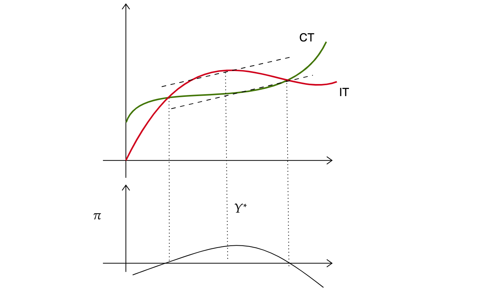
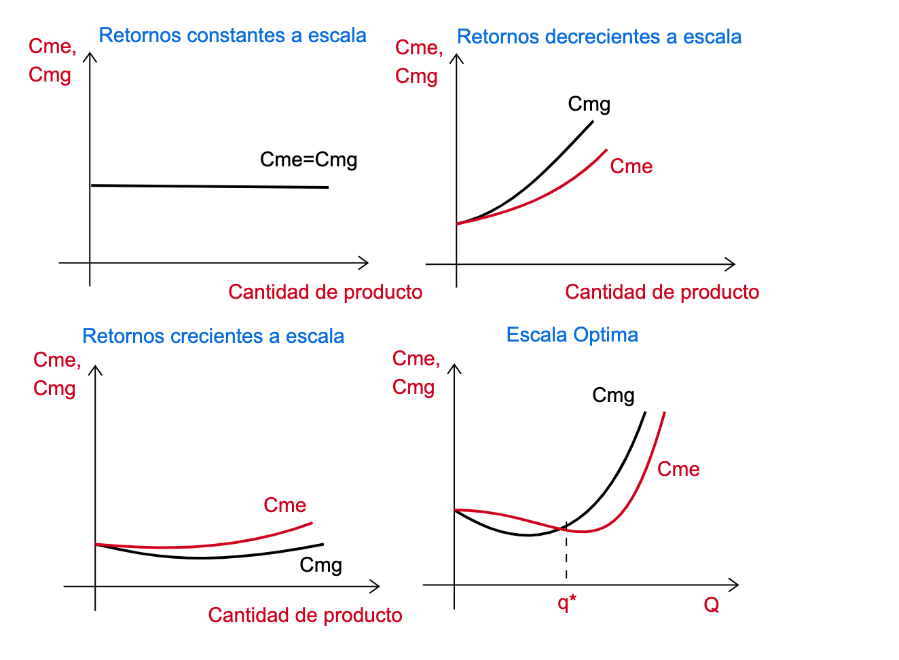
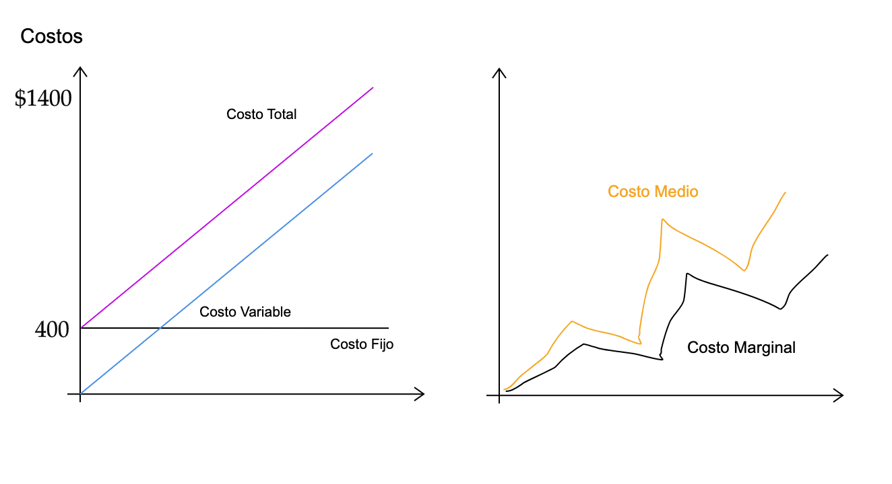
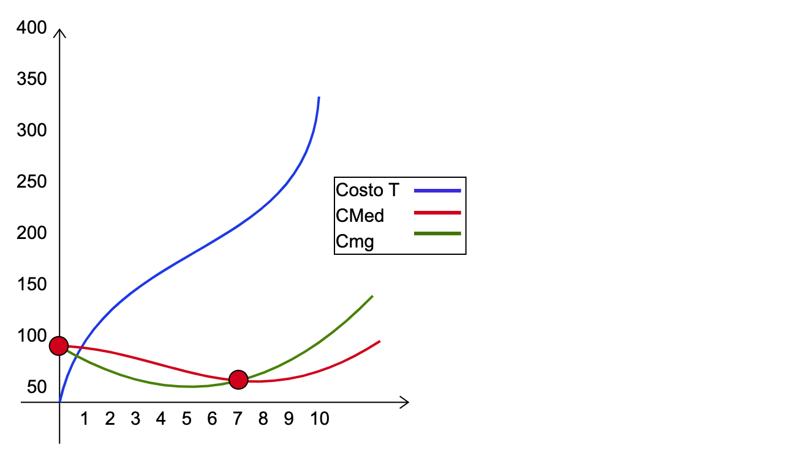
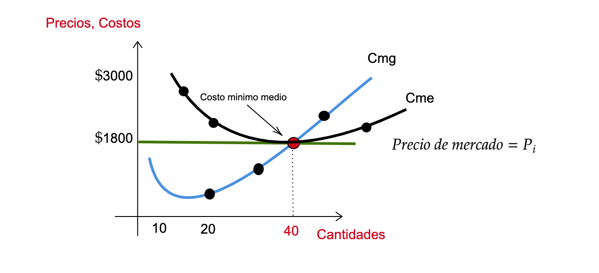
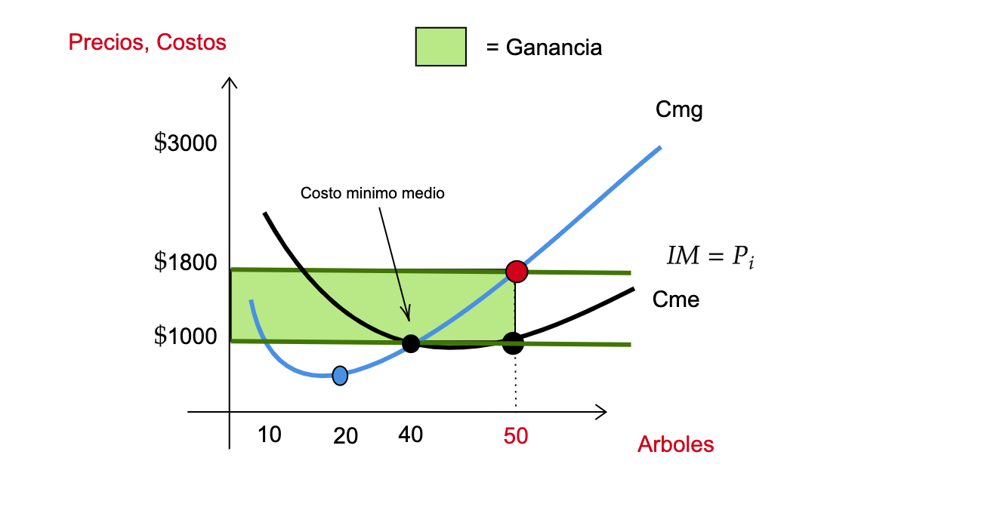
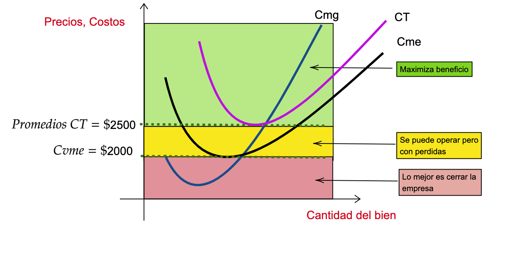

name: xaringan-title
class: left, middle


# Principios de Microeconomía
<br>
## Teoría del Productor (Costos)
<br>
<br>


### Carlos Yanes | Departamento de Economía | `r Sys.Date()`

```{r Setup, include = F}
options(htmltools.dir.version = FALSE)
library(pacman)
p_load(broom, latex2exp, ggplot2, ggthemes, ggforce, viridis, dplyr, magrittr, knitr, parallel, readxl, dslabs, gapminder, extrafont, Ecdat, wooldridge, tidyverse, magrittr, janitor, kableExtra, fontawesome, babynames, DiagrammeR, hrbrthemes, econocharts, plotly, flextable)

# Definimos colores
red_pink <- "#e64173"
met_slate <- "#272822" # De otra diapos
purple <- "#9370DB"
green <- "#007935"
light_green <- "#7DBA97"
orange <- "#FD5F00"
turquoise <- "#44C1C4"
red <- "#b92e34"
# Knitr options
opts_chunk$set(
  comment = "#>",
  fig.align = "center",
  fig.height = 7,
  fig.width = 10.5,
  #dpi = 300,
  #cache = T,
  warning = F,
  message = F
)  
theme_simple <- theme_bw() + theme(
  axis.line = element_line(color = met_slate),
  panel.grid = element_blank(),
  rect = element_blank(),
  strip.text = element_blank(),
  text = element_text(family = "Fira Sans", color = met_slate, size = 17),
  # axis.text.x = element_text(size = 12),
  # axis.text.y = element_text(size = 12),
  axis.ticks = element_blank()
)
theme_market <- theme_bw() + theme(
  axis.line = element_line(color = met_slate),
  panel.grid = element_blank(),
  rect = element_blank(),
  strip.text = element_blank(),
  text = element_text(family = "Fira Sans", color = met_slate, size = 17),
  axis.title.x = element_text(hjust = 1, size = 17),
  axis.title.y = element_text(hjust = 1, angle = 0, size = 17),
  axis.ticks = element_blank()
)
theme_gif <- theme_bw() + theme(
  axis.line = element_line(color = met_slate),
  panel.grid = element_blank(),
  rect = element_blank(),
  text = element_text(family = "Fira Sans", color = met_slate, size = 17),
  axis.text.x = element_text(size = 12),
  axis.text.y = element_text(size = 12),
  axis.ticks = element_blank()
)
theme_goods <- theme_bw() + theme(
  axis.line = element_line(),
  panel.grid = element_blank(),
  rect = element_rect(size = 1),
  strip.text = element_blank(),
  text = element_text(size = 17, family = "Fira Sans"), 
  axis.text.x = element_text(size = 17),
  axis.text.y = element_text(size = 17, angle = 90, hjust = 0.5),
  axis.title.x = element_text(color = purple, size = 19),
  axis.title.y = element_text(color = red_pink, size = 19),
  axis.ticks = element_blank(),
  plot.title = element_blank(),
  legend.position = "none"
)
shift_axis <- function(p, y=0){
  g <- ggplotGrob(p)
  dummy <- data.frame(y=y)
  ax <- g[["ranuras"]][g$layout$name == "eje-b"][[1]]
  p + annotation_custom(grid::grobTree(ax, vp = grid::viewport(y=1, height=sum(ax$height))), 
                        ymax=y, ymin=y) +
    geom_hline(aes(yintercept=y), data = dummy, size = 0.5, color = met_slate) +
    theme(axis.text.x = element_blank(), 
          axis.ticks.x = element_blank())
}
wrapper <- function(x, ...) paste(strwrap(x, ...), collapse = "\n")
```

---
class: middle, inverse

.left-column[

# `r emo::ji("danger")`

]

.right-column[
# Preguntas de la semana anterior?
]

---
class: title-slide-section-blue, middle

# Productor

<br>


---
# Productor

--

Para .RUred[maximizar] beneficios, un **productor** debe intentar responderse:

--

+ Cuánto debe producir?
+ Qué precio debe colocar/establecer
+ Cuánto trabajo contratar? Cuanto de maquinaria?
+ Debería cerrar o mantenerme produciendo?

--

Algunas de esas respuestas dependen de:

--

1. Las funciones de producción --> Estructura de costos
2. Estructura de mercado --> habilidad para establecer precios
3. Corto/largo plazo

---
# Producto total

--

.left-column[
## Definición
>Cantidad de un producto dado la cantidad de insumos que se tenga

**Ejemplo:** Trabajadores (L), manteniendo lo demás constante.
]

.right-column[
```{r, echo = FALSE, fig.height = 5, fig.width = 5, dev = "svg"}
x <- 0:10
total_product <- function(x) 3*x - 0.5*x^3 + 4*x^2 
ggplot(data = data.frame(x = 0), mapping = aes(x = x)) +
  scale_x_continuous(limits = c(0, 7.5), expand=c(0,0), breaks = seq(0,7,1)) +
  scale_y_continuous(limits = c(0, 65), expand=c(0,0), breaks = seq(0,60,10)) +
  theme_market +
  labs(x = "L", y = "Q") +
  stat_function(fun = total_product, color = purple, size = 1)
```
]
---
# Producto total

.left-column[
## Definición
>Cantidad de un producto dado la cantidad de insumos que se tenga 

**Ejemplo:** Trabajadores (L), manteniendo lo demas constante.
]

.right-column[
```{r, echo = FALSE, fig.height = 5, fig.width = 5, dev = "svg"}
x <- 0:10
z <- seq(0, 2.67, 0.01)
w <- seq(2.67, 5.68, 0.01)
u <- seq(5.68, 7.5, 0.01)
total_product <- function(x) 3*x - 0.5*x^3 + 4*x^2 
ggplot() +
  scale_x_continuous(limits = c(0, 7.5), expand=c(0,0), breaks = seq(0,7,1)) +
  scale_y_continuous(limits = c(0, 65), expand=c(0,0), breaks = seq(0,60,10)) +
  theme_market +
  labs(x = "L", y = "Q") +
  stat_function(fun = total_product, color = purple, size = 1) +
  geom_vline(xintercept = 2.67, color = met_slate, size = 1, linetype = "dashed") +
  geom_vline(xintercept = 5.68, color = met_slate, size = 1, linetype = "dashed") +
  annotate("label", label = wrapper("Increntos a tasa creciente", 15), x = 2.67/2, y = 58.5, color = purple, family = "Fira Sans", size = 4) +
  annotate("label", label = wrapper("Incrementos a tasa decreciente", 15), x = (2.67 + 5.68)/2, y = 58.5, color = purple, family = "Fira Sans", size = 4) +
  annotate("label", label = wrapper("Decreciendo", 15), x = (7.5 + 5.68)/2, y = 58.5, color = purple, family = "Fira Sans", size = 4) +
  geom_ribbon(aes(x = z, ymin = 0, ymax = 65), fill = purple, alpha = 0.2, linetype = "blank") + # PS
  geom_ribbon(aes(x = u, ymin = 0, ymax = 65), fill = purple, alpha = 0.2, linetype = "blank")
```
]
---
# Producto marginal

.left-column[
## Definición
> Cambios en el producto total producto del incremento de una unidad adicional de trabajo

**Ejemplo:** Trabajadores (L), manteniendo lo demas constante.
]

.right-column[
```{r, echo = FALSE, fig.height = 5, fig.width = 5, dev = "svg"}
x <- 0:10
marginal_product <- function(x) 3 + 8*x - 1.5*x^2
mp1 <- ggplot(data = data.frame(x = 0), mapping = aes(x = x)) +
  scale_x_continuous(limits = c(0, 7.5), expand=c(0,0), breaks = seq(1,7,1)) +
  scale_y_continuous(limits = c(-6, 16), expand=c(0,0), breaks = seq(-5,15,5)) +
  theme_market +
  #geom_hline(yintercept = 0, color = met_slate, size = 0.5) + 
  labs(x = "L", y = "PMg") +
  stat_function(fun = marginal_product, color = purple, size = 1) +
  theme(axis.line.x = element_blank(),
        axis.title.x = element_text(hjust = 1, vjust = 21, size = 17)) 
shift_axis(mp1)
```
]
---
# Producto marginal

.left-column[
## Definición
> Cambios en el producto total debido al incremento de una unidad adicional de trabajo

**Ejemplo:** Trabajadores (L), manteniendo lo demas constante.
]

.right-column[
```{r, echo = FALSE, fig.height = 5, fig.width = 5, dev = "svg"}
x <- 0:10
z <- seq(0, 2.67, 0.01)
w <- seq(2.67, 5.68, 0.01)
u <- seq(5.68, 7.5, 0.01)
marginal_product <- function(x) 3 + 8*x - 1.5*x^2
mp1 <- ggplot(data = data.frame(x = 0), mapping = aes(x = x)) +
  scale_x_continuous(limits = c(0, 7.5), expand=c(0,0), breaks = seq(1,7,1)) +
  scale_y_continuous(limits = c(-6, 16), expand=c(0,0), breaks = seq(-5,15,5)) +
  theme_market +
  #geom_hline(yintercept = 0, color = met_slate, size = 0.5) + 
  labs(x = "L", y = "Pmg") +
  stat_function(fun = marginal_product, color = purple, size = 1) +
  theme(axis.line.x = element_blank(),
        axis.title.x = element_text(hjust = 1, vjust = 21, size = 17)) +
  geom_vline(xintercept = 2.67, color = met_slate, size = 1, linetype = "dashed") +
  geom_vline(xintercept = 5.68, color = met_slate, size = 1, linetype = "dashed") +
  annotate("label", label = wrapper("Incrementos a tasa creciente", 22), x = 2.67/2 - 0.0, y = 14.75, color = purple, family = "Fira Sans", size = 4) +
  annotate("label", label = wrapper("Incrementos a tasa decreciente", 22), x = (2.67 + 5.68)/2 + 0.0, y = 14.75, color = purple, family = "Fira Sans", size = 4) +
  annotate("label", label = wrapper("Decreciente", 22), x = (7.5 + 5.68)/2, y = 14.75, color = purple, family = "Fira Sans", size = 4)
shift_axis(mp1)
```
]
---
# Producto Marginal Decreciente

--

.left-column[
### Idea
En la medida que incrementamos un .blue[insumo] y todo lo demás permanece fijo, la producción lo hace cada vez menos.
]

.right-column[
```{r, echo = FALSE, fig.height = 5, fig.width = 5, dev = "svg"}
x <- 0:10
marginal_product <- function(x) 3 + 8*x - 1.5*x^2
mp1 <- ggplot(data = data.frame(x = 0), mapping = aes(x = x)) +
  scale_x_continuous(limits = c(0, 7.5), expand=c(0,0), breaks = seq(1,7,1)) +
  scale_y_continuous(limits = c(-6, 16), expand=c(0,0), breaks = seq(-5,15,5)) +
  theme_market +
  #geom_hline(yintercept = 0, color = met_slate, size = 0.5) + 
  labs(x = "L", y = "MP") +
  stat_function(fun = marginal_product, color = purple, size = 1) +
  theme(axis.line.x = element_blank(),
        axis.title.x = element_text(hjust = 1, vjust = 21, size = 17)) +
  geom_vline(xintercept = 2.67, color = met_slate, size = 1, linetype = "dashed") +
  annotate("label", label = wrapper("Producto Marginal creciente", 18), x = 2.67/2 - 0.0, y = 14.85, color = purple, family = "Fira Sans", size = 4) +
  annotate("label", label = wrapper("Producto Marginal decreciente", 18), x = (2.67 + 7.5)/2 + 0.0, y = 14.85, color = purple, family = "Fira Sans", size = 4)
shift_axis(mp1)
```
]
---
# Producto Marginal Decreciente

--

Suponga por un momento que usted produce y vende .RUred[Papaya] y el precio es de $5 y los salarios que usted paga -*por el mercado trabajo*- es de 2000 por mes, .RUred[Cuántos trabajadores debe contratar?]

--

```{R, echo = F, escape = F}
data.frame(
  v1 = c(0, 1, 2, 3, 4, 5),
  v2 = c(0, 1000, 1800, 2400, 2800, 3000),
  v3 = c("", "", "", "", "", ""),
  v4 = c("", "", "", "", "", ""),
  v5 = c("$2000", "$2000", "$2000", "$2000", "$2000", "$2000")
) %>% kable(
  escape = F,
  col.names = c("Trabajadores (L)", "Papayas (Q)", "Producto Marginal", "Producto Marginal &times; P", "Salario"),
  align = c("c", "c", "c", "c", "c")#,
) %>%
row_spec(1:6, color = red) %>%
row_spec(1:6, extra_css = "line-height: 110%;")
```
---
# Producto Marginal Decreciente


Suponga por un momento que usted produce y vende .RUred[Papaya] y el precio es de $5 y los salarios que usted paga -*por el mercado trabajo*- es de 2000 por mes, .RUred[Cuántos trabajadores debe contratar?]


```{R, echo = F, escape = F}
data.frame(
  v1 = c(0, 1, 2, 3, 4, 5),
  v2 = c(0, 1000, 1800, 2400, 2800, 3000),
  v3 = c("&mdash;", 1000, 800, 600, 400, 200),
  v4 = c("", "", "", "", "", ""),
  v5 = c("$2000", "$2000", "$2000", "$2000", "$2000", "$2000")
) %>% kable(
  escape = F,
  col.names = c("Trabajadores (L)", "Papayas (Q)", "Producto Marginal", "Producto Marginal &times; P", "Salario"),
  align = c("c", "c", "c", "c", "c")#,
) %>%
row_spec(1:6, color = red) %>%
row_spec(1:6, extra_css = "line-height: 110%;")
```

---
# Producto Marginal Decreciente


Suponga por un momento que usted produce y vende .RUred[Papaya] y el precio es de $5 y los salarios que usted paga -*por el mercado trabajo*- es de 2000 por mes, .RUred[Cuántos trabajadores debe contratar?]


```{R, echo = F, escape = F}
data.frame(
  v1 = c(0, 1, 2, 3, 4, 5),
  v2 = c(0, 1000, 1800, 2400, 2800, 3000),
  v3 = c("&mdash;", 1000, 800, 600, 400, 200),
  v4 = c("&mdash;", "$5000", "$4000", "$3000", "$2000", "$1000"),
  v5 = c("$2000", "$2000", "$2000", "$2000", "$2000", "$2000")
) %>% kable(
  escape = F,
  col.names = c("Trabajadores (L)", "Papayas (Q)", "Producto Marginal", "Producto Marginal &times; P", "Salario"),
  align = c("c", "c", "c", "c", "c")#,
) %>%
row_spec(1:6, color = red) %>%
row_spec(1:6, extra_css = "line-height: 110%;")
```

--

La clave siempre será: 

.blue[**Pensando marginalmente:**] Se mantiene el contrato siempre que .RUred[Producto Marginal &times; P] $\geq$ .blue[**Salarios**].

--

Por ende, la mejor manera es contratar solo **4 Personas**.

---
# Insumos

--

**Insumo:** Tierra .mono[-->] uno debe pagar .RUred[arriendo] cada mes, independiente el número de papayas que usted produzca.

--

**Insumo:** Trabajo .mono[-->] el salario del mercado es de $2000 por mes.

--

```{R, echo = F, escape = F}
data.frame(
  v1 = c(0, 1, 2, 3, 4, 5),
  v2 = c(0, 1000, 1800, 2400, 2800, 3000),
  v3 = c("", "", "", "", "", ""),
  v4 = c("", "", "", "", "", ""),
  v5 = c("", "", "", "", "", "")
) %>% kable(
  escape = F,
  col.names = c("Trabajadores (L)", "Papayas (Q)", "Costo de la tierra", "Costo del trabajo", "Costo Total"),
  align = c("c", "c", "c", "c", "c")#,
) %>%
row_spec(1:6, color = met_slate) %>%
row_spec(1:6, extra_css = "line-height: 110%;")
```

---
# Insumos


**Insumo:** Tierra .mono[-->] uno debe pagar .RUred[arriendo] cada mes, independiente el número de papayas que usted produzca.


**Insumo:** Trabajo .mono[-->] el salario del mercado es de $2000 por mes.


```{R, echo = F, escape = F}
data.frame(
  v1 = c(0, 1, 2, 3, 4, 5),
  v2 = c(0, 1000, 1800, 2400, 2800, 3000),
  v3 = c("$1000", "$1000", "$1000", "$1000", "$1000", "$1000"),
  v4 = c("", "", "", "", "", ""),
  v5 = c("", "", "", "", "", "")
) %>% kable(
  escape = F,
  col.names = c("Trabajadores (L)", "Papayas (Q)", "Costo de la tierra", "Costo del trabajo", "Costo Total"),
  align = c("c", "c", "c", "c", "c")#,
) %>%
row_spec(1:6, color = met_slate) %>%
row_spec(1:6, extra_css = "line-height: 110%;")
```
---
# Insumos


**Insumo:** Tierra .mono[-->] uno debe pagar .RUred[arriendo] cada mes, independiente el número de papayas que usted produzca.


**Insumo:** Trabajo .mono[-->] el salario del mercado es de $2000 por mes.


```{R, echo = F, escape = F}
data.frame(
  v1 = c(0, 1, 2, 3, 4, 5),
  v2 = c(0, 1000, 1800, 2400, 2800, 3000),
  v3 = c("$1000", "$1000", "$1000", "$1000", "$1000", "$1000"),
  v4 = c("$0", "$2000", "$4000", "$6000", "$8000", "$10000"),
  v5 = c("", "", "", "", "", "")
) %>% kable(
  escape = F,
  col.names = c("Trabajadores (L)", "Papayas (Q)", "Costo de la tierra", "Costo del trabajo", "Costo Total"),
  align = c("c", "c", "c", "c", "c")#,
) %>%
row_spec(1:6, color = met_slate) %>%
row_spec(1:6, extra_css = "line-height: 110%;")
```
---
# Insumos


**Insumo:** Tierra .mono[-->] uno debe pagar .RUred[arriendo] cada mes, independiente el número de papayas que usted produzca.


**Insumo:** Trabajo .mono[-->] el salario del mercado es de $2000 por mes.


```{R, echo = F, escape = F}
data.frame(
  v1 = c(0, 1, 2, 3, 4, 5),
  v2 = c(0, 1000, 1800, 2400, 2800, 3000),
  v3 = c("$1000", "$1000", "$1000", "$1000", "$1000", "$1000"),
  v4 = c("$0", "$2000", "$4000", "$6000", "$8000", "$10000"),
  v5 = c("$1000", "$3000", "$5000", "$7000", "$9000", "$11000")
) %>% kable(
  escape = F,
  col.names = c("Trabajadores (L)", "Papayas (Q)", "Costo de la tierra", "Costo del trabajo", "Costo Total"),
  align = c("c", "c", "c", "c", "c")#,
) %>%
row_spec(1:6, color = met_slate) %>%
row_spec(1:6, extra_css = "line-height: 110%;")
```
---
# Insumos

--

**Insumo:** Tierra .mono[-->] uno debe pagar .RUred[arriendo] cada mes, independiente el número de papayas que usted produzca.


**Insumo:** Trabajo .mono[-->] el salario del mercado es de $2000 por mes.

--

.center[.RUred[**Curva de costo total**]]

--

.pull-left[
```{R, echo = F, escape = F}
cost_data <- data.frame(
  q = c(0, 1000, 1800, 2400, 2800, 3000),
  tc = c("$1000", "$3000", "$5000", "$7000", "$9000", "$11000")
) 
cost_data %>% 
  kable(
  escape = F,
  col.names = c("Papayas (Q)", "Costo Total"),
  align = c("c", "c")#,
) %>%
row_spec(1:6, color = met_slate) %>%
row_spec(1:6, extra_css = "line-height: 110%;")
```
]

.pull-right[
```{r, echo = FALSE, fig.height = 3.25, fig.width = 4.25, dev = "svg"}
cost_data <- data.frame(
  q = c(0, 1000, 1800, 2400, 2800, 3000),
  tc = c(1000, 3000, 5000, 7000, 9000, 11000)
) 
cost_data %>% 
  ggplot(aes(x = q, y = tc)) +
  scale_x_continuous(limits = c(0, 3500)) +
  scale_y_continuous(limits = c(0, 12000), expand=c(0, 0), breaks = scales::pretty_breaks()) +
  theme_market +
  labs(x = "Q", y = "CT") +
  geom_point(size = 2, color = purple) +
  geom_line(size = 1, color = purple)
```
]


---
class: title-slide-section-blue, middle

# Teoría de costos

<br>


---
# Teoría de costos

--

`r fa("angle-double-right", fill="blue")` Las firmas, hasta el momento, enfrenta precios .RUred[fijos], son dados por el **mercado**.

--

`r fa("bowling-ball", fill="red")` .black[P], Precio del producto que se ha producido y por ende se vende.

--

`r fa("bowling-ball", fill="red")` Precio de los .black[insumos] que se deben comprar para **producir**:

--

+ .black[w] (*wages*), Salarios, costo de mano de obra ($ unidad-tiempo)

--

+ .black[r] (*rates*), costo de capital, alquiler de la maquina ($ unidad-tiempo)

--

Son tres mercados operando, para definir cada una de las variables, (w,r y desde luego p).

---
# Teoría de costos

--

La función de producción de una empresa supone que:

--

$$Y= f(K,L)$$

--

Por ende:

--

$$\pi_{i}=\underbrace{p\times f\left ( K_{i},L_{i} \right )}_{\textrm{Ingresos de la firma}} - \underbrace{CT_{i}\left ( K_{i}, L_{i} \right )}_{\textrm{Costos de la firma}}$$

--

Lo que es:

--

$$\pi_{i}=P \times f\left ( K_{i},L_{i} \right ) - \left ( r K_{i}, w L_{i} \right )$$

--

En términos blandos:

--

$$Beneficio_{i}=P \times Q - \color{#fc0330}{C_{t} \times Q}$$
--

$Q$ viene siendo la cantidad de producto que vende la firma en cuestión.

---
# Teoría de costos

--




---
# Teoría de costos

--

.blue[*Ejemplo 1*]: Una firma cuyo precio de mercado que recibe es de $5000 por cada uno de sus productos pero producirlos le cuesta 3000, entonces sus beneficios por vender 20 unidades son:

--

$$Beneficio_{i}=\$5000 \times 20 - \color{#fc0330}{\$3000 \times 20}= 40000$$
--

después de haber cubierto sus costos, la **firma** puede entonces maximizar su ganancia.

--

En algunos casos, la **empresa** puede operar siempre y cuando sus costos nunca superen sus ingresos.

---
# Teoría de costos

--

### Curvas de costos

--

*Regularmente los rendimientos suelen ir de acuerdo al comportamiento de los costos empresariales*.

--



---
class: title-slide-section-blue, middle

# Costos fijos, variables y totales

<br>


---
# Costos fijos, variables y totales

--

<midd-blockquote>Los costos *fijos* son aquellos que independiente la firma no produzca, siempre se van a incurrir en ellos. </midd-blockquote>

--

<midd-blockquote>Los costos *variables* son aquellos que dependen directamente de la producción de la empresa. </midd-blockquote>

--

<midd-blockquote>Los costos **totales** son aquellos que independiente la firma no produzca, siempre se van a incurrir en ellos. </midd-blockquote>

--


| Trabajadores | Cantidad de Producto | Costo Variable | Costo Fijo | Costo Total |
| ------------ | -------------------- | -------------- | ---------- | ----------- |
| 0            | 0                    | 0              | 400        | 400         |
| 1            | 20                   | 200            | 400        | 600         |
| 2            | 37                   | 400            | 400        | 800         |
| 3            | 40                   | 600            | 400        | 1000        |
| 4            | 49                   | 800            | 400        | 1200        |
| 5            | 52                   | 1000           | 400        | 1400        |

--

$$\text{Costos Totales}= \text{Costos Fijos}+ \text{Costos Variables}$$

---
class: title-slide-section-grey, middle

# Cuales son los costos medios y marginales?

---
# Cuales son los costos medios?

--

| Producción | Costo Variable | CVM | Costo Fijo | CFM | Costo Total | Cmed |
| ---------- | -------------- | --- | ---------- | --- | ----------- | ---- |
| 0          | 0              | \-  | 400        |  \- | 400         | \-   |
| 20         | 200            | 10  | 400        | 20  | 600         | 30   |
| 37         | 400            | 11  | 400        | 11  | 800         | 22   |
| 40         | 600            | 15  | 400        | 10  | 1000        | 25   |
| 49         | 800            | 16  | 400        | 8   | 1200        | 24   |
| 52         | 1000           | 19  | 400        | 8   | 1400        | 27   |

--

La formula es sencilla:

--

$$\text{Costo Medio}=\frac{Costo_i}{Cantidad_i}$$

---
# Cuales son los costos marginales?

--

| Costo Total | Variacion CT | Variacion Q | Costo Marginal |
| ----------- | ------------ | ----------- | -------------- |
| 400         | \-           | \-          | \-             |
| 600         | 200          | 20          | 10             |
| 800         | 200          | 17          | 12             |
| 1000        | 200          | 3           | 67             |
| 1200        | 200          | 9           | 22             |
| 1400        | 200          | 3           | 67             |

--

Los *costos marginales* son los costos por unidades adicionales que se producen. Estos vienen a tener en cuenta tanto las *variaciones del costo total* como las variaciones de las cantidades producidad.

--

$$\text{Costo Marginal}= \frac{\triangle CT}{\triangle Q}$$
---
# Cuales son los costos medios y marginales?

--

`r fa("atom", fill="blue")` Note que si se producen .RUred[37] unidades de producto entonces los costos son:

--

$$Cmed= \underbrace{11}_{CVMe}+\underbrace{11}_{CFMe}=22$$

--

`r fa("atom", fill="red")` Ahora mire que si se producen .RUred[49] unidades de producto, entonces el costo asciende a:

--

$$Cmed= \underbrace{16}_{CVMe}+\underbrace{8}_{CFMe}=24$$

--


`r fa("box-open", fill="red")` El .black[costo medio] es la suma de los costos .grey[variables] medios con los costos .grey[fijos] medios.

--

`r fa("box-open", fill="red")` Las **empresas** siempre buscaran trabajar u operar con el *mínimo costo* posible.

---
class: title-slide-section-blue, middle

# Relación Costos Marginales y Medios

<br>


---
# Relación Costos Marginales y Medios

--

Tanto el costo **marginal** como el **medio** nos pueden dar indicaciones de los niveles .RUred[óptimos] para contratar personal o alquilar capital. Sin embargo también es decisión de la firma buscar el costo medio mas pequeño y con eso ubicarse en un punto de producción.

--



---
# Relación Costos Marginales y Medios

--

.blue[*Ejemplo 2*]: Ahora pensemos en lo siguiente: Un grupo de ingenieros ha encontrado que la función de producción de una empresa se asemeja a una función de polinomio superior.

--

Esto es,

--

$$q^3-14q^2+75q$$
--

Nos preguntan, que ocurre con su relación de costos medios y marginales y si hay un punto de equilibrio para eso.

---
# Relación Costos Marginales y Medios

--

Tomamos la función y hallamos su **costo medio**:

--

$$Cme= \frac{q^3}{q}-\frac{14q^2}{q}+\frac{75q}{q}$$
--

Siendo esto:

--

$$Cme= q^2-14q+75$$
--

Luego, podemos entonces tener su marginal:

--

$$Cmg= 3q^2-28q+75$$

---
# Relación Costos Marginales y Medios

--

Nos queda simplemente igualar las expresiones:

--

$$q^2-14q+75=3q^2-28q+75$$

--

*Lo único que nos queda es despejar y tener el resultado con un poco de álgebra*

--

$$2q^2-14q=\text{equilibrio}$$
--

*A continuación podemos resolverlo mediante el desarrollo de x por raices*

--

$$\frac{-(-14)\pm \sqrt{(-14)^2-(4\cdot2\cdot0)}}{2(2)}$$

--

Lo que nos brinda dos raices como resultado. Una viene siendo $q=0$ y la otra donde $q=7$.

---
# Relación Costos Marginales y Medios

--



---
class: title-slide-section-blue, middle

# Otros tipos de costos

<br>


---
# Otros tipos de costos

--

Las empresas (personas) también enfrentan tipos de costos como:

--

+ Costos **hundidos**: *Costos irrecuperables*, p.e: Entrenamiento a personal de trabajo, campañas de mercado (impulsadores).

--

+ Costos **implícitos**: *Costos de oportunidad*, p.e: la depreciación de un activo.

--

+ Costos **explícitos**: *Costos monetarios*, p.e: el pago de un servicio

---
class: title-slide-section-blue, middle

# Precios y Costos Variables Medios

<br>


---
# Precios y Costos Variables Medios

--

`r fa("calculator", fill="red")` Las **empresas** pueden tener reglas (operar, mantenerse, salir del mercado, etc.). Estas pueden situarse en el nivel de revisar sus insumos, precios de mercado y no manejar la .black[subjetividad].

--

Es por ello, que a continuación, se muestra el deber ser:

--

| Caso    | Decisión                      |
| ------- | ------------------------------|
| P=CVMed | No cerrar, mantenerse         |
| P>CVMed | Beneficios                    |
| P<CVMed | .RUred[Cerrar el negocio]     |

---
# Precios y Costos Variables Medios

--



---
# Precios y Costos Variables Medios

--



---
# Precios y Costos Variables Medios

--



---
class: title-slide-section-grey

# Bibliografía

`r fa('book')` Coppock, L., & Mateer, D. (2018). *Principles of Economics (Second edition)*. W.W. Norton & Company, inc. 

`r fa('book')` Krugman, P., & Wells, R. (2014). *Microeconomics (for AP)*. New York: Worth Publishers.

`r fa('book')` Mankiw, N. G. (2007).. *Principles of Microeconomics*. Canadá: Cengage Learning.

---
class: title-slide-final, middle

# Gracias por su atención!

## Alguna pregunta adicional?

### Carlos Andres Yanes Guerra
`r fa("envelope", fill="red")` cayanes@uninorte.edu.co
`r fa("university", fill="blue")` Universidad del Norte


 